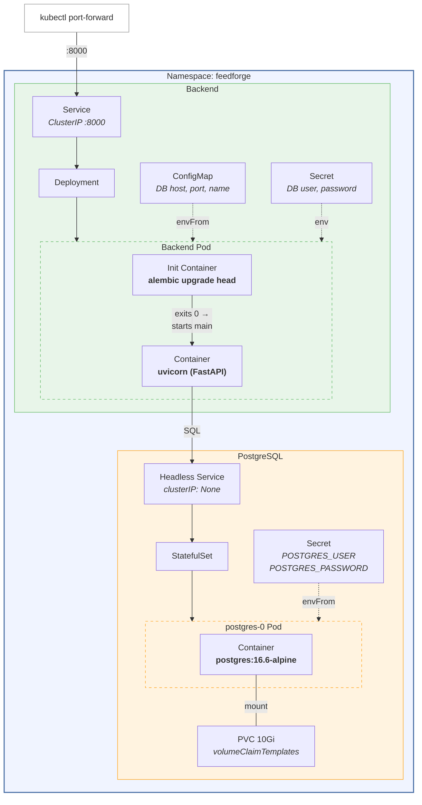

# Diagrams for Phase 1 Blog Post

Render these at https://mermaid.live and export as PNG.

## 1. Architecture Diagram (architecture.png)

```mermaid
graph TB
    subgraph ns["Namespace: feedforge"]
        subgraph backend_group["Backend"]
            CM["ConfigMap<br/><i>DB host, port, name</i>"]
            SEC2["Secret<br/><i>DB user, password</i>"]
            DEP["Deployment"]
            subgraph pod["Backend Pod"]
                INIT["Init Container<br/><b>alembic upgrade head</b>"]
                APP["Container<br/><b>uvicorn (FastAPI)</b>"]
                INIT -->|"exits 0 →<br/>starts main"| APP
            end
            SVC_BE["Service<br/><i>ClusterIP :8000</i>"]
        end

        subgraph pg_group["PostgreSQL"]
            SEC1["Secret<br/><i>POSTGRES_USER<br/>POSTGRES_PASSWORD</i>"]
            SS["StatefulSet"]
            subgraph pgpod["postgres-0 Pod"]
                PG["Container<br/><b>postgres:16.6-alpine</b>"]
            end
            SVC_PG["Headless Service<br/><i>clusterIP: None</i>"]
            PVC["PVC 10Gi<br/><i>volumeClaimTemplates</i>"]
        end
    end

    KPF["kubectl port-forward"]

    KPF -->|":8000"| SVC_BE
    SVC_BE --> DEP
    DEP --> pod
    CM -.->|"envFrom"| pod
    SEC2 -.->|"env"| pod
    APP -->|"SQL"| SVC_PG
    SVC_PG --> SS
    SS --> pgpod
    SEC1 -.->|"envFrom"| pgpod
    PG ---|"mount"| PVC

    style ns fill:#f0f4ff,stroke:#4a6fa5,stroke-width:2px
    style backend_group fill:#e8f5e9,stroke:#66bb6a
    style pg_group fill:#fff3e0,stroke:#ffa726
    style pod fill:#e8f5e9,stroke:#66bb6a,stroke-dasharray:5
    style pgpod fill:#fff3e0,stroke:#ffa726,stroke-dasharray:5
    style KPF fill:#fff,stroke:#999
```

## 2. Deploy Flow Diagram (deploy-flow.png)

```mermaid
flowchart LR
    A["kubectl apply -k<br/>k8s/base/"] --> B["Namespace<br/>created"]
    B --> C["Secret +<br/>ConfigMap"]
    C --> D["Headless Service<br/>+ ClusterIP Service"]
    D --> E["StatefulSet<br/>→ postgres-0"]

    E --> E1["PVC provisioned<br/>(10Gi GCE PD)"]
    E1 --> E2["initdb runs<br/>(first boot only)"]
    E2 --> E3["Readiness probe<br/>passes ✓"]

    D --> F["Deployment<br/>→ backend pod"]
    F --> F1["Init container:<br/>alembic upgrade head"]

    F1 -.->|"connects to"| E3

    F1 --> F1a{{"Bug 1 ✗<br/>Wrong registry<br/>region"}}
    F1a -->|"fix region"| F1b{{"Bug 2 ✗<br/>@ in password<br/>breaks URL"}}
    F1b -->|"URL-encode"| F1c{{"Bug 3 ✗<br/>% breaks<br/>configparser"}}
    F1c -->|"bypass<br/>configparser"| F2["Migration<br/>succeeds ✓"]

    F2 --> G["Main container:<br/>uvicorn starts"]
    G --> H["Readiness probe<br/>/api/health ✓"]
    H --> I["Pod added to<br/>Service endpoints"]
    I --> J["curl<br/>localhost:8000 ✓"]

    style A fill:#e3f2fd,stroke:#1976d2
    style E3 fill:#e8f5e9,stroke:#4caf50
    style F2 fill:#e8f5e9,stroke:#4caf50
    style H fill:#e8f5e9,stroke:#4caf50
    style J fill:#e8f5e9,stroke:#4caf50
    style F1a fill:#ffebee,stroke:#ef5350
    style F1b fill:#ffebee,stroke:#ef5350
    style F1c fill:#ffebee,stroke:#ef5350
```
