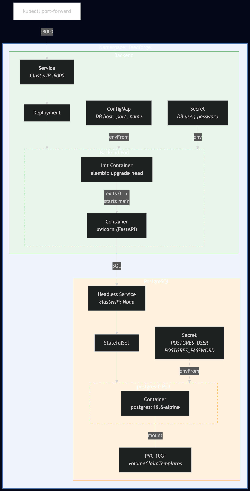
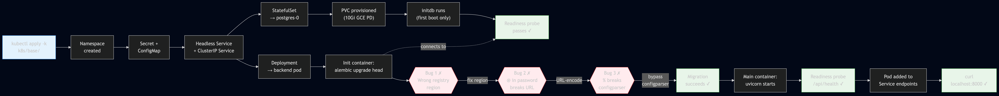

# Deploying a FastAPI App to GKE: What I Actually Learned About Kubernetes

*This is the third post in a series about learning Kubernetes by building FeedForge — an RSS feed aggregator on GKE. These posts are learning notes from someone figuring things out in real time. [Previous post here.](https://medium.com/@huchka)*

---

I'm building FeedForge as a way to learn Kubernetes hands-on. Phase 0 gave me a GKE cluster via Terraform. Phase 1 was where things got real — deploying a FastAPI backend with PostgreSQL, hitting real bugs, and learning how K8s concepts actually fit together.

This isn't a clean tutorial. I'll walk through what I built, the decisions I made, and the three cascading bugs I hit during deployment.

## What I Built

> Want to see the full source code — FastAPI app, Dockerfile, K8s manifests, and Terraform modules? Check out the [`phase-1` tag](https://github.com/huchka/feedforge/tree/phase-1) in the FeedForge repo — it's a snapshot of the codebase at exactly this point.

A FastAPI backend with CRUD endpoints for RSS feeds and articles, backed by PostgreSQL, all running on GKE.



This single deploy touches 12 Kubernetes concepts: Namespace, Deployment, StatefulSet, Service (ClusterIP and headless), ConfigMap, Secret, PVC, init container, liveness probe, readiness probe, and resource requests/limits. Here's how they fit together.

## K8s Concepts That Mattered Most

### StatefulSet vs Deployment

A Deployment treats pods as interchangeable — kill one, spin up another with a random name. A database needs stable identity. A StatefulSet guarantees the pod is always `postgres-0`, and the same PersistentVolumeClaim follows it across restarts and rescheduling. The backend is stateless, so a regular Deployment works there.

### Headless Service

A normal ClusterIP Service gets a virtual IP and load-balances traffic. A headless Service (`clusterIP: None`) resolves DNS directly to the pod IP — no virtual IP in between. For a StatefulSet, this is what gives you stable per-pod DNS like `postgres-0.postgres.feedforge.svc.cluster.local`.

### The subPath Trick

GCE Persistent Disks have a `lost+found` directory at the filesystem root. PostgreSQL's `initdb` refuses to start if the data directory isn't empty. Fix: mount with `subPath: pgdata` so PostgreSQL writes to a subdirectory and never sees `lost+found`.

### ConfigMap + Secret Split

Non-sensitive config (DB host, port, name) goes in a ConfigMap. Credentials go in a Secret. The app assembles the connection URL at startup. This way I can change the database host without touching the Secret. Worth noting: base64 in a Secret manifest is just encoding, not security. Secrets still rely on access controls, and any at-rest encryption is a separate cluster feature.

### Init Container for Migrations

The backend pod runs an init container (`alembic upgrade head`) before the main container starts. If the migration fails, the backend never starts — no traffic hits a stale schema. It uses the same Docker image as the main container, so migration code and app code are always in sync. If PostgreSQL isn't ready yet, Kubernetes retries automatically.

### Liveness vs Readiness Probes

**Readiness**: "Can this pod serve traffic?" Fails → pod is removed from the Service endpoints, so no traffic gets routed to it. **Liveness**: "Is this pod stuck?" If it keeps failing past the probe's `failureThreshold` (3 by default), kubelet restarts the container. The backend's `/api/health` endpoint does a `SELECT 1` on the database — if it can't reach PostgreSQL, it fails readiness and stops receiving requests.

Key detail: PostgreSQL's liveness probe has `initialDelaySeconds: 30` because `initdb` takes time on first boot. Too aggressive and you get an infinite crash loop.

## The Dockerfile: One Image, Two Jobs

Multi-stage build with uv:

```dockerfile
FROM python:3.12.8-slim AS builder
COPY --from=ghcr.io/astral-sh/uv:0.6 /uv /usr/local/bin/uv
# ... install deps, copy app

FROM python:3.12.8-slim AS runtime
RUN groupadd -r feedforge && useradd -r -g feedforge ...
COPY --from=builder /app/.venv /app/.venv
COPY --from=builder /app/app ./app
COPY --from=builder /app/alembic ./alembic
USER feedforge
CMD ["uvicorn", "app.main:app", "--host", "0.0.0.0", "--port", "8000"]
```

Deliberate choices: pinned base image (no silent Python upgrades on restart), non-root user, Alembic files included so the same image serves both init container and main container. Built with `--platform linux/amd64` on Apple Silicon since GKE nodes are x86.

## Things I Learned



### Three Bugs, Each Fix Revealing the Next

My first deploy attempt failed. Then the fix failed. Then that fix failed too. The whole chain happened in the init container — `alembic upgrade head` couldn't connect to PostgreSQL.

**Bug 1**: Docker push returned a cryptic 404. My Terraform variable defaults said `asia-northeast1`, but the actual deploy used `us-central1`. I was pushing to a registry that didn't exist. A quick `gcloud artifacts repositories list` showed the real location. Lesson learned: don't trust defaults in example files — verify your actual infrastructure state.

**Bug 2**: After fixing the region, the init container crash-looped. The logs showed psycopg trying to resolve `ssw0rd2026@postgres.feedforge...` as a hostname. My database password was `P@ssw0rd2026` — the `@` was being interpreted as the user/host delimiter in the connection URL. Fix: URL-encode the username and password components before building the URL, using something like `urllib.parse.quote`. This is the kind of bug that works in dev (simple passwords) and breaks in production.

**Bug 3**: After URL-encoding `@` to `%40`, Alembic crashed with `ValueError: invalid interpolation syntax`. Python's `configparser` treats `%` as its interpolation character, and Alembic's default `env.py` routes the URL through `configparser`. Fix: bypass it entirely and create the SQLAlchemy engine directly from the URL instead of going through `config.set_main_option()`.

Three bugs, one root cause rippling through layers. Generated boilerplate (like Alembic's `env.py`) is a starting point, not sacred — when it breaks, simplify.

### Debugging on Kubernetes: Read the Logs, Not the Status

When the init container was failing, `kubectl get pods` just showed `Init:CrashLoopBackOff`. That tells you *something* is wrong but not *what*. The actual debugging happened with:

```bash
kubectl logs <pod> -c run-migrations    # init container output
kubectl describe pod <pod>              # events, env vars, image pull status
```

`describe pod` showed me the environment variables were correctly injected. `logs -c run-migrations` showed the actual Python traceback. I learned to go straight to these two commands instead of staring at pod status.

### GCP Project IDs in Manifests Aren't Secrets

The Deployment manifest ended up with the full Artifact Registry path hardcoded:

```yaml
image: us-central1-docker.pkg.dev/project-76da2d1f-231c-4c94-ae9/feedforge/backend:0.1.2
```

I initially worried about committing a GCP project ID to a public repo. The deeper answer: it's usually low sensitivity, not a secret. A project ID is an identifier, not a credential, and it doesn't grant access on its own. The real control point is IAM. That said, it is still metadata about your environment, so I wouldn't treat it as completely meaningless either.

It is a maintainability issue though — the path appears in two places (init container and main container) and breaks if you fork the repo. The clean fix is kustomize's `images` transformer, which I'll set up in Phase 3.

## Verification

```bash
$ kubectl port-forward svc/backend 8000:8000

$ curl http://localhost:8000/api/health
{"status":"ok","database":"ok"}

$ curl -X POST http://localhost:8000/api/feeds \
  -H 'Content-Type: application/json' \
  -d '{"url":"https://feeds.arstechnica.com/arstechnica/index","title":"Ars Technica"}'
{"id":"26d6ec46-...","title":"Ars Technica",...}
```

Health check confirms database connectivity. Feed CRUD works end-to-end through the full chain: Service → backend Pod → PostgreSQL Pod, with the Deployment and StatefulSet managing those pods behind the scenes.

## What's Next

Phase 2 adds workers — a CronJob that fetches RSS feeds and a consumer that summarizes articles with an LLM. That brings Redis, CronJob, and Job resources into the cluster.

---

*This is part of a series where I build FeedForge, an RSS aggregator with AI summarization, to learn Kubernetes from the ground up. Each phase adds new K8s concepts while building a real application.*
