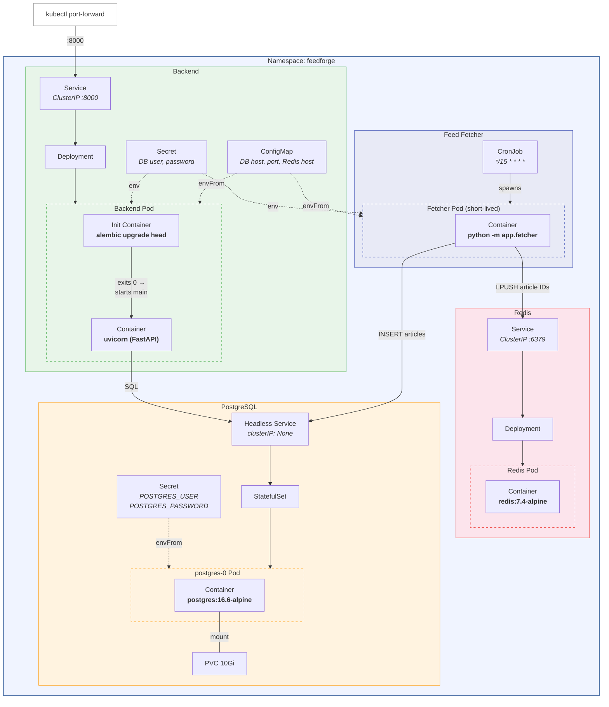

# Diagrams for Phase 2 Blog Post

Render these at https://mermaid.live and export as PNG.

## 1. Architecture Diagram (architecture.png)

```mermaid
graph TB
    subgraph ns["Namespace: feedforge"]
        subgraph fetcher_group["Feed Fetcher"]
            CJ["CronJob<br/><i>*/15 * * * *</i>"]
            subgraph fetchpod["Fetcher Pod (short-lived)"]
                FETCH["Container<br/><b>python -m app.fetcher</b>"]
            end
        end

        subgraph redis_group["Redis"]
            DEP_R["Deployment"]
            subgraph redispod["Redis Pod"]
                RD["Container<br/><b>redis:7.4-alpine</b>"]
            end
            SVC_R["Service<br/><i>ClusterIP :6379</i>"]
        end

        subgraph backend_group["Backend"]
            CM["ConfigMap<br/><i>DB host, port, Redis host</i>"]
            SEC2["Secret<br/><i>DB user, password</i>"]
            DEP_B["Deployment"]
            subgraph bepod["Backend Pod"]
                INIT["Init Container<br/><b>alembic upgrade head</b>"]
                APP["Container<br/><b>uvicorn (FastAPI)</b>"]
                INIT -->|"exits 0 →<br/>starts main"| APP
            end
            SVC_BE["Service<br/><i>ClusterIP :8000</i>"]
        end

        subgraph pg_group["PostgreSQL"]
            SEC1["Secret<br/><i>POSTGRES_USER<br/>POSTGRES_PASSWORD</i>"]
            SS["StatefulSet"]
            subgraph pgpod["postgres-0 Pod"]
                PG["Container<br/><b>postgres:16.6-alpine</b>"]
            end
            SVC_PG["Headless Service<br/><i>clusterIP: None</i>"]
            PVC["PVC 10Gi"]
        end
    end

    KPF["kubectl port-forward"]

    CJ -->|"spawns"| fetchpod
    FETCH -->|"INSERT articles"| SVC_PG
    FETCH -->|"LPUSH article IDs"| SVC_R
    SVC_R --> DEP_R
    DEP_R --> redispod

    CM -.->|"envFrom"| fetchpod
    SEC2 -.->|"env"| fetchpod
    CM -.->|"envFrom"| bepod
    SEC2 -.->|"env"| bepod

    KPF -->|":8000"| SVC_BE
    SVC_BE --> DEP_B
    DEP_B --> bepod
    APP -->|"SQL"| SVC_PG
    SVC_PG --> SS
    SS --> pgpod
    SEC1 -.->|"envFrom"| pgpod
    PG ---|"mount"| PVC

    style ns fill:#f0f4ff,stroke:#4a6fa5,stroke-width:2px
    style fetcher_group fill:#e8eaf6,stroke:#5c6bc0
    style redis_group fill:#fce4ec,stroke:#ef5350
    style backend_group fill:#e8f5e9,stroke:#66bb6a
    style pg_group fill:#fff3e0,stroke:#ffa726
    style fetchpod fill:#e8eaf6,stroke:#5c6bc0,stroke-dasharray:5
    style redispod fill:#fce4ec,stroke:#ef5350,stroke-dasharray:5
    style bepod fill:#e8f5e9,stroke:#66bb6a,stroke-dasharray:5
    style pgpod fill:#fff3e0,stroke:#ffa726,stroke-dasharray:5
    style KPF fill:#fff,stroke:#999
```
