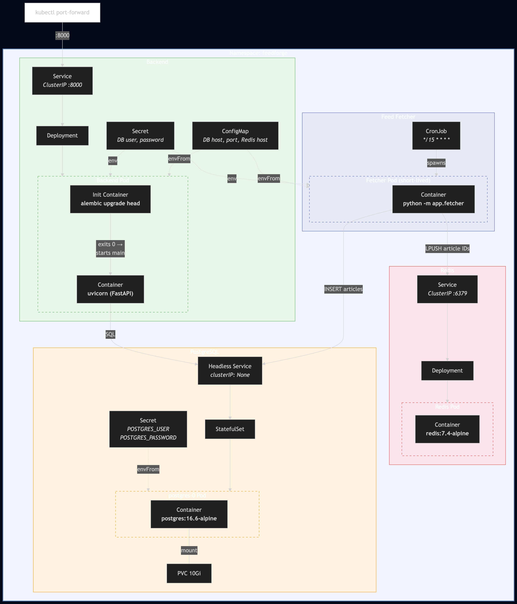

# CronJobs, Redis, and the Feed Pipeline: Phase 2 of Learning Kubernetes

*This is the fourth post in a series about learning Kubernetes by building FeedForge — an RSS feed aggregator on GKE. These posts are learning notes from someone figuring things out in real time. [Previous post here.](https://medium.com/@huchka)*

---

Phase 1 gave me a CRUD API — I could create feeds and articles, but nothing actually *fetched* anything. Phase 2 starts the async pipeline: feeds get fetched on a schedule, articles get inserted into PostgreSQL, and their IDs get queued in Redis for summarization later.

This post covers what I built, the Kubernetes concepts involved, and the design decisions behind the fetcher.

## What I Built

> Check out the [`phase-2` tag](https://github.com/huchka/feedforge/tree/phase-2) in the FeedForge repo for the full source code at this point — manifests, fetcher script, and Terraform configs.

- A **Redis** Deployment + ClusterIP Service as a lightweight message queue
- A **feed fetcher** script (`app/fetcher.py`) that parses RSS/Atom feeds, inserts new articles into PostgreSQL, and pushes article IDs into a Redis list
- A **CronJob** that runs the fetcher every 15 minutes
- Image bumped to `0.2.0`



## K8s Concepts That Mattered

### CronJob: Run Something on a Schedule, Then Stop

In Phase 1, the backend runs as a Deployment — it's always on. The feed fetcher is different: it does its work and exits. A CronJob creates a Job on a cron schedule (`*/15 * * * *`), and that Job runs a short-lived pod that terminates when the script finishes.

One required gotcha: for Jobs and CronJobs, `restartPolicy` should be `Never` or `OnFailure` — not `Always`. In this setup I used `Never`, and let the Job controller handle retries via `backoffLimit`.

### concurrencyPolicy: Forbid

What if a fetch takes longer than 15 minutes? Without this setting, the next scheduled run would start while the previous one is still going — potentially inserting duplicate articles or hammering the same feeds. `Forbid` tells Kubernetes to skip the next run if the previous one hasn't finished. Simple and safe.

### Job Safety Nets

Two settings that prevent runaway jobs:

- `backoffLimit: 2` — retry up to 2 times on failure, then give up
- `activeDeadlineSeconds: 300` — kill the job if it runs longer than 5 minutes, regardless of retries

Also `successfulJobsHistoryLimit: 3` and `failedJobsHistoryLimit: 3` — without these, completed Job objects pile up in `kubectl get jobs` output indefinitely.

### Redis Without Persistence

In Phase 1, PostgreSQL got a StatefulSet with a PersistentVolumeClaim — because losing your database is catastrophic. Redis here is just a Deployment with no persistent storage. If Redis restarts, the pending queue is gone.

That's mostly fine for this phase. PostgreSQL is the data of record; Redis is a transient buffer. If Redis restarts, any pending queue items are lost, and the next CronJob run only re-queues genuinely new articles it discovers. Already-inserted articles would need a separate reconciliation pass if I wanted guaranteed delivery. For a learning project, I was okay with that tradeoff. Adding a PVC to Redis would add complexity without solving the bigger reliability question.

### Same Image, Different Command

The CronJob reuses the same Docker image as the backend:

```yaml
image: .../feedforge/backend:0.2.0
command: ["python", "-m", "app.fetcher"]
```

Same image, different entrypoint. One build, one push, one version tag across both the API server and the fetcher. This is the same pattern as the init container from Phase 1 (which runs `alembic upgrade head` from the same image).

The tradeoff: the fetcher image carries FastAPI and uvicorn even though it never uses them. For now, build simplicity wins over image size.

### Probes Using exec

Redis doesn't have an HTTP endpoint, so the liveness and readiness probes use `exec` instead of `httpGet`:

```yaml
livenessProbe:
  exec:
    command: ["redis-cli", "ping"]
```

If `redis-cli ping` doesn't return `PONG`, the container is unhealthy. Readiness controls whether the Service routes traffic to the pod; liveness controls whether Kubernetes restarts it.

## The Fetcher Script

The fetcher (`app/fetcher.py`) is ~160 lines. A few design choices worth noting:

**Graceful Redis degradation.** If Redis is down, the fetcher still inserts articles into PostgreSQL — they just don't get queued for summarization. That means a Redis outage doesn't block data collection, but it can delay or lose summarization work until I add a reconciliation path for unsummarized articles.

```python
try:
    redis_client = get_redis()
    redis_client.ping()
except redis.RedisError:
    logger.warning("Redis unavailable — articles will be inserted but not queued")
    redis_client = None
```

**Savepoints for duplicate handling.** Each article insert is wrapped in `db.begin_nested()` (a SQL savepoint). If the URL already exists, the `IntegrityError` rolls back just that one insert without killing the entire transaction.

**Defensive truncation.** URLs get truncated to 2048 chars, titles to 1000. RSS feeds in the wild are messy — better to truncate than crash.

## Region Migration

I moved from `asia-northeast1` to `us-central1` across the Terraform configs. The reason was covered in [post #2](https://medium.com/@huchka) — GCP free trial resources are more reliably available in larger regions.

One thing I couldn't move: the Terraform state bucket in GCS. You can't change a GCS bucket's location after creation, so the state bucket stays in `asia-northeast1` while everything else runs in `us-central1`. Added a note in CLAUDE.md so future-me doesn't wonder why.

## Verification

```bash
# Trigger a manual run
$ kubectl create job --from=cronjob/feed-fetcher test-fetch

# Check the logs
$ kubectl logs job/test-fetch
Feed https://feeds.arstechnica.com/...: 20 new articles

# Verify Redis queue
$ kubectl exec deploy/redis -- redis-cli llen feedforge:articles:pending
40
```

20 articles from Ars Technica, each pushed to Redis twice (the feed was added twice during testing). Pipeline works.

## Things I Learned

### AI Memory Is Shorter Than You Think

In Phase 0, I realized Claude Code was running `kubectl` commands for me — which defeats the purpose when you're trying to learn Kubernetes. I stopped it and said "don't run kubectl, just give me the commands." It worked for that session.

Two phases later, it had completely forgotten. Phase 2 started and Claude was right back to running `kubectl apply`, `kubectl get pods`, the whole thing — fully automated, no pause. I had to stop it again.

The fix was obvious in hindsight: **put it in `CLAUDE.md`.** Session-level instructions don't survive across sessions. If a behavior matters long-term, it needs to be in the persistent config:

```markdown
- NEVER run `kubectl` commands — the user runs all K8s commands themselves (learning project).
- Provide the commands to run, but don't execute them.
```

This ties back to [post #1](https://medium.com/@huchka) where I set up CLAUDE.md. I configured communication style, safety rails for Terraform, commit conventions — but I missed this one because the verbal instruction "worked" at the time. The lesson: if you find yourself correcting your AI assistant twice for the same thing, it belongs in the config file, not in conversation.

### Redis as a Queue: The Simplest Possible Broker

The entire queue implementation is `LPUSH` to enqueue and (eventually) `RPOP` to dequeue. No topics, no consumer groups, no acknowledgments, no dead letter queue. Just a Redis list.

The tradeoff is real: if the summarizer crashes mid-processing, the article ID is gone from the queue with no automatic retry. For a learning project where re-fetching is cheap, this is the right level of complexity. In production, you'd want Redis Streams (which add consumer groups and acknowledgment) or a dedicated message broker.

Starting simple made it much easier to reason about the pipeline. I can always add delivery guarantees later if I need them.

## What's Next

Phase 2 isn't done — the fetcher fills the queue, but nothing consumes it yet. Next up: the summarizer worker that reads article IDs from Redis, fetches the content, calls an LLM API to generate summaries, and writes them back to PostgreSQL.

That brings a new K8s resource into the mix: a long-running worker Deployment that's neither a web server nor a scheduled job.

---

*This is part of a series where I build FeedForge, an RSS aggregator with AI summarization, to learn Kubernetes from the ground up. Each phase adds new K8s concepts while building a real application.*
