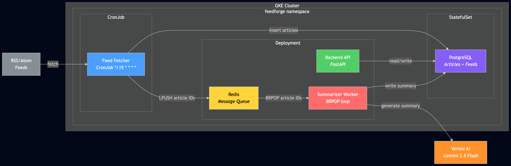

# Adding AI Summarization to Kubernetes: Vertex AI, Worker Deployments, and Reviewing AI with AI

*This is the fifth post in a series about learning Kubernetes by building FeedForge — an RSS feed aggregator with AI summarization on GKE. These posts are learning notes from someone figuring things out in real time. [Previous post here.](https://medium.com/@huchka)*

---

Last post I built the pipeline — a CronJob fetches RSS feeds every 15 minutes and pushes article IDs into a Redis queue. But nothing was consuming that queue. This post adds the brain: a long-running worker that pulls article IDs from Redis, sends the content to Google's Gemini 2.5 Flash via Vertex AI, and writes summaries back to PostgreSQL.

It also covers something I didn't expect to write about: using OpenAI's Codex to review blog post #4 before publishing, and how that review directly influenced the code in this post.

## What I Built

> Check out the [`phase-2-summarizer` tag](https://github.com/huchka/feedforge/tree/phase-2-summarizer) in the FeedForge repo for the full source code at this point.

- A **summarizer worker** (`app/summarizer.py`) — a long-running Deployment that consumes from Redis and calls Gemini
- **Vertex AI integration** — no API keys, using Application Default Credentials backed by the GKE node service account
- **IAM role grant** via Terraform — `roles/aiplatform.user` added to the node SA
- **Backfill logic** — on startup, re-queues any articles missing summaries
- Image bumped to `0.2.1`



## Worker Deployment vs CronJob

Post #4 introduced CronJobs: run a script on a schedule, then exit. The summarizer is the opposite pattern. It needs to stay alive, waiting for work.

The manifest looks similar to the backend Deployment, but there's no Service (nobody sends HTTP requests to this pod), no liveness probe (there's no endpoint to probe), and the `command` override tells it to run the summarizer instead of uvicorn:

```yaml
containers:
  - name: summarizer
    image: .../feedforge/backend:0.2.1
    command: ["python", "-m", "app.summarizer"]
```

Same image serving three roles now: API server, feed fetcher, and summarizer. One build, one push, three different entrypoints.

### BRPOP: The Simplest Consumer Loop

The worker's main loop is a single Redis call:

```python
while not _shutdown:
    result = redis_client.brpop(QUEUE_KEY, timeout=30)
    if result is None:
        continue  # timeout, loop again
    _, article_id = result
    process_one(article_id, db, client)
```

`BRPOP` blocks until an item appears in the list or the timeout expires. No polling, no sleep, no framework. When there's nothing to do, it waits. When an article arrives, it processes immediately. The 30-second timeout lets the loop check the `_shutdown` flag periodically for graceful termination.

### Graceful Shutdown

When Kubernetes sends `SIGTERM` (during scaling, rolling updates, or node draining), the worker needs to finish its current summarization before exiting — not die mid-API-call:

```python
_shutdown = False

def _handle_signal(signum, frame):
    global _shutdown
    _shutdown = True
```

The manifest sets `terminationGracePeriodSeconds: 45`, giving the worker up to 45 seconds to wrap up after receiving the signal. The BRPOP timeout is 30 seconds, so if the process is idle in `BRPOP` when `SIGTERM` arrives, it will wake up within 30 seconds, check `_shutdown`, and exit cleanly. That's different from being mid-request to Vertex AI or mid-database write, where the runtime depends on whatever operation is already in flight.

## Authenticating to GCP from GKE — No API Keys

This was the part I expected to be complicated. It wasn't.

In this setup, the pod gets Google credentials through Application Default Credentials backed by the GKE node service account. If that service account has the right IAM roles, the code can call GCP APIs with no explicit credential handling. The Vertex AI SDK picks up the credentials automatically.

The Terraform change was one line:

```hcl
gke_node_roles = [
  "roles/logging.logWriter",
  "roles/monitoring.metricWriter",
  "roles/monitoring.viewer",
  "roles/artifactregistry.reader",
  "roles/storage.objectViewer",
  "roles/aiplatform.user",       # <-- new
]
```

And the Python client initialization:

```python
from google import genai

client = genai.Client(
    vertexai=True,
    project=settings.gcp_project_id,
    location=settings.gcp_location,
)
```

No API key, no secret mount, no credentials file in the pod spec. The `google-genai` SDK uses the ambient credentials available to the workload. Compare this to the typical pattern of creating a Kubernetes Secret with an API key, mounting it as an environment variable, and rotating it manually. IAM is cleaner and more secure because you avoid managing a long-lived API key as an application secret.

The tradeoff: it couples you to GCP. If I wanted to run this outside GKE, I'd need a different ADC source or another auth setup. For a GKE learning project, that's fine.

## The Backfill Fix

Post #4 acknowledged a reliability gap: if Redis is down when the fetcher runs, articles get inserted into PostgreSQL but never queued for summarization. The fetcher skips duplicates on the next run (URL uniqueness), so those articles just silently miss the summarization pipeline.

The summarizer fixes this on startup:

```python
def backfill_unsummarized(db, redis_client):
    stmt = select(Article.id).where(Article.summary.is_(None))
    article_ids = list(db.scalars(stmt).all())
    for aid in article_ids:
        redis_client.lpush(QUEUE_KEY, str(aid))
```

Every time the summarizer starts (or restarts), it queries for articles with `summary IS NULL` and pushes them back into the queue. This covers common missed-queue cases like Redis being unavailable during enqueueing, summarizer restarts, or other startup-recoverable scenarios where articles slip through without summaries.

It's not perfect — if the summarizer is running and Redis dies mid-operation, it won't backfill until the next restart. But it's a simple fix that closes the most common gap.

## Using Codex to Review Technical Writing

Before publishing post #4, I ran it through OpenAI's Codex for a technical review. I pointed it at the draft and asked it to check for factual accuracy.

It found three real issues:

**1. A factual K8s error.** I wrote that `restartPolicy` "must be Never, not Always" and explained what `Always` does. The problem: `Always` isn't even a valid option for Jobs and CronJobs. The valid values are `Never` and `OnFailure`. Codex caught a mistake I would've published confidently.

**2. An incomplete reliability claim.** I wrote that if Redis restarts, the next CronJob run would re-queue the articles. Codex pointed out that's wrong — the fetcher only queues *newly inserted* articles, and duplicates are skipped. Already-inserted articles would never be re-queued. This is exactly the gap that the backfill logic in this post addresses.

**3. An imprecise K8s explanation.** I wrote "A CronJob spawns a short-lived pod." Technically, a CronJob creates a Job, and the Job creates the pod. For a blog explicitly teaching K8s concepts, that precision matters.

Codex updated the draft, and the fixes landed before publication.

What I find interesting is the workflow that's emerging: I build with Claude Code, write about it, then review with Codex. Each AI has a different context — Claude sees the code, Codex sees the prose — and the review step catches blind spots that neither I nor the coding AI noticed during implementation. Finding #2 is the best example: Claude and I both described the Redis recovery wrong in the blog, but the actual summarizer code (written in the same session) contains the fix. The knowledge was there — it just didn't make it into the writing accurately.

## Things I Learned

### IAM Beats Secrets for GCP Services

If you're already on GKE, service account roles are almost always cleaner than managing API key secrets. No rotation, no mount paths, no risk of logging a credential. The downside is portability — this only works on GCP. But for GCP-native workloads, it's the right default.

### One Image, Many Roles Has Limits

Three entrypoints from one Docker image is convenient — one build pipeline, one version tag, guaranteed consistency. But the image now carries `feedparser` (only used by the fetcher) and `google-genai` (only used by the summarizer) and `uvicorn` (only used by the API). At some point the image bloat or startup time might justify splitting. Not yet, but I can see it coming.

### AI Reviewing AI Is Becoming Part of My Workflow

I didn't plan this as a process — it just happened. Build with one AI, write about it, review with another. The fact that they have different contexts (codebase vs. prose) makes the review genuinely useful, not just a rubber stamp. Finding real factual errors in a blog post before publishing is worth the extra step.

## What's Next

Phase 2 is complete — the full async pipeline works end-to-end. Feeds get fetched on a schedule, articles get summarized by Gemini, and everything lands in PostgreSQL.

Phase 3 adds the user-facing layer: a React frontend, Ingress for path-based routing, and CI/CD with Cloud Build. That's where FeedForge stops being a collection of backend services and starts looking like an actual application.

---

*This is part of a series where I build FeedForge, an RSS aggregator with AI summarization, to learn Kubernetes from the ground up. Each phase adds new K8s concepts while building a real application.*
