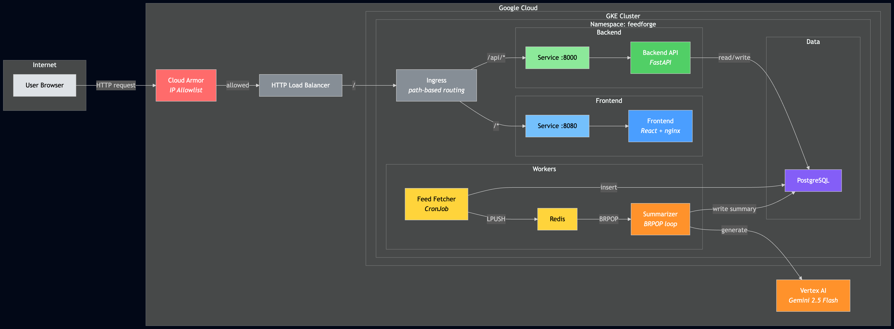
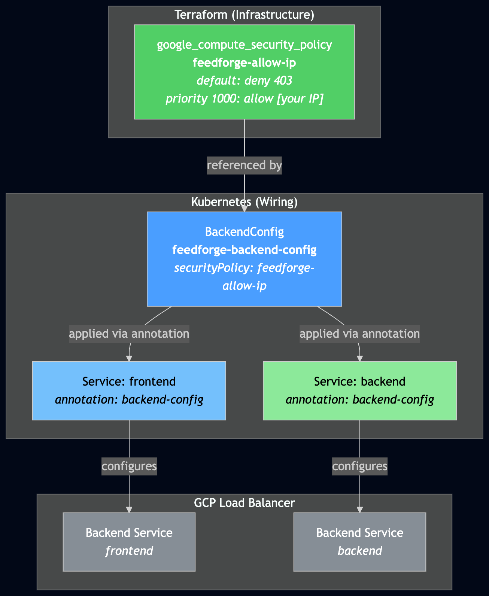

# GKE Ingress Gotchas and Locking It Down with Cloud Armor

*This is the sixth post in a series about learning Kubernetes by building FeedForge — an RSS feed aggregator with AI summarization on GKE. These posts are learning notes from someone figuring things out in real time. [Previous post here.](https://medium.com/@huchka)*

---

Phase 3 is about making FeedForge a real web application — a React frontend, a single external IP to reach everything, and not leaving it wide open to the internet. This post covers the Ingress setup and everything that went wrong along the way, plus locking it down with Cloud Armor.

The frontend itself was straightforward (React + Vite + Tailwind, served from nginx). The Ingress was where I spent most of my time debugging.

## What I Built

> Check out the [`phase-3` tag](https://github.com/huchka/feedforge/tree/phase-3) in the FeedForge repo for the full source code at this point.

- A **React frontend** (Vite + TypeScript + Tailwind) with article list, feed management, and AI summary display
- **GCE Ingress** with path-based routing — `/` to the frontend, `/api` to the backend
- **Cloud Armor** IP restriction via a Terraform module and K8s BackendConfig
- **kustomize overlays** for environment-specific configuration
- Backend additions: CORS middleware, PATCH endpoint for article read/favorite toggle



## Gotcha #1: `ingressClassName` vs the Annotation

Kubernetes has two ways to declare the ingress class, but GKE's Ingress controller still relies on the annotation:

```yaml
# The "modern" way (spec field)
spec:
  ingressClassName: gce

# The "deprecated" way (annotation)
metadata:
  annotations:
    kubernetes.io/ingress.class: "gce"
```

I started with the annotation. kubectl warned me it was deprecated and to use `spec.ingressClassName` instead. So I switched. The Ingress was created, but nothing happened — no events, no load balancer, no IP address. For ten minutes, nothing:

```
$ kubectl describe ingress feedforge-ingress
Events:       <none>
```

The GKE ingress-gce controller simply ignored it. The reason: GKE's Ingress controller still keys off the `kubernetes.io/ingress.class` annotation. When that annotation is absent and only `spec.ingressClassName` is set, the controller takes no action. It doesn't fall back to checking the spec field.

I tried creating an `IngressClass` resource manually, thinking that might bridge the gap. It didn't help — the controller still wasn't processing the Ingress. I switched back to the annotation and it worked immediately. Events appeared within seconds.

The deprecation warning is cosmetic on GKE. The annotation is still what the controller actually relies on.

## Gotcha #2: NEG Timing — Order of Operations Matters

I wanted container-native load balancing via Network Endpoint Groups (NEGs). NEGs route traffic directly from the load balancer to pod IPs, skipping the node-level iptables hop. The setup is an annotation on the Service:

```yaml
metadata:
  annotations:
    cloud.google.com/neg: '{"ingress": true}'
```

Here's where the chronology matters. I had already created the Ingress in an earlier attempt — before the NEG annotations were on the Services. I then added the annotations and re-applied, expecting the controller to pick them up. It didn't. Backends came up as `UNHEALTHY`. I checked for NEGs:

```
$ gcloud compute network-endpoint-groups list
Listed 0 items.

$ gcloud compute backend-services list
Listed 0 items.

$ gcloud compute health-checks list
Listed 0 items.
```

Nothing. No NEGs, no backend services, no health checks. But the Ingress `describe` showed backends with a `k8s1-` prefix — that's instance group mode, not NEG.

What happened: the controller had already chosen instance group mode when the Ingress was first created (before the NEG annotations existed). Adding the annotations afterward didn't trigger a switch to NEG mode.

In the instance group path, the load balancer expected to reach pods via NodePorts. But my Services were `ClusterIP` — the intended setup was ClusterIP + NEG, not ClusterIP + instance groups. Without NodePorts to route through, the health checks had no path to the pods, so everything was `UNHEALTHY`.

The fix was delete and recreate:

```bash
kubectl delete ingress feedforge-ingress -n feedforge
kubectl apply -k k8s/overlays/dev/
```

**The lesson: NEG annotations must be on the Services before the Ingress resource is created.** If you add them after, delete and recreate the Ingress.

## Gotcha #3: Ingress Creates a Full Cloud Load Balancer (and It Costs Money)

This one caught me off guard. A Kubernetes Ingress resource is a few lines of YAML — but on GKE, applying it triggers the creation of a full Google Cloud HTTP Load Balancer. That means a forwarding rule, a target proxy, a URL map, backend services, health checks, and NEGs. These are real GCP resources that show up in the Cloud Console and start billing immediately.

The load balancer adds roughly **~$18/month** — a forwarding rule alone is ~$0.025/hour. For a learning project already running at ~$55/month on GKE, that's a meaningful jump. If you're on free trial credits, keep an eye on it.

You can tear it down when not testing:

```bash
kubectl delete ingress feedforge-ingress -n feedforge
```

This deletes the Ingress resource and GKE cleans up all the associated LB infrastructure. Re-apply when you need it again. Just remember Gotcha #2 — make sure your Service annotations are in place before recreating.

## The Debugging Path

For anyone hitting similar issues, here's the diagnostic sequence that actually helped:

**1. Check the Ingress events and backend status:**

```bash
kubectl describe ingress <name> -n <namespace>
```

Look at two things: the `Events` section (are there any?) and the `ingress.kubernetes.io/backends` annotation. `HEALTHY` vs `UNHEALTHY` tells you if the health checks are passing. The backend name prefix tells you the mode — `k8s1-` is instance groups, `k8s-be-` is NEG.

**2. If no events at all**, the controller isn't processing your Ingress. Check the ingress class declaration.

**3. If backends are UNHEALTHY**, check what the load balancer is actually probing:

```bash
gcloud compute health-checks list --project=<project>
gcloud compute backend-services list --project=<project>
gcloud compute network-endpoint-groups list --project=<project>
```

If these return empty, the LB infrastructure isn't fully provisioned. Check whether NEG mode activated (if you expected it) and whether your Services are the right type for the mode you're in.

**4. If the LB exists but `curl` returns connection reset**, the backends might have just turned healthy. The load balancer needs another minute or two after backends go `HEALTHY` before it actually starts serving traffic.

## Locking It Down with Cloud Armor

Once the Ingress was working, I had a publicly accessible application. For a learning project with a database behind it, that's not great. Cloud Armor provides IP-based access control at the load balancer level — traffic gets blocked before it ever reaches the cluster.

### The Setup

The Cloud Armor policy itself lives in Terraform — a `google_compute_security_policy` resource with a default-deny rule and an allow rule for whitelisted CIDRs. It's a small module; the full source is in the [repo](https://github.com/huchka/feedforge/tree/phase-3/terraform/modules/cloud-armor). The interesting part is how it connects to Kubernetes.



### Wiring It to Kubernetes

The Cloud Armor policy exists in GCP. To attach it to the Ingress backends, you need a `BackendConfig` resource — a GKE-specific CRD that configures load balancer behavior per Service:

```yaml
apiVersion: cloud.google.com/v1
kind: BackendConfig
metadata:
  name: feedforge-backend-config
  namespace: feedforge
spec:
  securityPolicy:
    name: feedforge-allow-ip
```

Then each Service references it via annotation:

```yaml
metadata:
  annotations:
    cloud.google.com/backend-config: '{"default": "feedforge-backend-config"}'
```

After applying, both the frontend and backend load balancer backends enforce the same IP allowlist. The policy propagates within a couple of minutes.

### Why Not a NetworkPolicy?

NetworkPolicy is the Kubernetes-native way to restrict traffic. But it operates at the pod level — traffic has already entered the cluster. Cloud Armor operates at the load balancer level — unwanted traffic never reaches the cluster at all. For internet-facing IP allowlists, Cloud Armor is the right edge-layer tool. NetworkPolicy is complementary — better suited for in-cluster traffic control like restricting which pods can reach the database. Both are on the roadmap; NetworkPolicy comes in Phase 4.

## kustomize Overlays

This phase also introduced kustomize overlays — a way to apply environment-specific patches on top of a shared base.

```
k8s/
├── base/           # All manifests — the shared foundation
└── overlays/
    └── dev/        # Patches specific to dev
        ├── kustomization.yaml
        └── patches/
            └── backend-config-patch.yaml
```

The base contains everything. The dev overlay references the base and patches what differs:

```yaml
# k8s/overlays/dev/kustomization.yaml
resources:
  - ../../base
patches:
  - path: patches/backend-config-patch.yaml
```

Right now the dev overlay just sets `FEEDFORGE_DEBUG: "true"` on the backend ConfigMap. It's a small change, but the pattern matters — the same structure supports staging and production overlays that patch replica counts, resource limits, image tags, or secrets references. Deploy with:

```bash
kubectl apply -k k8s/overlays/dev/
```

## Things I Learned

### NEG Mode Is Decided at Ingress Creation Time

The GCE Ingress controller decides whether to use NEG or instance group backends when it first processes the Ingress. That specific decision doesn't get revisited — if the NEG annotations aren't on the Services at that moment, you're locked into instance group mode. Other settings like BackendConfig and health checks do get reconciled after creation through supported config paths, but the NEG-vs-instance-group choice is a one-shot decision. If you get it wrong, delete and recreate the Ingress.

### Deprecation Warnings Aren't Always Actionable

kubectl told me `kubernetes.io/ingress.class` was deprecated. But on GKE Ingress, the controller still keys off that annotation, so the "replacement" (`spec.ingressClassName`) wasn't actually a drop-in replacement here. Sometimes the "old way" is still the only reliable way, and a warning is just a warning.

### Cloud Armor + BackendConfig Is GKE's Answer to "Who Can Access This?"

The mental model: Terraform creates the policy (infrastructure), BackendConfig references it (Kubernetes-side wiring), and the Service annotation connects them. Three layers for what's conceptually "only my IP can access this." It's more ceremony than a simple firewall rule, but each layer has a clear owner — infra team manages the policy, platform team configures the BackendConfig, app team annotates their Services.

## What's Next

Phase 3 still has CI/CD left — Cloud Build pipeline, skaffold for local dev, and rolling update strategy on the Deployments. That's the next post. After that, Phase 4 gets into the advanced K8s concepts: HPA, NetworkPolicy, SecurityContext, and daily digest notifications.

---

*This is part of a series where I build FeedForge, an RSS aggregator with AI summarization, to learn Kubernetes from the ground up. Each phase adds new K8s concepts while building a real application.*
