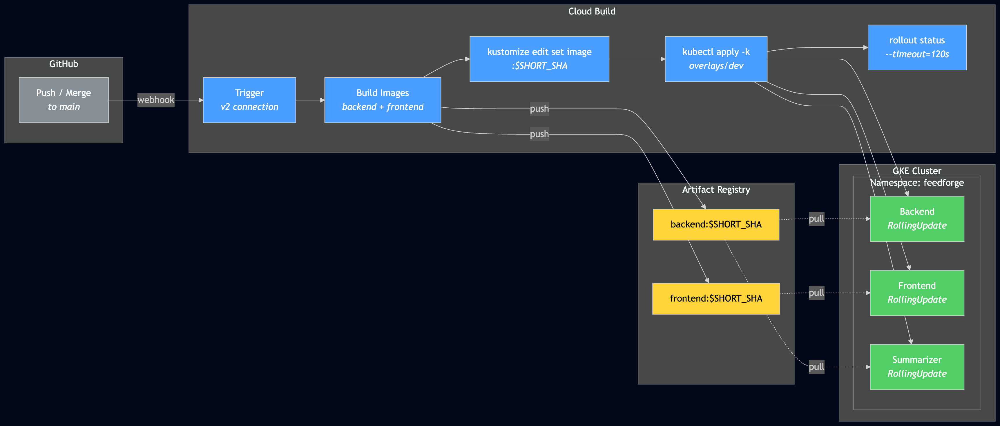

# From `git push` to Running Pods: Setting Up CI/CD on GKE with Cloud Build

*This is the seventh post in a series about learning Kubernetes by building FeedForge — an RSS feed aggregator with AI summarization on GKE. These posts are learning notes from someone figuring things out in real time. [Previous post here.](https://medium.com/@huchka)*

---

At this point FeedForge had a React frontend, an API backend, a summarizer worker, Ingress with Cloud Armor, and kustomize overlays. Everything worked. But every deployment was me running `kubectl apply -k` from my laptop. That meant remembering which image tag to use, hoping I had the right context, and trusting myself not to fat-finger a rollback.

This post covers wiring up a real CI/CD pipeline — Cloud Build triggers on merge to main, builds the images, pushes them to Artifact Registry, and deploys to GKE. No manual `kubectl apply` for deploys. Also: rolling update strategy on every Deployment, and Skaffold for local dev.

## What I Built

> Check out the [`phase-3-cicd` tag](https://github.com/huchka/feedforge/tree/phase-3-cicd) in the FeedForge repo for the full source code at this point.

- A **Cloud Build pipeline** (`cloudbuild.yaml`) that builds, pushes, and deploys on every merge to main
- A **Cloud Build v2 trigger** managed in Terraform with a user-managed service account
- **Rolling update strategy** (`maxUnavailable: 0`, `maxSurge: 1`) on backend, frontend, and summarizer Deployments
- **Skaffold** configuration for local development with the same kustomize-based deploy path



## The Pipeline: What Happens After `git push`

The pipeline lives in `cloudbuild.yaml` at the repo root. Five logical steps:

**1. Build both images** — backend and frontend, tagged with `$SHORT_SHA` (the first 7 characters of the commit hash):

```yaml
- name: 'gcr.io/cloud-builders/docker'
  args:
    - 'build'
    - '-t'
    - 'us-central1-docker.pkg.dev/$PROJECT_ID/feedforge/backend:$SHORT_SHA'
    - './backend'
```

Same pattern for frontend. The `$SHORT_SHA` tag is the key design choice here — every image is immutably tied to a specific commit. No `latest` tag ambiguity, no wondering which version is running. You see `backend:0c63ea9` in the cluster and can `git show 0c63ea9` to see exactly what's deployed.

**2. Push both images** to Artifact Registry.

**3. Get GKE credentials** so kubectl works inside Cloud Build:

```bash
gcloud container clusters get-credentials feedforge-cluster \
  --zone us-central1-f --project $PROJECT_ID
```

**4. Patch image tags and apply** — this is where kustomize comes in:

```bash
cd k8s/overlays/dev
kustomize edit set image \
  .../backend=.../backend:$SHORT_SHA \
  .../frontend=.../frontend:$SHORT_SHA
kubectl apply -k .
```

`kustomize edit set image` rewrites the image references in the kustomization.yaml *inside the Cloud Build workspace* — it patches the tags to the current commit SHA before applying. Those edits are local to the build workspace and are never committed back to the repo.

**5. Wait for rollouts** to confirm the deploy actually landed:

```bash
kubectl -n feedforge rollout status deployment/backend --timeout=120s
kubectl -n feedforge rollout status deployment/frontend --timeout=120s
kubectl -n feedforge rollout status deployment/summarizer --timeout=120s
```

If any Deployment fails to roll out within 120 seconds, the build fails. You get a red build instead of a silently broken cluster.

## Cloud Build v2 Triggers: The Part Nobody Warns You About

This is where I spent the most time debugging.

### Attempt 1: The Legacy `github` Block

The Terraform `google_cloudbuild_trigger` resource has a `github` block that looks straightforward:

```hcl
github {
  owner = "huchka"
  name  = "feedforge"
  push {
    branch = "^main$"
  }
}
```

Applied it. Got:

```
Error: Error creating Trigger: googleapi: Error 400:
Request contains an invalid argument.
```

No further detail. Just "invalid argument." I verified the Cloud Build GitHub App was installed on GitHub, confirmed the repo name was correct, tried `location = "global"` instead of regional — same error every time.

### The Problem: v1 vs v2 Are Different APIs

When you connect a GitHub repo through the GCP Console (Cloud Build → Repositories → Link Repository), you're creating a **v2 connection**. The `github` block in Terraform is a **v1 construct** — it expects the legacy Cloud Build GitHub App connection, which is a different integration path.

You can verify which one you have:

```bash
# v2 connections show up here
gcloud builds connections list --region=us-central1

# v1 would show up... nowhere obvious in CLI
```

If `gcloud builds connections list` returns your connection, you're on v2 and the `github` block won't work.

### Attempt 2: Switch to `repository_event_config`

The v2 equivalent uses `repository_event_config` with a fully qualified repository reference:

```hcl
resource "google_cloudbuild_trigger" "deploy" {
  name     = "feedforge-deploy"
  location = var.region

  repository_event_config {
    repository = "projects/${var.project_id}/locations/${var.region}/connections/${var.connection_name}/repositories/${var.repository_name}"
    push {
      branch = "^main$"
    }
  }

  service_account = "projects/${var.project_id}/serviceAccounts/${var.service_account_email}"
  filename        = "cloudbuild.yaml"
}
```

That long `repository` path references the v2 connection and linked repository by their full resource names. Applied it — trigger created successfully.

### Why You Need a User-Managed Service Account

Notice the explicit `service_account` field. My first attempt omitted it, expecting Cloud Build to use its default service account (`{project-number}@cloudbuild.gserviceaccount.com`). That failed too — v2 triggers require an explicit service account.

The fix was creating a dedicated SA in Terraform with exactly the permissions Cloud Build needs:

```hcl
resource "google_service_account" "cloud_build" {
  account_id   = "feedforge-cloud-build"
  display_name = "FeedForge Cloud Build Service Account"
}

locals {
  cloud_build_roles = [
    "roles/container.developer",     # deploy to GKE
    "roles/artifactregistry.writer", # push images
    "roles/logging.logWriter",       # write build logs
  ]
}

resource "google_project_iam_member" "cloud_build_roles" {
  for_each = toset(local.cloud_build_roles)
  role     = each.value
  member   = "serviceAccount:${google_service_account.cloud_build.email}"
}
```

Three roles, nothing more. `container.developer` lets Cloud Build run kubectl against the cluster. `artifactregistry.writer` lets it push images. `logging.logWriter` lets it write build logs. Least-privilege, explicitly declared.

## Rolling Updates: Zero-Downtime with One Replica

Every Deployment now has a rolling update strategy:

```yaml
spec:
  replicas: 1
  strategy:
    type: RollingUpdate
    rollingUpdate:
      maxUnavailable: 0
      maxSurge: 1
```

Here's what actually happens during a deploy with `replicas: 1`:

1. Kubernetes creates a **new pod** with the updated image (surge = 1, so briefly two pods exist)
2. The new pod runs its init container (for backend, that's `alembic upgrade head` — DB migrations)
3. The new pod must pass its **readiness probe** before it receives traffic
4. Once the new pod is ready, the **old pod is terminated** (maxUnavailable = 0 means the old pod stays up until the new one is ready)

The result: a much lower risk of deploy-time downtime, even with a single replica. If the new image is broken — crash loop, failed health check, or some other startup failure — the old pod keeps serving traffic and the rollout halts. You get a failed build instead of an immediate outage.

That said, this is not a hard zero-downtime guarantee. The backend runs DB migrations in an init container before the new pod becomes ready, so a backward-incompatible schema change could still break the old pod even if Kubernetes keeps it running until the replacement passes readiness.

The tradeoff: with `replicas: 1` and `maxSurge: 1`, you're briefly running two pods during every deploy. For a learning project on a small node pool, this is fine. At scale with many replicas, you'd tune these numbers differently.

## Skaffold for Local Dev

Cloud Build handles production deploys. For local development, Skaffold provides the same build-and-deploy loop without pushing to GitHub:

```yaml
apiVersion: skaffold/v4beta11
kind: Config
metadata:
  name: feedforge
build:
  artifacts:
    - image: us-central1-docker.pkg.dev/.../backend
      context: backend
    - image: us-central1-docker.pkg.dev/.../frontend
      context: frontend
deploy:
  kustomize:
    paths:
      - k8s/overlays/dev
portForward:
  - resourceType: service
    resourceName: backend
    namespace: feedforge
    port: 8000
    localPort: 8000
  - resourceType: service
    resourceName: frontend
    namespace: feedforge
    port: 80
    localPort: 8080
```

`skaffold dev` watches for file changes, rebuilds the image, pushes it to Artifact Registry for this remote-GKE setup, and redeploys via kustomize — same path as Cloud Build but triggered locally. It also sets up port forwarding so you can hit `localhost:8000` and `localhost:8080` directly.

The key insight: Skaffold and Cloud Build share the same deploy mechanism (kustomize overlay). The difference is just what triggers the build — a file change vs a git push.

## Verifying It Works

After merging the PR to main, I watched it happen end-to-end:

```bash
$ gcloud builds list --limit=1 --region=us-central1
ID          CREATE_TIME               STATUS
50b637e1    2026-03-26T10:45:39+00:00 SUCCESS
```

Then checked the cluster:

```bash
$ kubectl get pods -n feedforge -o \
  jsonpath='{range .items[*]}{.metadata.name}: {.spec.containers[0].image}{"\n"}{end}'

backend-5d9d7dd5fd-fbpk4: .../backend:0c63ea9
frontend-664f8669bb-w96tm: .../frontend:0c63ea9
summarizer-58ffcc9478-stxr4: .../backend:0c63ea9
```

All three Deployments running with the merge commit SHA. The summarizer uses the backend image (same codebase, different entrypoint) — so both show `:0c63ea9`. No manual intervention. Merge the PR, wait a few minutes, pods are updated.

## Things I Learned

### Cloud Build v1 and v2 Are Basically Different Products

The documentation doesn't emphasize this enough. The Terraform resources look similar, but the `github` block and `repository_event_config` target different integration models and aren't interchangeable. If you connected your repo through the GCP Console, you're on v2 — and the `github` block won't work. The error message ("invalid argument") gives you zero indication of this.

### Image Tags Should Be Immutable

Using `$SHORT_SHA` as the image tag means every commit produces a uniquely tagged image. You can always trace a running pod back to the exact commit. Compare this to `:latest` — which tells you nothing about what's actually deployed. The downside: your Artifact Registry accumulates images over time. A lifecycle policy or scheduled cleanup is worth adding eventually.

### The Pipeline Owns the Image Tags Now

After setting up CI/CD, the base manifests in the repo still reference old hardcoded tags (`backend:0.2.1`, `summarizer:0.2.1`, `frontend:0.3.0`). Cloud Build patches them to `$SHORT_SHA` during the deploy step, but that patch happens only in the Cloud Build workspace — it's never committed back. This means if you run `kubectl apply -k k8s/overlays/dev/` from your laptop, you'd accidentally roll back to those pinned tags. The pipeline is the source of truth for what's deployed, not the manifests on disk.

This tripped me up at first — it felt like I'd lost the ability to quickly iterate on manifests locally. Want to add a new ConfigMap? Test a resource limit change? Going through commit, push, and merge just to see the result in the cluster felt like too much friction for dev.

Then I realized: Skaffold is the answer. `skaffold dev` does its own image tagging (SHA-based, same idea as Cloud Build), builds and pushes the images, patches the kustomize overlay, and deploys — all without touching the stale tags in the base manifests. It's the same kustomize deploy path Cloud Build uses, just triggered locally instead of by a git push.

So the workflow landed here: **`skaffold dev` for local iteration, Cloud Build for production deploys via merge to main.** Manual `kubectl apply -k` is effectively off the table now — both tools handle the image tagging that makes it dangerous to do by hand.

### v2 Triggers Require Explicit Service Accounts

The default Cloud Build SA doesn't work with v2 triggers. You must create a dedicated service account and pass it to the trigger. This is actually a good thing — it forces least-privilege from the start. But the error when you forget is the same useless "invalid argument" with no hint about what's missing.

### `rollout status` in the Pipeline Is Non-Negotiable

Without the `rollout status` step, Cloud Build would report `SUCCESS` the moment `kubectl apply` returns — which is almost immediately, before Kubernetes even starts pulling the new image. The rollout could fail silently. Adding `rollout status --timeout=120s` makes the build wait for the actual deploy to complete and fail loudly if it doesn't.

## What's Next

Phase 3 is complete. Phase 4 gets into the operational side of running workloads: Horizontal Pod Autoscaler, resource requests and limits tuning, NetworkPolicy for in-cluster traffic control, and SecurityContext for pod-level security. The cluster works — now it's time to make it production-hardened.

---

*This is part of a series where I build FeedForge, an RSS aggregator with AI summarization, to learn Kubernetes from the ground up. Each phase adds new K8s concepts while building a real application.*
