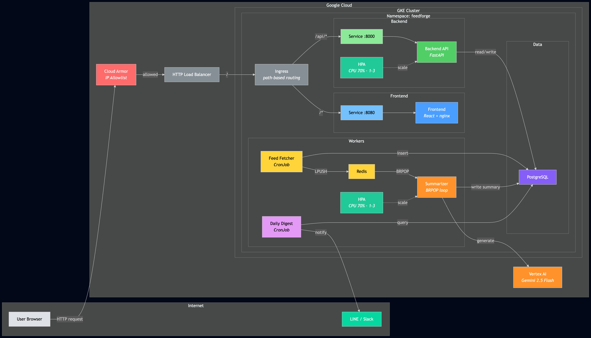
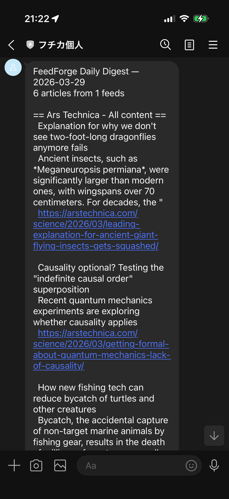

# CronJobs, HPA, and the Limits of CPU Scaling: Phase 4 of Learning Kubernetes

*This is the eighth post in a series about learning Kubernetes by building FeedForge — an RSS feed aggregator with AI summarization on GKE. These posts are learning notes from someone figuring things out in real time. [Previous post here.](https://medium.com/@huchka)*

---

Phase 3 gave FeedForge a CI/CD pipeline — merge to main, Cloud Build deploys to GKE, no more manual `kubectl apply`. But the system still had gaps: no scheduled notifications, no auto-scaling, and no easy way to see what the pipeline had actually produced.

This post covers making the cluster more self-operating: a CronJob that compiles a daily digest and sends it to my phone via LINE, HPA for the backend and summarizer, and the Skaffold changes needed to keep local development working. It also covers where CPU-based auto-scaling falls short, and why I'm keeping the imperfect config anyway.

## What I Built

> Check out the [`phase-4` tag](https://github.com/huchka/feedforge/tree/phase-4) in the FeedForge repo for the full source code at this point.

- A **daily digest CronJob** that queries recent summarized articles and sends a formatted notification via LINE or Slack
- **HorizontalPodAutoscaler** on the backend and summarizer Deployments
- **Skaffold config fix** for the v4beta11 schema and Apple Silicon cross-compilation
- A **notification secrets** pattern using optional `secretKeyRef`



## Skaffold: Fixing the Local Dev Loop

Before touching any new features, the Skaffold config needed fixing. Two issues surfaced when I tried to `skaffold run` to deploy to GKE from my Mac.

### The v4beta11 Schema Split

The previous Skaffold config had `kustomize.paths` nested under `deploy`. In `v4beta11`, Skaffold split manifest rendering from deployment into separate top-level keys. After the schema change, the old structure no longer produced the expected kustomized output — manifests were applied without the overlay transformations.

The fix:

```yaml
# Before (v4beta10 and earlier)
deploy:
  kustomize:
    paths:
      - k8s/overlays/dev

# After (v4beta11)
manifests:
  kustomize:
    paths:
      - k8s/overlays/dev
deploy:
  kubectl: {}
```

`manifests` now handles rendering (kustomize build), and `deploy` handles applying (kubectl apply). You need both. The `deploy.kubectl: {}` is required even though it's empty — without it, Skaffold doesn't know how to apply the rendered manifests.

### Apple Silicon Cross-Compilation

My Mac has an ARM chip. GKE runs amd64 nodes. Without telling Skaffold to cross-compile, the built images would contain ARM binaries that crash immediately on GKE with `exec format error`.

```yaml
build:
  platforms: ["linux/amd64"]
  artifacts:
    - image: .../backend
      context: backend
    - image: .../frontend
      context: frontend
```

One line: `platforms: ["linux/amd64"]`. Docker buildx handles the cross-compilation under the hood. This wasn't an issue when Cloud Build was doing the building (Cloud Build runs on amd64), but for local builds pushed to a remote cluster, the platform mismatch bites you.

### What Skaffold Actually Does

In this project, Skaffold is the local counterpart to Cloud Build. Both follow the same path — build images, render manifests via kustomize, apply to the cluster. The difference is the trigger: `skaffold run` is manual from my laptop, while Cloud Build fires on merge to main.

The full Skaffold config after the fix:

```yaml
apiVersion: skaffold/v4beta11
kind: Config
metadata:
  name: feedforge
build:
  platforms: ["linux/amd64"]
  artifacts:
    - image: .../backend
      context: backend
    - image: .../frontend
      context: frontend
manifests:
  kustomize:
    paths:
      - k8s/overlays/dev
deploy:
  kubectl: {}
portForward:
  - resourceType: service
    resourceName: backend
    namespace: feedforge
    port: 8000
    localPort: 8000
```

`skaffold run` builds the images, pushes to Artifact Registry, renders the kustomize overlay, and applies to GKE. `skaffold dev` does the same but watches for file changes and re-deploys automatically. Port forwarding lets me hit `localhost:8000` against the remote cluster.

## CronJob: Sending a Daily Digest

### The Problem

FeedForge fetches RSS feeds, summarizes articles with Gemini, and stores everything in PostgreSQL. But the only way to see the results was by querying the API. I wanted a daily summary pushed to my phone: a digest of what had been processed in the last 24 hours.

### CronJob vs the Fetcher CronJob

Post #4 already introduced CronJobs for the feed fetcher. The digest CronJob follows the same pattern — scheduled, short-lived, run-to-completion — but with a different purpose. The fetcher produces data; the digest reports on it.

```yaml
apiVersion: batch/v1
kind: CronJob
metadata:
  name: daily-digest
  namespace: feedforge
spec:
  schedule: "30 23 * * *"
  concurrencyPolicy: Forbid
  successfulJobsHistoryLimit: 3
  failedJobsHistoryLimit: 3
  jobTemplate:
    spec:
      backoffLimit: 2
      activeDeadlineSeconds: 300
      template:
        spec:
          restartPolicy: Never
          containers:
            - name: digest
              image: .../backend:0.2.1
              command: ["python", "-m", "app.digest"]
```

The schedule is `30 23 * * *` — daily at 23:30 UTC. The fetcher runs every 15 minutes, so this is 30 minutes after its 23:00 UTC run and gives the summarizer time to process the final batch before the digest queries for results.

The safety nets are the same as the fetcher: `concurrencyPolicy: Forbid` prevents overlapping runs, `backoffLimit: 2` retries twice on failure, and `activeDeadlineSeconds: 300` kills the Job if it's still running after 5 minutes. For a job that's just a database query and an HTTP call, 5 minutes is generous — but it's a safety net, not a target.

### Same Image, Different Entrypoint (Again)

This is the fourth time this pattern shows up in FeedForge. The backend image now serves four purposes:

| Workload | Command | K8s Resource |
|---|---|---|
| API server | `uvicorn app.main:app` | Deployment |
| DB migrations | `alembic upgrade head` | Init container |
| Feed fetcher | `python -m app.fetcher` | CronJob |
| Daily digest | `python -m app.digest` | CronJob |

One image, one build, four entrypoints. The tradeoff hasn't changed from post #4: the digest container carries FastAPI, uvicorn, and the fetcher code even though it uses none of them. For a learning project, build simplicity wins over image size.

### Notification Credentials: Optional Secrets

The digest supports two providers — LINE and Slack. You only need credentials for the one you're using. The CronJob manifest handles that with `optional: true` on the secret keys:

```yaml
env:
  - name: FEEDFORGE_DIGEST_LINE_TOKEN
    valueFrom:
      secretKeyRef:
        name: notification-credentials
        key: LINE_CHANNEL_TOKEN
        optional: true
  - name: FEEDFORGE_DIGEST_LINE_USER_ID
    valueFrom:
      secretKeyRef:
        name: notification-credentials
        key: LINE_USER_ID
        optional: true
```

Without `optional: true`, the container would fail to start if any referenced Secret key is missing — even if you're using Slack and don't need the LINE keys. With it, missing keys are silently skipped, and the Python code validates that the required keys for the chosen provider are actually present.

The Secret itself is committed as an `.example` file with placeholder values. The real Secret is applied manually and never checked into git.

### The Digest Script

The Python side is straightforward — query, format, send:

```python
def get_recent_articles(db) -> list[Article]:
    cutoff = datetime.now(UTC) - timedelta(hours=settings.digest_lookback_hours)
    stmt = (
        select(Article)
        .options(joinedload(Article.feed))
        .where(Article.fetched_at >= cutoff)
        .where(Article.summary.is_not(None))
        .order_by(Article.feed_id, Article.published_at.desc())
    )
    return list(db.scalars(stmt).unique().all())
```

The query filters for articles with non-null summaries fetched within the last 24 hours (configurable via `FEEDFORGE_DIGEST_LOOKBACK_HOURS`). `joinedload` eager-loads the feed relationship to avoid N+1 queries when formatting.

Provider dispatch uses a dict lookup:

```python
PROVIDERS = {"slack": _send_slack, "line": _send_line}
```

Adding a new provider is one function plus one dict entry. No long if/else chain, no extra abstraction.

One practical detail: LINE's Messaging API has a 5000-character limit per text message. The digest truncates at the last newline boundary before the limit so messages don't get cut mid-sentence:

```python
if len(text) > LINE_TEXT_LIMIT:
    truncated_at = text.rfind("\n", 0, LINE_TEXT_LIMIT - 60)
    text = text[:truncated_at] + "\n\n... (truncated, see app for full list)"
```

### Result

Here's what the digest looks like on LINE:



A daily push notification with article titles, summaries, and links — grouped by feed. No more checking the API manually.

## HPA: Letting Kubernetes Scale for You

### Why Auto-Scaling

Up to this point, every Deployment in FeedForge had a hardcoded `replicas: 1`. That works for development, but it means the cluster can't respond to load. If backend traffic increases, there's still just one pod handling everything.

HorizontalPodAutoscaler (HPA) watches a metric — in this case, CPU utilization — and adjusts the replica count within a defined range. When CPU goes up, more pods are created. When it drops, pods are removed.

### The HPA Manifest

```yaml
apiVersion: autoscaling/v2
kind: HorizontalPodAutoscaler
metadata:
  name: backend
  namespace: feedforge
spec:
  scaleTargetRef:
    apiVersion: apps/v1
    kind: Deployment
    name: backend
  minReplicas: 1
  maxReplicas: 3
  metrics:
    - type: Resource
      resource:
        name: cpu
        target:
          type: Utilization
          averageUtilization: 70
  behavior:
    scaleDown:
      stabilizationWindowSeconds: 300
```

This tells Kubernetes: keep the backend between 1 and 3 replicas, scaling up when average CPU utilization exceeds 70% of the *requested* CPU. That last part is important — HPA computes utilization as a percentage of what the pod *requested*, not what the node has available. No CPU request, no utilization calculation, no scaling.

### The Ownership Pattern: Remove `replicas` from the Deployment

When HPA manages a Deployment, you should remove the static `replicas` field from the Deployment spec:

```yaml
spec:
  # replicas managed by HPA (backend/hpa.yaml)
  strategy:
    type: RollingUpdate
```

Why? If you leave `replicas: 1` in the Deployment and run `kubectl apply`, Kubernetes resets the replica count to 1 — undoing whatever the HPA scaled to. The HPA then scales it back up, and you're in a fight loop. Removing the field entirely means `kubectl apply` doesn't touch the replica count, and HPA has sole ownership.

### Stabilization Window

```yaml
behavior:
  scaleDown:
    stabilizationWindowSeconds: 300
```

This tells the HPA to wait 5 minutes before scaling down after the metric drops below the threshold. Without it, a brief CPU dip could trigger a scale-down, followed immediately by a scale-up when the next request batch arrives. The stabilization window prevents this flapping — it acts like a cooldown period.

Scale-up has no stabilization window by default, which makes sense: you want to react to load quickly, but be conservative about removing capacity.

## Where CPU-Based HPA Falls Short

The backend HPA makes sense. It's an HTTP server, and more requests generally mean more CPU. CPU utilization is a reasonable proxy for load.

The summarizer is a different story.

The summarizer is a long-running worker that polls Redis via `BRPOP` and processes articles sequentially. It's not serving HTTP traffic, so external load doesn't translate to CPU spikes. Most of the time, it's waiting — on Redis to return an item, on the Vertex AI API to return a summary. That's network I/O, not CPU work.

In practice, the summarizer's CPU usage stays flat and low regardless of how many articles are in the queue. CPU-based HPA won't trigger a meaningful scale-up for this workload.

What *would* work is scaling on a **custom or external metric** — specifically, the Redis queue length (`feedforge:articles:pending`). If the queue grows past a threshold, the cluster should spin up more summarizer pods to drain it faster. That requires additional infrastructure, but there are a few valid ways to do it: KEDA can scale directly from Redis queue length, while a more traditional HPA setup would need a metrics pipeline such as Prometheus or Cloud Monitoring plus an adapter that exposes the metric to the HPA. That's a much more complex setup than CPU-based scaling.

I'm keeping the HPA on the summarizer anyway. For this project, it's mostly harmless — `minReplicas: 1` means there will always be at least one pod, and in practice it just never scales up. Removing it would be cleaner, but keeping it in the manifest demonstrates the HPA pattern, and the gap between "what this config says" and "what actually happens" is a useful learning point. When I get to custom metrics and monitoring in a future phase, the scaling object is already in place — I just need to swap the metric.

## Verification

After deploying with `skaffold run`:

```bash
# Check the CronJob
$ kubectl get cronjob -n feedforge
NAME           SCHEDULE       SUSPEND   ACTIVE   LAST SCHEDULE
daily-digest   30 23 * * *    False     0        <none>
feed-fetcher   */15 * * * *   False     0        12m

# Trigger a manual run
$ kubectl create job --from=cronjob/daily-digest test-digest -n feedforge
job.batch/test-digest created

$ kubectl logs job/test-digest -n feedforge
2026-03-29 ... INFO app.digest: Daily digest starting (provider=line, lookback=24h)
2026-03-29 ... INFO app.digest: LINE notification sent
2026-03-29 ... INFO app.digest: Digest complete: 47 articles sent (1.2s)

# Check HPA status
$ kubectl get hpa -n feedforge
NAME         REFERENCE              TARGETS   MINPODS   MAXPODS   REPLICAS
backend      Deployment/backend     12%/70%   1         3         1
summarizer   Deployment/summarizer  3%/70%    1         3         1
```

The backend sits at 12% CPU — well below the 70% threshold, so it stays at 1 replica. The summarizer is at 3% — essentially idle from a CPU perspective, which confirms the analysis above. Both HPAs are functional, but only the backend's is likely to trigger a scale-up under real load.

## Things I Learned

### CPU Utilization Is Not a Universal Scaling Metric

This was the biggest takeaway. HPA with CPU works great for request-driven workloads like the backend. For I/O-bound workers like the summarizer, CPU barely moves regardless of how backed up the queue is. The metric you scale on has to reflect the actual bottleneck. For the summarizer, that's queue depth — not CPU. Getting to queue-length-based scaling with KEDA or an HPA fed by Prometheus or Cloud Monitoring metrics is the next step to make this scaling real.

### HPA Owns the Replicas — Or Nobody Does

The `replicas` field in the Deployment and the HPA's `minReplicas`/`maxReplicas` can't coexist cleanly. If both are set, every `kubectl apply` resets the count and the HPA has to re-scale. The clean pattern is: remove `replicas` from the Deployment spec entirely, leave a comment pointing to the HPA, and let the HPA be the single source of truth.

### Skaffold Schema Changes Break Silently

The `v4beta11` manifest/deploy split didn't produce an obvious error in my workflow — manifests were applied without the overlay transformations, which meant wrong image tags and missing configuration. The `platforms` issue was louder because pods fail fast with `exec format error`, but the schema change was the subtler one. Lesson: when upgrading Skaffold versions, read the release notes for schema changes — don't assume backward compatibility in beta schemas.

### Optional Secrets Are a Clean Multi-Provider Pattern

Using `optional: true` on `secretKeyRef` lets a single manifest support multiple credential sets without requiring all of them to be present. The container starts either way, and the application code validates which ones are actually needed at runtime. This avoids the alternative of maintaining separate CronJob manifests per notification provider.

## What's Next

Phase 4 added auto-scaling and scheduled notifications. But the summarizer HPA exposed a gap: CPU-based scaling doesn't work for every workload. Phase 5 will explore custom metrics and monitoring — getting Prometheus or KEDA into the cluster to scale on queue depth, and adding observability so I can actually see what's happening inside the pipeline.

---

*This is part of a series where I build FeedForge, an RSS aggregator with AI summarization, to learn Kubernetes from the ground up. Each phase adds new K8s concepts while building a real application.*
