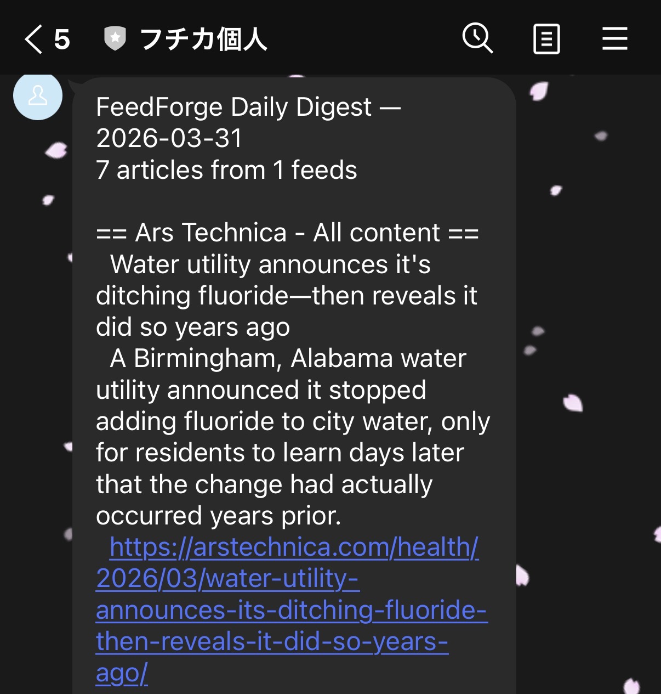

# My AI Summarizer Returned 7 Characters. Turns Out It Was Too Busy Thinking.

*This is the tenth post in a series about learning Kubernetes by building FeedForge — an RSS feed aggregator with AI summarization on GKE. These posts are learning notes from someone figuring things out in real time. [Previous post here.](https://medium.com/@huchka)*

---

I'm currently in the middle of studying Kubernetes security — NetworkPolicies, SecurityContexts, and the rest of Phase 5. But while working through that, I kept getting daily digest notifications on LINE that were hard to read. The summaries were cut off mid-sentence. Some ended with a dangling quote mark. One was just a title fragment.

Rather than wait until the security work is done, I took a detour to fix the digest output. The cluster is stable, the security hardening can wait a few commits, and broken notifications were bothering me every morning.

This post covers fixing the summary quality for messaging apps, a debugging session that revealed how "thinking models" silently consume your output token budget, and a simple dedup pattern to prevent articles from being sent twice.

## What I Built

> Check out the [`phase-5-digest`](https://github.com/huchka/feedforge/tree/phase-5-digest) tag in the FeedForge repo for the full source code at this point.

- A **configurable summary character budget** (default 200 chars) with a soft LLM prompt and hard truncation safety net
- **Disabled thinking tokens** in Gemini 2.5 Flash for summarization — fixing a silent token consumption bug
- **Pipeline observability logging** — the digest now reports how many articles were fetched, already sent, and queued to send
- A **`digest_sent_at` column** to prevent duplicate article delivery across digest runs

## The Problem

Here's what the LINE digest actually looked like before the fix:

```
== Ars Technica - All content ==
  Explanation for why we don't see two-foot-long dragonflies anymore fails
  Ancient insects, such as *Meganeuropsis permiana*, were significantly
  larger than modern ones, with wingspans over 70 centimeters. For
  decades, the "

  Playing Wolfenstein 3D with one hand in 2026
  The author reflects on playing *Wolfenstein

  With new plugins feature, OpenAI officially takes Codex beyond coding
  OpenAI has introduced plugin support for its
```

Six articles, and most summaries are incomplete. The ancient insects article ends with `the "`. The Wolfenstein article cuts off at the game title. The OpenAI article just stops. Only one summary — the bycatch article — was actually a complete thought, and it was three times longer than the others.

Two problems were stacked on top of each other:

1. The summarizer had no character budget — it just asked Gemini for "2-3 sentences" with `max_output_tokens=256`, producing wildly inconsistent lengths
2. LINE has a 5000-character limit per message, and the digest was silently truncating at the nearest newline when it hit that limit

The combination meant short summaries got cut off by LINE truncation, long summaries ate the budget for other articles, and there was no logging to tell me any of this was happening.

## Designing for LINE's Constraints

Before touching code, I needed a target. LINE's limit is 5000 characters per text message, and the digest needs to fit on a phone screen without endless scrolling.

The math for a single article in the digest:

| Component | Characters |
|-----------|-----------|
| Title | ~70 |
| Summary | ? |
| URL | ~90 |
| Formatting | ~15 |

With 6 articles, the total budget per article is about 375 characters to stay comfortably under 5000. Subtracting title, URL, and formatting leaves roughly **200 characters for the summary** — enough for 1-2 complete sentences.

The key insight: the fix isn't to truncate summaries *after* generation. It's to tell the LLM to write summaries that *fit* in the first place. Truncation is a safety net, not the strategy.

I added a configurable `FEEDFORGE_SUMMARY_MAX_CHARS` setting (default 200) and updated the summarizer prompt:

```python
SYSTEM_PROMPT = (
    "You are a concise article summarizer. "
    "Given an article title and content, produce a 1-2 sentence summary "
    "that captures the key point. Be factual and neutral. "
    "Aim for around {max_chars} characters. "
    "Always write complete sentences."
)
```

Plus a hard safety net that truncates at the last period if the LLM overshoots:

```python
if len(summary) > max_chars:
    last_period = summary.rfind(".", 0, max_chars)
    summary = summary[:last_period + 1] if last_period > 0 else summary[:max_chars]
```

If the model overshoots, this truncates at the last sentence boundary. In the worst case — no period in the first 200 characters — it falls back to a hard cut, but in practice the prompt gets the model close enough that the safety net almost always finds a clean break.

Here's the digest after the fix — every summary is a complete sentence that fits on a phone screen:



But getting here wasn't straightforward. The prompt change alone wasn't enough.

## The Thinking Model Trap

With the prompt updated, I lowered `max_output_tokens` from 256 to 128 — 200 characters is roughly 50-60 tokens, so 128 seemed like plenty of headroom. I ran a test.

The summary came back as 7 characters: `Bycatch`.

Just the word "Bycatch." Not a sentence. Not even a phrase. I ran it five more times:

```
[1] (31 chars): Bycatch, the accidental capture
[2] (12 chars): Bycatch, the
[3] (31 chars): Bycatch, the accidental capture
[4] (7 chars): Bycatch
[5] (7 chars): Bycatch
```

The model was echoing the first few words of the input content and stopping. My first thought was a prompt issue — maybe the character constraint was making Gemini too cautious. I softened the wording from "MUST be under 200 characters" to "aim for around 200 characters." Same result.

Then I wrote a debug script that inspected the raw Gemini response:

```python
print('Finish reason:', c.finish_reason)
print('Parts:', c.content.parts)
```

Output:

```
Finish reason: FinishReason.MAX_TOKENS
Parts: [Part(text='Bycatch, the accidental')]
```

`MAX_TOKENS` with 23 characters of output. That's when it clicked.

**Gemini 2.5 Flash is a thinking model.** Its internal chain-of-thought reasoning consumes tokens from the same `max_output_tokens` budget as the visible output. With `max_output_tokens=128`, the model was using most of the budget on internal reasoning before producing any visible text — the `MAX_TOKENS` finish reason with only 23 characters of output makes that clear, even though I didn't inspect the exact thinking/output token split.

The fix was straightforward — disable thinking for summarization:

```python
config=genai.types.GenerateContentConfig(
    system_instruction=system_prompt,
    max_output_tokens=256,
    temperature=0.3,
    thinking_config=genai.types.ThinkingConfig(thinking_budget=0),
)
```

Summarization is a simple task. Chain-of-thought reasoning adds no value here — it just burns tokens. With `thinking_budget=0`, the full token budget goes to the actual output.

After the fix, summaries started coming back consistently in the 130-200 character range, always as complete sentences.

## Preventing Duplicate Sends

While debugging the summary quality, I noticed another issue: the digest was sending the same articles every time it ran. The query just grabbed everything from the last 24 hours with a summary. Run the digest twice, get the same articles twice.

The fix was adding a `digest_sent_at` timestamp to the Article model. After a successful send, mark every included article:

```python
# In the digest query — skip already-sent articles
.where(Article.digest_sent_at.is_(None))

# After successful send
now = datetime.now(UTC)
for article in articles:
    article.digest_sent_at = now
db.commit()
```

Alembic migration `002` adds the column:

```python
def upgrade() -> None:
    op.add_column("articles",
        sa.Column("digest_sent_at", sa.DateTime(timezone=True), nullable=True))
```

The migration runs automatically via the backend's init container — the same `alembic upgrade head` pattern from post #3. The init container already existed in the backend Deployment, so adding a new migration required zero changes to the Kubernetes manifests. Write the migration file, build the image, deploy — the init container picks it up before the main container starts. This is exactly the kind of payoff you get from setting up infrastructure patterns early: a schema change that would normally require a manual `kubectl exec` or port-forward just works.

## Pipeline Observability

The original digest had zero visibility into what was happening between fetch and send. Articles could be lost at any stage — unsummarized, filtered out, truncated by LINE — and there was no way to know.

I added a `count_recent_articles` function that counts all articles in the lookback window regardless of summary or send status, then logs the breakdown:

```
Digest pipeline: 15 fetched, 6 already sent, 9 to send
LINE notification sent (2104 chars, 9 articles)
```

A high `already sent` count is normal later in the 24-hour lookback window — it just means earlier runs already delivered those articles. If `to send` is zero and you expected new articles, the summarizer might be falling behind. If LINE truncation fires, there are more articles than fit in 5000 characters.

Simple logging, but it turns a black box into something you can actually debug.

## Things I Learned

### Thinking Models Have a Hidden Token Tax

This was the biggest surprise. When you use a thinking model like Gemini 2.5 Flash, the internal reasoning tokens count against `max_output_tokens`. If you set a tight token limit for efficiency, the model may spend its entire budget thinking and produce almost no visible output. The symptom — tiny outputs with `FinishReason.MAX_TOKENS` — doesn't immediately suggest "your model is thinking too much." It looks like a broken API response.

The lesson: if you're using a thinking model for a simple task, either disable thinking entirely (`thinking_budget=0`) or set `max_output_tokens` high enough to accommodate both reasoning and output. For straightforward tasks like summarization, disabling thinking is the right call — it's faster, cheaper, and produces better results.

### Prompt Guidance + Hard Truncation Is Better Than Either Alone

Relying only on the prompt to control output length is unreliable — LLMs don't count characters accurately. Relying only on truncation produces cut-off sentences. The combination works: the prompt gets you into the right ballpark, and the truncation-at-last-period safety net usually preserves a clean result when the model overshoots.

### Design for the Delivery Channel, Not Just the Data

The summarizer was built to produce "good summaries." But a good summary for an API response and a good summary for a LINE message on a phone screen are different things. The delivery channel imposes constraints — character limits, screen size, scanning behavior — that should flow upstream into the prompt design. Starting from "how much space do I have in the LINE message?" and working backward to the character budget was more productive than trying to tune the prompt in isolation.

### Dedup Should Be in the First Version

The digest shipped without any tracking of what had been sent. It worked fine in testing because I only ran it once. In production, the CronJob ran daily, and any manual test run would re-send everything. Adding `digest_sent_at` was trivial — one column, one filter, one update. It should have been there from the start.

## What's Next

The digest now produces clean, complete summaries and doesn't re-send articles. But the pipeline still has capacity questions — what happens when I add more feeds and the article count exceeds what fits in a single LINE message? That might mean priority ranking, multi-message digests, or a different delivery format entirely. The observability logging will tell me when I'm hitting that wall.

---

*This is part of a series where I build FeedForge, an RSS aggregator with AI summarization, to learn Kubernetes from the ground up. Each phase adds new K8s concepts while building a real application.*
