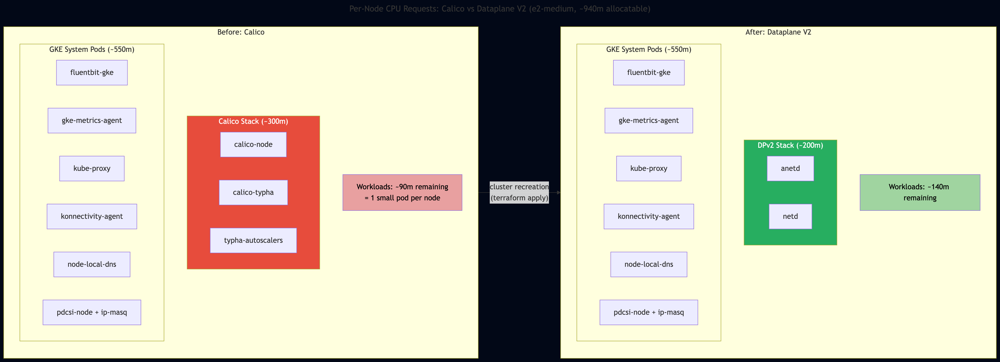

# Why My 2-Node GKE Cluster Kept Scaling to 3 — And the Rabbit Hole That Followed

*This is the eleventh post in a series about learning Kubernetes by building FeedForge — an RSS feed aggregator with AI summarization on GKE. These posts are learning notes from someone figuring things out in real time. [Previous post here.](https://medium.com/@huchka)*

---

I looked at my GKE cluster and there were 3 nodes. The autoscaler was configured for min 1, max 3, with a default count of 2. Actual CPU usage was under 20% per node. So why was the autoscaler insisting on 3?

What started as a simple "why is this node here?" investigation turned into a CNI migration, a Terraform state bug, a Kubernetes PVC permissions gotcha, a PostgreSQL lock chain, and a Python library with no socket timeout. This post covers all of it.

## What I Built

> Check out the [`phase-5-dpv2`](https://github.com/huchka/feedforge/tree/phase-5-dpv2) tag in the FeedForge repo for the full source code at this point.

- **Migrated the GKE CNI** from Calico to Dataplane V2 (Cilium/eBPF) to reduce system pod overhead
- **Fixed a Terraform state issue** where cluster recreation didn't cascade to the node pool
- **Added a PostgreSQL init container** to handle PVC permissions with `subPath` on fresh volumes
- **Fixed a silent hang** in the feed fetcher caused by `feedparser` having no default socket timeout

## The Investigation: Where Is All the CPU Going?

Three nodes, all showing under 21% actual CPU usage. But `kubectl describe nodes` told a different story:

```
# Node ghud — hosts only Redis (50m request)
Allocated resources:
  cpu    911m (96%)

# Node q2hh — hosts only Frontend (50m request)
Allocated resources:
  cpu    914m (97%)

# Node mp36 — hosts Backend, Postgres, Summarizer
Allocated resources:
  cpu    734m (78%)
```

Two nodes at 96-97% CPU *requests* while running a single application pod each. Redis requests 50m. Frontend requests 50m. That leaves roughly 860m of CPU requests consumed by system pods on each node.

The cluster autoscaler confirmed it: `scaleDown: NoCandidates`. It couldn't remove any node because moving even a 50m pod to another node would push it over 100% requested.



### Counting the System Tax

On each e2-medium node (~940m allocatable CPU), GKE runs these system components (a mix of per-node DaemonSets and cluster-level Deployments):

- `calico-node` — the CNI agent
- `calico-typha` — Calico's fan-out daemon (runs on 2 of 3 nodes)
- `calico-typha-horizontal-autoscaler`
- `calico-typha-vertical-autoscaler`
- `calico-node-vertical-autoscaler`
- `fluentbit-gke` — logging
- `gke-metrics-agent` — monitoring
- `kube-proxy`, `ip-masq-agent`, `node-local-dns`, `pdcsi-node`
- `konnectivity-agent` — control plane connectivity

Calico alone — the node agent, typha, and its autoscalers — consumed roughly 300m per node. On a machine with 940m allocatable, that's 32% of the node gone before a single application pod is scheduled.

The math was simple: on e2-medium, the GKE system overhead was dominating the CPU request budget. Workload optimization alone wasn't going to solve the node count problem — the system pods were fixed costs.

## The Migration: Calico to Dataplane V2

Dataplane V2 is GKE's Cilium-based CNI with an eBPF-based datapath, rather than the separate Calico stack I was using before. It enforces NetworkPolicy natively. The appeal wasn't performance — it was fewer DaemonSet pods eating my CPU budget.

There was one catch from post #9 that made this easier: I had deliberately used only standard `networking.k8s.io/v1` NetworkPolicy resources, not Calico-specific CRDs. The postgres and redis policies would work unchanged under any CNI that implements standard Kubernetes NetworkPolicy semantics.

### The Terraform Change

Two lines in `terraform/modules/gke/main.tf`:

```diff
+  datapath_provider = "ADVANCED_DATAPATH"
+
   addons_config { ... }

-  network_policy {
-    enabled  = true
-    provider = "CALICO"
-  }
```

Add `datapath_provider`, remove the Calico `network_policy` block. Dataplane V2 handles NetworkPolicy enforcement natively — the old block is incompatible.

`datapath_provider` is a `ForceNew` attribute in the Google Terraform provider. Changing it destroys the entire cluster and creates a new one. For a dev project, that's fine — but it means backing up PostgreSQL data, exporting secrets, and redeploying everything after.

### Bug #1: Terraform Node Pool Stale State

After `terraform apply` finished — 6 minutes to destroy, 11 minutes to create — it hit an error:

```
Error: googleapi: Error 404: Not found: node pool "feedforge-cluster-pool" not found.
```

The cluster was recreated successfully, but Terraform tried to *modify* the existing node pool instead of recreating it. The old node pool was destroyed along with the old cluster, but Terraform's state still had a reference to it.

The root cause: the node pool references the cluster by name (`google_container_cluster.primary.name`), and the name didn't change. Terraform saw no change to the node pool's `cluster` attribute, so it didn't mark it for replacement — even though the cluster it pointed to was a completely different resource.

The immediate fix was `terraform taint` to force recreation. The permanent fix was adding a lifecycle rule:

```hcl
resource "google_container_node_pool" "primary" {
  cluster = google_container_cluster.primary.name
  # ...

  lifecycle {
    replace_triggered_by = [google_container_cluster.primary.id]
  }
}
```

When the cluster is recreated, its `.id` changes (it's the full resource path, not just the name). `replace_triggered_by` watches that value and forces the node pool to be replaced too. This is a general pattern for any Terraform resource that depends on another resource's identity, not just its name.

## Bug #2: PostgreSQL Can't Start on a Fresh PVC

After the cluster was recreated and workloads redeployed, PostgreSQL refused to start:

```
chmod: /var/lib/postgresql/data: Operation not permitted
initdb: error: could not change permissions of directory "/var/lib/postgresql/data"
```

The StatefulSet uses a `subPath` mount:

```yaml
volumeMounts:
  - name: postgres-data
    mountPath: /var/lib/postgresql/data
    subPath: pgdata
```

And the pod has `fsGroup: 70` in its securityContext. On the old cluster, this worked because the PVC already had correct permissions from a previous init. On the fresh cluster, the PVC was new.

Here's the gotcha: in this setup, **Kubernetes did not fix ownership for the `subPath` directory on a fresh volume.** Without `subPath`, Kubernetes recursively sets group ownership on the entire volume via `fsGroup` before the container starts. With `subPath`, that didn't happen here — the subdirectory was created by the kubelet with root ownership, and the non-root container couldn't `chmod` it. This is a commonly reported issue, though the exact behavior may vary by Kubernetes version and storage driver.

The fix was an init container that mounts the volume *without* `subPath`, runs as root, and sets up the directory:

```yaml
initContainers:
  - name: init-permissions
    image: postgres:16.6-alpine
    command: ["sh", "-c", "mkdir -p /data/pgdata && chown 70:70 /data/pgdata && chmod 700 /data/pgdata"]
    securityContext:
      runAsNonRoot: false
      runAsUser: 0
      allowPrivilegeEscalation: false
    volumeMounts:
      - name: postgres-data
        mountPath: /data
```

The init container mounts the PVC root at `/data`, creates the `pgdata` subdirectory with postgres ownership (UID 70), then exits. The main container's `subPath: pgdata` mount then works because the directory already has the right ownership.

## Bug #3: The Alembic Lock Chain

With PostgreSQL running, the backend deployment's init container (`alembic upgrade head`) hung indefinitely. No logs, no error, no timeout. It just sat there.

After 15 minutes of debugging connection strings, NetworkPolicies, and image differences, I checked `pg_stat_activity`:

```sql
SELECT pid, state, query FROM pg_stat_activity WHERE datname='feedforge';
```

```
pid |       state       |                    query
----+-------------------+---------------------------------------------
 54 | idle in transaction | SELECT ... FROM articles WHERE summary IS NULL
 63 | active            | ALTER TABLE articles ADD COLUMN digest_sent_at ...
494 | active            | INSERT INTO articles ...
```

A classic lock chain:

1. **PID 54** — the summarizer had an open transaction with a read lock on the `articles` table
2. **PID 63** — Alembic's `ALTER TABLE` was waiting for the read lock to release
3. **PID 494** — the feed fetcher's `INSERT` was waiting behind the `ALTER TABLE`

The summarizer pod had started processing articles before the new backend deployment triggered Alembic. The summarizer pod itself was never restarted — it was still running from the initial deploy, and its open transaction was still holding a lock. Every subsequent operation on the `articles` table queued behind it.

The fix was surgical:

```sql
SELECT pg_terminate_backend(54);
```

Kill the stale summarizer connection, the ALTER TABLE proceeds, the INSERT unblocks, and the whole chain resolves. The summarizer reconnected automatically on its next iteration.

The takeaway: when doing cluster migrations that involve database schema changes, drain or restart your database clients *before* running migrations. A stale transaction from a pre-migration pod can block everything.

## Bug #4: feedparser Has No Socket Timeout

The final bug. The feed fetcher job ran, found 1 feed to fetch, and then... nothing. For 5 minutes, until the job's `activeDeadlineSeconds: 300` killed it.

I could reach `kubernetes.io/feed.xml` from debug pods using `urllib` and even using `feedparser` with `socket.setdefaulttimeout(15)`. But the actual fetcher job hung every time.

The issue: `feedparser.parse(url)` does the HTTP fetch internally using `urllib`, but never sets a socket timeout. Without `setdefaulttimeout`, Python sockets wait forever. If a connection stalls — maybe a DNS hiccup, a slow TLS handshake, a flaky network path — the call blocks indefinitely.

The fix was two lines:

```python
import socket

def main() -> None:
    socket.setdefaulttimeout(30)
    # ... rest of fetcher
```

`socket.setdefaulttimeout()` is process-global, so it's a blunt instrument. But when a library doesn't expose a timeout parameter, it's better than letting a stalled connection block forever.

With the global socket timeout set, `feedparser` completed in under 10 seconds and pulled 50 articles from the Kubernetes blog.

## Things I Learned

### System Pod Overhead Dominates Small Nodes

On e2-medium (2 vCPU), GKE system pods consume roughly 850-900m of the ~940m allocatable CPU — before any application pods. The autoscaler bases decisions on resource *requests*, not actual usage. If you're wondering why your cluster has more nodes than expected, `kubectl describe nodes | grep -A 20 "Allocated resources"` is the first command to run. Look at the request percentages, not the `kubectl top` utilization numbers.

### Watch Out for `fsGroup` and `subPath` Interactions

If your StatefulSet uses `subPath` (which PostgreSQL needs to avoid the "lost+found" directory issue), `fsGroup` may not set ownership on the subdirectory — that's what happened on my fresh GKE cluster. The exact behavior can vary by Kubernetes version and storage driver, but the safe approach is an init container that handles permissions explicitly on fresh PVCs. On an existing cluster this is invisible — the PVC already has correct permissions from the first successful init.

### Terraform `replace_triggered_by` Solves Cascading Recreation

When a parent resource is force-replaced but its name doesn't change, dependent resources won't be automatically replaced — Terraform sees no attribute change. `replace_triggered_by` watching the parent's `.id` (which changes on recreation) fixes this. It's the right pattern for any Terraform resource that must be recreated when its parent is, regardless of whether visible attributes changed.

### Lock Chains Are the Silent Killer During Migrations

A stale database transaction from a pre-migration pod can block schema changes indefinitely. `pg_stat_activity` is the diagnostic tool — look for `idle in transaction` connections with old `query_start` timestamps. During cluster migrations that include schema changes, restart all database clients before running migrations, or at minimum check for stale connections.

### Libraries Without Timeouts Are Time Bombs

`feedparser` is a widely-used library that makes HTTP requests with no default socket timeout. A single stalled connection blocks the entire process. `socket.setdefaulttimeout()` is a blunt instrument — it applies to all sockets in the process — but it's the only option when a library doesn't expose timeout parameters. Check whether your HTTP-calling libraries have explicit timeout support, and set global defaults as a safety net.

## What's Next

After the migration and the completed job pods got cleaned up, the autoscaler scaled down from 3 to 2 nodes. The Dataplane V2 system pods (`anetd`, `netd`) have a slightly smaller footprint than Calico's stack — just enough to free the headroom the autoscaler needed to pack everything onto 2 nodes. It's not a dramatic win per node, but it crossed the threshold that matters: fitting all workloads without a third node. On e2-medium at ~$25/node/month, that's a real saving for a learning project.

More importantly, the debugging journey surfaced four real issues — Terraform state cascading, PVC permissions, lock chains, and missing timeouts — that would have bitten me later in a less controlled situation. Next up: RBAC and Workload Identity — giving each pod its own GCP identity instead of sharing the node's service account.

---

*This is part of a series where I build FeedForge, an RSS aggregator with AI summarization, to learn Kubernetes from the ground up. Each phase adds new K8s concepts while building a real application.*
