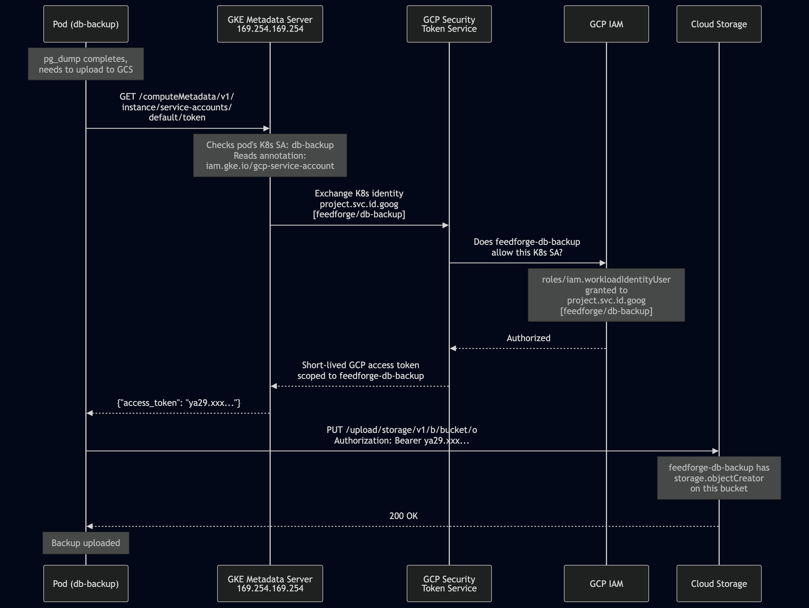

# I Gave Every Pod the Same Identity. Here's What It Took to Fix That.

*This is the twelfth post in a series about learning Kubernetes by building FeedForge — an RSS feed aggregator with AI summarization on GKE. These posts are learning notes from someone figuring things out in real time. [Previous post here.](https://medium.com/@huchka)*

---

After the Dataplane V2 migration and the SecurityContext lockdown in the last two posts, FeedForge's pods were running non-root, with read-only filesystems and all Linux capabilities dropped. The network was segmented with NetworkPolicy. It looked locked down.

But there was one fundamental problem I'd been ignoring: every pod in the cluster was running as the same identity. Backend, frontend, summarizer, postgres, redis, fetcher, digest — all seven existing workloads were using the `default` ServiceAccount. Any compromised container could impersonate any other workload. And the default SA's token was auto-mounted into every pod, giving each one a credential it didn't need.

This post covers finishing Phase 5: dedicated ServiceAccounts for every workload, GKE Workload Identity to connect Kubernetes identities to GCP, and a pg_dump backup Job that authenticates to Cloud Storage without a single JSON key file.

## What I Built

> Check out the [`phase-5-rbac-wi`](https://github.com/huchka/feedforge/tree/phase-5-rbac-wi) tag in the FeedForge repo for the full source code at this point.

- **8 dedicated ServiceAccounts** with `automountServiceAccountToken: false` — one for each of the 7 existing workloads, plus one for the new backup Job
- **Workload Identity** enabled on the GKE cluster and node pool via Terraform
- **GCP service account** (`feedforge-db-backup`) bound to a Kubernetes SA for keyless GCS access
- **GCS bucket** with 7-day auto-delete lifecycle for database backups
- **pg_dump backup Job** using `postgres:16.6-alpine` and the GCS JSON API with a Workload Identity token

## ServiceAccounts: The Easy Part That Matters

A Kubernetes ServiceAccount is an identity for pods. When you don't specify one, the pod gets the `default` SA in its namespace. The default SA comes with a token that gets auto-mounted at `/var/run/secrets/kubernetes.io/serviceaccount/token` inside every container. That token can be used to authenticate to the Kubernetes API.

None of FeedForge's workloads need to talk to the Kubernetes API. Backend serves HTTP. Frontend serves static files. Summarizer consumes a Redis queue. The CronJobs run scripts and exit. PostgreSQL and Redis are data stores. Not one of them needs to list pods, read secrets, or call any Kubernetes endpoint.

Creating a dedicated SA per workload was straightforward — eight nearly identical YAML files:

```yaml
apiVersion: v1
kind: ServiceAccount
metadata:
  name: backend
  namespace: feedforge
  labels:
    app.kubernetes.io/name: backend
    app.kubernetes.io/part-of: feedforge
automountServiceAccountToken: false
```

Then a one-line addition to each workload's pod spec:

```yaml
spec:
  serviceAccountName: backend
```

The key line is `automountServiceAccountToken: false`. This prevents Kubernetes from mounting the SA's token into the pod. Since none of these workloads call the K8s API, there's no reason for the token to be there. If an attacker gets code execution inside a container, there's nothing at `/var/run/secrets/` for them to steal.

I didn't create any RBAC Roles or RoleBindings. With no mounted token, there's nothing to authorize — the pods can't authenticate to the API server in the first place. The security improvement is identity isolation plus token removal, not permission grants.

## Workload Identity: Three Pieces That Must Agree

ServiceAccounts handle identity inside the cluster. But what about GCP? I wanted a backup Job that dumps PostgreSQL to Cloud Storage. That means the Job's pod needs to authenticate to GCS — a Google Cloud API outside the cluster.

Before Workload Identity, the standard approach was either exporting a GCP service account JSON key as a Kubernetes Secret (which means a long-lived credential sitting in the cluster), or relying on the node's service account (which means every pod on the node gets the same GCP permissions).

Workload Identity solves both problems. It lets a Kubernetes ServiceAccount act as a GCP service account — no key files, no shared node identity.

GKE actually supports two Workload Identity patterns: **direct federation** (using `principal://` identifiers in IAM) and **KSA-to-GSA impersonation** (linking a Kubernetes SA to a GCP SA via an annotation and `roles/iam.workloadIdentityUser`). This post uses the impersonation pattern — it's more explicit about the mapping and easier to reason about when you're learning. The direct federation pattern is newer and avoids the annotation step, but the mental model is the same.

The impersonation pattern requires three pieces, and all three must agree for it to work.



### Piece 1: The Cluster Workload Pool

First, the GKE cluster needs Workload Identity enabled. In Terraform:

```hcl
resource "google_container_cluster" "primary" {
  # ...
  workload_identity_config {
    workload_pool = "${var.project_id}.svc.id.goog"
  }
}
```

This registers an identity pool with GCP's IAM system. The pool name `<project>.svc.id.goog` is a GKE convention — you don't choose it. For the impersonation pattern used in this post, members in this pool are referenced as `serviceAccount:<project>.svc.id.goog[<namespace>/<k8s-sa-name>]` in IAM bindings. This tells IAM: "Kubernetes ServiceAccounts from this cluster are valid identities that can impersonate GCP service accounts."

### Piece 2: The GKE Metadata Server

Second, the node pool needs to swap its metadata server:

```hcl
resource "google_container_node_pool" "primary" {
  node_config {
    workload_metadata_config {
      mode = "GKE_METADATA"
    }
  }
}
```

Every GCE VM runs a metadata server at `169.254.169.254`. When code calls a GCP client library without explicit credentials, the library hits this endpoint to get an access token. By default, it returns the node VM's service account token — meaning every pod on the node gets the node SA's identity.

`GKE_METADATA` mode replaces this with the GKE metadata server. When a pod requests a token, the GKE metadata server checks which Kubernetes ServiceAccount the pod runs under and, in the impersonation pattern, uses the annotation to decide which GCP service account to impersonate. Without that annotation, the impersonation step won't happen.

This setting is on the node pool, not the cluster, because it changes what runs on each physical node. GKE docs say updating this "might result in disruptions" — in my case, the nodes were recreated and pods rescheduled over a few minutes.

### Piece 3: The Two-Way Binding

Third, the Kubernetes SA and the GCP SA need to point at each other.

On the Kubernetes side, the SA gets an annotation saying which GCP SA it wants to impersonate:

```yaml
metadata:
  name: db-backup
  annotations:
    iam.gke.io/gcp-service-account: feedforge-db-backup@<project>.iam.gserviceaccount.com
```

On the GCP side, an IAM binding grants `roles/iam.workloadIdentityUser` on the GCP SA to the K8s SA's pool identity:

```hcl
resource "google_service_account_iam_member" "db_backup_workload_identity" {
  service_account_id = google_service_account.db_backup.name
  role               = "roles/iam.workloadIdentityUser"
  member             = "serviceAccount:${var.project_id}.svc.id.goog[feedforge/db-backup]"
}
```

The annotation says "I want to be this GCP SA." The IAM binding says "I allow this K8s SA to be me." If either side is missing, the token exchange fails. You can verify the GCP side with:

```bash
gcloud iam service-accounts get-iam-policy \
  feedforge-db-backup@<project>.iam.gserviceaccount.com
```

## The Terraform Ordering Problem

My first `terraform apply` failed:

```
Error: Identity Pool does not exist (project-xxxx.svc.id.goog).
Please check that you specified a valid resource name.
```

The workload pool `<project>.svc.id.goog` doesn't exist until the GKE cluster is updated with `workload_identity_config`. But I had the IAM binding in the same Terraform module as the GCP service account — the IAM module — which runs *before* the GKE module (because GKE `depends_on` IAM for the node service account).

```
module "iam"  →  creates GCP SA  →  creates IAM binding (fails: pool doesn't exist)
module "gke"  →  depends_on iam  →  enables WI pool (too late)
```

I tried moving the binding from the IAM module into the environment's `main.tf` with `depends_on = [module.gke]`. That fixed the ordering — Terraform now applies the cluster changes first, creating the pool, and then creates the IAM binding.

```hcl
# environments/dev/main.tf
resource "google_service_account_iam_member" "db_backup_workload_identity" {
  service_account_id = module.iam.db_backup_sa_name
  role               = "roles/iam.workloadIdentityUser"
  member             = "serviceAccount:${var.project_id}.svc.id.goog[feedforge/db-backup]"

  depends_on = [module.gke]
}
```

This is a general Terraform pattern: when a resource in module A references something created by module B, but module B depends on module A, you can't express the cross-dependency inside either module. Hoist the dependent resource to the environment level where you can see both modules.

### The `service_account_id` Format Gotcha

Even after fixing the ordering, the next apply failed:

```
Error: "service_account_id" doesn't match regexp "projects/..."
```

The `google_service_account_iam_member` resource expects `service_account_id` in the full resource name format — `projects/<project>/serviceAccounts/<email>` — not just the email address. I was passing the output of `.email`. The fix was adding a `.name` output from the IAM module, which returns the full path:

```hcl
output "db_backup_sa_name" {
  value = google_service_account.db_backup.name
  # projects/<project>/serviceAccounts/<email>
}
```

A small thing, but it burned a `terraform apply` cycle.

## Building the Backup Job

With Workload Identity working, I needed a Job that dumps PostgreSQL to GCS. The concept is simple: `pg_dump | gzip | upload to bucket`. The implementation took two tries.

### Attempt 1: cloud-sdk Image

My first version used `google/cloud-sdk:slim` — it has `gsutil` built in, which handles Workload Identity authentication natively. But I needed `pg_dump` too, so the script started with `apt-get install postgresql-client-16`.

The pod crashed immediately:

```
E: Could not open lock file /var/lib/apt/lists/lock - open (13: Permission denied)
E: Unable to lock directory /var/lib/apt/lists/
```

The container was running as non-root (UID 65534, `nobody`). `apt-get` needs root to write to `/var/lib/apt`. I could have run the container as root, but that would break the security principle every other workload in the cluster follows.

### Attempt 2: postgres Image + GCS JSON API

Instead of fighting the cloud-sdk image, I switched to `postgres:16.6-alpine` — it already has `pg_dump`, no installation needed. The trade-off: no `gsutil`. I had to upload to GCS manually using the JSON API and a token fetched from the metadata server.

The script fetches a Workload Identity token from `169.254.169.254`, dumps the database, compresses it, and uploads via `wget`:

```yaml
containers:
  - name: pg-dump
    image: postgres:16.6-alpine
    command: ["/bin/sh", "-c"]
    args:
      - |
        set -e
        TIMESTAMP=$(date +%Y%m%d-%H%M%S)
        OBJECT="feedforge-${TIMESTAMP}.sql.gz"
        TOKEN=$(wget -q -O- --header="Metadata-Flavor: Google" \
          "http://169.254.169.254/computeMetadata/v1/instance/service-accounts/default/token" | \
          sed 's/.*"access_token":"\([^"]*\)".*/\1/')
        pg_dump -h "$PGHOST" -U "$PGUSER" -d "$PGDATABASE" --no-password | \
          gzip > /tmp/backup.sql.gz
        wget -q -O /dev/null --post-file=/tmp/backup.sql.gz \
          --header="Authorization: Bearer ${TOKEN}" \
          --header="Content-Type: application/gzip" \
          "https://storage.googleapis.com/upload/storage/v1/b/${BACKUP_BUCKET}/o?uploadType=media&name=${OBJECT}"
        echo "Backup uploaded: gs://${BACKUP_BUCKET}/${OBJECT}"
```

The token fetch is the interesting part. `169.254.169.254` is the GKE metadata server — the one we swapped in with `GKE_METADATA` mode. It sees the pod is running as K8s SA `db-backup`, finds the Workload Identity annotation, exchanges the identity via GCP's Security Token Service, and returns a short-lived access token scoped to the `feedforge-db-backup` GCP SA. That token then works as a Bearer token on the GCS JSON API.

The GCS bucket has a 7-day lifecycle rule that auto-deletes old backups, and the GCP SA only has `storage.objectCreator` — it can write new backups but can't read or delete existing ones.

This is a Job, not a CronJob — it sits as a template and runs when triggered manually:

```bash
kubectl create job db-backup-test --from=job/db-backup -n feedforge
```

## The NetworkPolicy Blind Spot

The backup Job ran, uploaded a file to GCS, and reported success. I moved on. Then I looked at the actual backup file — and realized something was wrong.

Back in post #9, I'd added a NetworkPolicy on PostgreSQL that only allows ingress from `backend`, `summarizer`, `feed-fetcher`, and `daily-digest`. The backup Job's pods have label `app.kubernetes.io/name: db-backup` — which isn't in that allow list.

The `pg_dump` connection had timed out:

```
pg_dump: error: connection to server at "postgres" (10.1.0.14), port 5432 failed: Operation timed out
	Is the server running on that host and accepting TCP/IP connections?
```

But the script still printed "Backup uploaded" and the Job completed successfully. I'd uploaded an empty gzip file to GCS. The fix was two things.

First, `db-backup` needed to be in the postgres NetworkPolicy:

```yaml
ingress:
  - from:
      # ... existing entries ...
      - podSelector:
          matchLabels:
            app.kubernetes.io/name: db-backup
    ports:
      - protocol: TCP
        port: 5432
```

Second, the script used `set -e`, which should fail on errors — but it doesn't catch failures in pipes. `pg_dump | gzip` only checks the exit code of the last command (`gzip`), which succeeds even when `pg_dump` fails because `gzip` happily compresses an empty input. The fix:

```bash
set -eo pipefail
```

`pipefail` makes the pipe return the exit code of the first command that fails. With both fixes, a failed `pg_dump` actually fails the Job instead of silently uploading garbage.

## Environment Portability with Kustomize

The Workload Identity annotation includes the full GCP service account email, which contains the project ID:

```yaml
annotations:
  iam.gke.io/gcp-service-account: feedforge-db-backup@project-xxxx.iam.gserviceaccount.com
```

Hardcoding this in the base manifest makes it environment-specific. I moved the annotation out of the base SA and into a kustomize overlay patch:

```yaml
# k8s/overlays/dev/patches/backup-sa-patch.yaml
apiVersion: v1
kind: ServiceAccount
metadata:
  name: db-backup
  namespace: feedforge
  annotations:
    iam.gke.io/gcp-service-account: feedforge-db-backup@project-xxxx.iam.gserviceaccount.com
```

The base SA stays clean — no project ID, no environment-specific values. Each overlay adds its own annotation. Same pattern as the existing `backend-config-patch.yaml` that sets `FEEDFORGE_DEBUG: "true"` only in dev.

## Things I Learned

### Workload Identity Is Three Pieces, Not One

Enabling Workload Identity on a GKE cluster is just the beginning. For the KSA-to-GSA impersonation pattern, you need the cluster-level pool, the node-level metadata server swap, and the two-way binding (K8s annotation + IAM grant). Each piece has a distinct role: the pool registers the trust domain, the metadata server intercepts token requests at the node, and the binding authorizes the specific SA-to-SA mapping. Missing the annotation or the IAM binding gives you a different error for each. And if the node pool is still using the default `GCE_METADATA` mode instead of `GKE_METADATA`, there's no interception at all — pods silently get the node SA's token regardless of annotations.

### `automountServiceAccountToken: false` Is the Real Security Win

When your pods don't need the Kubernetes API, the biggest security improvement isn't adding RBAC rules — it's removing the token entirely. With `automountServiceAccountToken: false`, there's no credential at `/var/run/secrets/` for an attacker to steal. I created eight ServiceAccounts and zero Roles. The access control is "no access at all," which is exactly right for application workloads that only do network I/O to their own databases and APIs.

### Terraform Cross-Module Dependencies Need Hoisting

When module A creates something that module B references, but module B depends on module A, you can't solve it with `depends_on` inside either module — that creates a circular dependency. The fix is hoisting the dependent resource to the environment level, where it can see both modules and express `depends_on = [module.gke]` without creating a cycle. This came up because the IAM binding references the Workload Identity pool, which only exists after the GKE module runs.

### The Metadata Server at 169.254.169.254 Is the Bridge

The GKE metadata server is the runtime mechanism that makes Workload Identity work. You can curl it directly — `wget -O- --header="Metadata-Flavor: Google" http://169.254.169.254/computeMetadata/v1/instance/service-accounts/default/token` — and get back a short-lived GCP access token scoped to your pod's mapped GCP SA. Client libraries like `gsutil` do this automatically, but understanding the raw flow helps debug issues and works in minimal images that don't have GCP SDKs.

### New Workloads Need NetworkPolicy Updates

This one was obvious in hindsight. I'd locked down postgres ingress in post #9 with an explicit allow list — then added a new workload that needs postgres and forgot to update the list. The dangerous part was that the failure was silent: `pg_dump` timed out, but the pipe masked it and the Job reported success. Any time you add a workload that talks to a NetworkPolicy-protected service, check the policy. And always use `set -eo pipefail` in shell scripts that use pipes — `set -e` alone doesn't catch failures in piped commands.

### Choose an Image That Already Has What You Need

My first backup Job used `google/cloud-sdk:slim` and tried to `apt-get install` PostgreSQL client at runtime. It failed because the container ran non-root and `apt-get` needs root. Instead of compromising on security, I switched to `postgres:16.6-alpine` and replaced `gsutil` with a raw HTTP call to the GCS JSON API. The right fix for "my image is missing a tool" in a non-root container is almost always "use a different image," not "run as root."

## What's Next

Phase 5 is complete. Every workload has its own identity, pods don't carry tokens they don't need, and the backup Job proves that Workload Identity works end to end — a pod can authenticate to GCS without a single key file or shared credential.

Phase 6 brings ResourceQuota and LimitRange (namespace-level resource governance), PodDisruptionBudget (availability guarantees during node drains), and potentially a sidecar container for metrics export — the last few K8s concepts on the learning tracker.

---

*This is part of a series where I build FeedForge, an RSS aggregator with AI summarization, to learn Kubernetes from the ground up. Each phase adds new K8s concepts while building a real application.*
