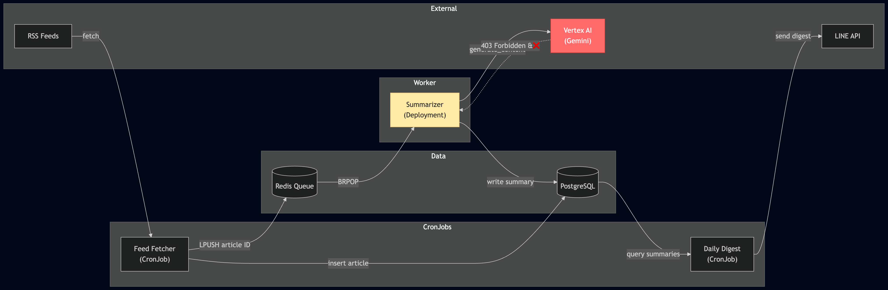

# I Enabled Workload Identity and My Summarizer Silently Stopped Working

*This is the thirteenth post in a series about learning Kubernetes by building FeedForge — an RSS feed aggregator with AI summarization on GKE. These posts are learning notes from someone figuring things out in real time. [Previous post here.](https://medium.com/@huchka)*

---

The previous post ended on a high note. I'd set up dedicated ServiceAccounts for every workload, enabled Workload Identity, disabled token auto-mounting, and built a backup Job that authenticates to GCS without a key file. Everything worked. I merged the PR.

The next morning, no LINE notification. FeedForge sends a daily digest of summarized articles — new RSS content, run through Gemini, delivered to my phone. It had been working for weeks. Now, silence.

This post is about debugging that pipeline, finding the blind spot in my Workload Identity rollout, and seeing how weak observability turned a straightforward permission error into a much longer investigation.

## What Broke

FeedForge's article pipeline has four stages:



1. **Feed fetcher** (CronJob) — pulls RSS feeds, inserts new articles into PostgreSQL, pushes article IDs to a Redis queue
2. **Summarizer** (Deployment) — consumes IDs from Redis via BRPOP, calls Vertex AI (Gemini) to summarize, writes summaries back to PostgreSQL
3. **Daily digest** (CronJob) — queries for articles with summaries in the last 24 hours, sends them to LINE
4. **LINE** — the notification I check every morning

The break was at stage 2. The summarizer wasn't summarizing.

## Following the Logs

I started from the output — the daily digest — and worked backwards.

### Digest: Nothing to Send

```
2026-04-01 23:30:26,165 INFO  Digest pipeline: 71 fetched, 70 already sent, 0 to send
2026-04-01 23:30:26,165 INFO  No articles with summaries in the last 24 hours, skipping
```

71 articles fetched total, 70 already sent in previous digests, and 0 new ones with summaries. The digest was working correctly — it just had nothing to deliver.

### Fetcher: Did Its Job

```
2026-04-01 23:00:45,002 INFO  Feed https://aws.amazon.com/blogs/architecture/feed/: 1 new articles
2026-04-01 23:00:45,003 INFO  Fetcher complete: 2 feeds processed, 1 new articles (13.7s)
```

The fetcher found a new article and pushed it to Redis. No errors.

### Summarizer: Three Lines, Then Silence

```
2026-04-01 13:21:25,284 INFO  Summarizer worker starting (provider=gemini, model=gemini-2.5-flash)
2026-04-01 13:21:25,313 INFO  Connected to Redis at redis.feedforge.svc.cluster.local:6379
2026-04-01 13:21:26,382 INFO  Vertex AI client ready (project=..., location=us-central1)
```

That was it. Three startup log lines, ten hours before the fetcher even ran. The pod was `Running` with zero restarts. No errors. No warnings. Nothing.

## The First Red Herring: Stale DB Session

The summarizer runs a persistent BRPOP loop — it blocks on a Redis list, pops an article ID, calls Gemini, writes the summary to PostgreSQL, and loops. The same SQLAlchemy session is held open for the pod's entire lifetime.

The pod had been running for 14 hours. My first thought was a stale PostgreSQL connection — the DB might have closed the idle connection, and the summarizer silently failed when it tried to query. But that would have raised an `OperationalError`, which the exception handler would have logged.

I checked Redis and the database directly:

```bash
$ kubectl exec redis-... -- redis-cli LLEN feedforge:articles:pending
(integer) 0

$ kubectl exec postgres-0 -- psql -U feedforge -d feedforge \
    -c "SELECT id, title, summary IS NOT NULL as has_summary
        FROM articles ORDER BY created_at DESC LIMIT 3;"
 d6a07d5c... | Automate safety monitoring with computer vision... | f
 43cfac76... | The Hidden Price Tag...                           | t
 b2c5a182... | Architecting for agentic AI development on AWS   | t
```

The Redis queue was empty, but the newest article still had no summary. That meant the summarizer *had* popped the message from Redis, tried to process it, and failed somewhere along the way. The failure left no visible trace.

## The Real Problem: Missing Workload Identity Binding

I restarted the summarizer to get a fresh run. The backfill mechanism re-queued the unsummarized article on startup, and this time the logs showed the actual error:

```
HTTP Request: POST https://us-central1-aiplatform.googleapis.com/v1beta1/projects/.../
    models/gemini-2.5-flash:generateContent "HTTP/1.1 403 Forbidden"

Permission 'aiplatform.endpoints.predict' denied on resource
'//aiplatform.googleapis.com/projects/.../models/gemini-2.5-flash'
```

A 403 from Vertex AI. The summarizer couldn't call Gemini because it didn't have the right GCP identity.

Here's what happened. Before Workload Identity, all pods on the node inherited the node SA's permissions. The node SA had `roles/aiplatform.user`, so the summarizer could call Vertex AI without any explicit configuration. It was "working by accident."

When I switched the node pool to `GKE_METADATA` mode, pods stopped falling back to the node SA for GCP credentials. The GKE metadata server now intercepts token requests and looks for a Workload Identity binding on the pod's Kubernetes ServiceAccount. No binding means no GCP identity, so the pod can't authenticate to GCP APIs. (`automountServiceAccountToken: false` is a separate hardening step that removes the *Kubernetes API* token; the GCP access broke because of the metadata server change, not the token setting.)

I set up Workload Identity for the backup Job — it needed GCS access, which was the explicit goal. But I missed the summarizer. It had been silently relying on the node SA for Vertex AI access, and there was nothing in the deployment manifest that made this dependency visible.

## The Fix: Dedicated GCP SA for the Summarizer

Same pattern as the backup Job — three pieces that must agree.

**Terraform — GCP service account with least-privilege role:**

```hcl
resource "google_service_account" "summarizer" {
  account_id   = "feedforge-summarizer"
  display_name = "FeedForge Summarizer Service Account"
  project      = var.project_id
}

resource "google_project_iam_member" "summarizer_aiplatform" {
  project = var.project_id
  role    = "roles/aiplatform.user"
  member  = "serviceAccount:${google_service_account.summarizer.email}"
}
```

**Terraform — Workload Identity binding:**

```hcl
resource "google_service_account_iam_member" "summarizer_workload_identity" {
  service_account_id = module.iam.summarizer_sa_name
  role               = "roles/iam.workloadIdentityUser"
  member             = "serviceAccount:${var.project_id}.svc.id.goog[feedforge/summarizer]"

  depends_on = [module.gke]
}
```

**Kustomize overlay — annotation on the K8s SA:**

```yaml
# k8s/overlays/dev/patches/summarizer-sa-patch.yaml
apiVersion: v1
kind: ServiceAccount
metadata:
  name: summarizer
  namespace: feedforge
  annotations:
    iam.gke.io/gcp-service-account: feedforge-summarizer@<project>.iam.gserviceaccount.com
```

After `terraform apply`, `kubectl apply`, and a rollout restart:

```
HTTP Request: POST .../gemini-2.5-flash:generateContent "HTTP/1.1 200 OK"
Summarized article d6a07d5c...: Automate safety monitoring with computer vision...
```

## Why the First Failure Was So Hard to See

The 403 only became obvious after the restart. The original pod ran for 14 hours with no error logs at all.

The reason the problem didn't show up at startup is straightforward: the summarizer's `genai.Client()` initializes lazily. It creates the client object, but it doesn't validate GCP credentials until the first real API call. At startup, the backfill query found zero unsummarized articles, so Gemini was never called. The pod spent the next 10 hours sitting in the BRPOP loop, apparently healthy, with broken credentials it had never actually exercised.

What remains unclear is why the first live failure left no log trail. When the fetcher pushed a new article at 23:00, the summarizer should have popped it and attempted processing. The code has exception logging for Gemini failures and for unexpected errors in the main loop. In theory, one of those paths should have emitted something. In practice, the original pod's logs showed only the three startup lines.

That gap is the real lesson. Because BRPOP is destructive and there was no "dequeued article X" log, I couldn't reconstruct what happened after the queue entry disappeared. All I knew for certain was the observable outcome: the pod stayed `Running`, the queue was empty, and the article still had no summary.

## Observability Gaps

This incident exposed several gaps in the summarizer's observability:

**No dequeue logging.** When BRPOP returns an article, there's no log. You can't tell from the logs whether the summarizer ever received a message.

**Debug-level failure paths.** The "article not found" and "already summarized" cases log at `DEBUG`, invisible with `INFO`-level configuration. The "Gemini returned None" path doesn't log at all in `process_one` — it just returns `False`.

**No retry or dead-letter.** Once BRPOP pops an article ID, it's gone from Redis. If processing fails, the article is lost. The backfill mechanism on startup can recover it, but only if someone restarts the pod.

**Stale session risk.** The summarizer holds a single SQLAlchemy session for its entire lifetime. A 14-hour-old idle connection is fragile — PostgreSQL can close it, network interruptions can break it. Using `pool_pre_ping=True` or creating a fresh session per article would be more resilient.

These are separate fixes from the Workload Identity issue, but they're the reason a straightforward 403 turned into silent data loss and a manual investigation.

## Things I Learned

### Workload Identity Breaks Implicit GCP Access

Before Workload Identity, all pods on a node share the node SA's GCP permissions. This is convenient and invisible: workloads "just work" if the node SA has broad enough roles. Switching the node pool to `GKE_METADATA` mode removes that fallback. Every pod that needs GCP APIs now needs its own explicit Workload Identity binding. If you miss one, it fails at runtime, not at deploy time. The fix is to audit every workload for GCP API dependencies before flipping the switch, not just the one you're actively working on.

### Lazy Client Initialization Hides Permission Errors

The Gemini client initialized successfully without valid credentials; it only failed on the first real API call. If the workload had processed an article during startup, the 403 would have shown up immediately. Instead, the backfill found nothing, and the pod sat idle for hours with broken credentials until real traffic arrived. This is a general pattern with cloud client libraries: constructor success doesn't mean the credentials are usable.

### Silent Consumers Are Dangerous

A queue consumer that pops a message and fails without logging or re-queuing creates silent data loss. The message disappears from the queue, and if the failure path doesn't log, there's no trace it was ever touched. The combination of BRPOP (destructive read) and catch-and-continue error handling meant the article vanished from Redis and never got a summary. A dead-letter queue, or at minimum re-pushing on failure, would have preserved it for retry.

### "No Errors in Logs" Doesn't Mean "No Errors"

The pod was Running, had zero restarts, and showed three startup log lines. It looked healthy. But `Running` only means the container process is alive; it says nothing about whether the application is doing useful work. A liveness probe that checks the process isn't enough for a queue worker. A readiness probe based on "last processing time" doesn't work either, because a consumer can legitimately sit idle for hours waiting for work. The right answer is metrics and alerts: track queue depth, unsummarized article count, or time since last successful summary, and alert when those values diverge from expectations.

---

*This is part of a series where I build FeedForge, an RSS aggregator with AI summarization, to learn Kubernetes from the ground up. Each phase adds new K8s concepts while building a real application.*
