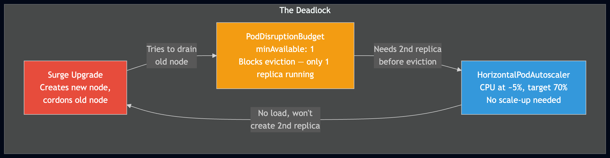
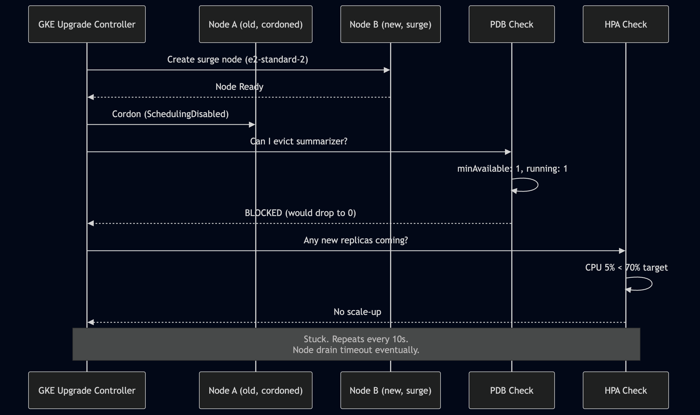

# My PodDisruptionBudget Deadlocked a GKE Node Upgrade for 23 Minutes

*This is the fourteenth post in a series about learning Kubernetes by building FeedForge — an RSS feed aggregator with AI summarization on GKE. These posts are learning notes from someone figuring things out in real time. [Previous post here.](https://medium.com/@huchka)*

---

> Check out the [`phase-6`](https://github.com/huchka/feedforge/tree/phase-6) tag in the FeedForge repo for the full source code at this point.

I added PodDisruptionBudgets to every workload, ran `terraform apply` to upgrade my node pool, and watched the upgrade hang for over 20 minutes. Three Kubernetes systems — PDB, HPA, and GKE's surge upgrade — were each doing exactly what I told them to do. Together, they created a deadlock that none of them could break.

This post walks through the deadlock, why it happens, and the configuration change that unblocked it.

## The Setup

FeedForge runs on a 3-node GKE cluster (e2-medium). Phase 6 added reliability features: ResourceQuota, LimitRange, PodDisruptionBudgets, and a maintenance window. I also needed to upgrade the node machine type from e2-medium to e2-standard-2 because system pods were consuming 96% of allocatable CPU, leaving no room for pod rescheduling.

The PDB config was straightforward:

```yaml
apiVersion: policy/v1
kind: PodDisruptionBudget
metadata:
  name: summarizer
spec:
  minAvailable: 1
  selector:
    matchLabels:
      app.kubernetes.io/name: summarizer
```

The HPA for the summarizer at the time:

```yaml
apiVersion: autoscaling/v2
kind: HorizontalPodAutoscaler
spec:
  minReplicas: 1
  maxReplicas: 1  # effectively no scaling — changed to 2 after the incident
  metrics:
    - type: Resource
      resource:
        name: cpu
        target:
          type: Utilization
          averageUtilization: 70
```

And the Terraform node pool had a surge upgrade strategy:

```hcl
upgrade_settings {
  max_surge       = 1
  max_unavailable = 0
}
```

Each of these is a reasonable, correct configuration on its own. Together, they're a trap.

## What Happened

I ran `terraform apply` to change the machine type. GKE started the node pool upgrade. The left terminal showed Terraform polling; the right showed `kubectl get node -w`:

```
NAME                     STATUS                    AGE
...-c889e42a-bhog        Ready                     25m     # new e2-standard-2
...-c889e42a-knru        Ready,SchedulingDisabled   2d20h  # old, cordoned
...-c889e42a-omke        Ready                     30m     # new e2-standard-2
...-c889e42a-kt6k        Ready,SchedulingDisabled   2d3h   # old, cordoned
```

The surge worked — new nodes appeared and old nodes were cordoned. But pods weren't moving. The old nodes stayed in `SchedulingDisabled` for over 20 minutes while Terraform kept printing:

```
module.gke.google_container_node_pool.primary: Still modifying... [18m40s elapsed]
module.gke.google_container_node_pool.primary: Still modifying... [18m50s elapsed]
module.gke.google_container_node_pool.primary: Still modifying... [19m0s elapsed]
```

## The Three-Way Deadlock

Here's what was happening:



**Surge upgrade** created a new node and cordoned the old one. It then tried to drain the old node by evicting pods.

**PDB** intercepted the eviction request. The policy says `minAvailable: 1`, and there's exactly 1 summarizer replica running — the one on the old node. Evicting it would drop the count to 0, so PDB blocked it. The eviction can only proceed if a second replica exists somewhere else first.

**HPA** checked whether to scale up the summarizer. CPU utilization was ~5% (the summarizer was idle, waiting for work on a Redis queue). The target is 70%. No scale-up needed.



The cycle:
1. GKE asks to evict the pod → PDB says no (need 2 running, only have 1)
2. PDB needs a second replica → HPA says no (CPU too low)
3. HPA won't create a replica → nothing changes → GKE retries

Nobody breaks the loop. The surge node sits empty and ready. The old node sits cordoned with a pod that can't be evicted. GKE retries the eviction every few seconds.

## Why Surge Upgrade Didn't Help

I initially assumed the surge upgrade strategy would prevent this. The logic seemed sound: create a new node first, let pods move there, then drain the old node. Zero downtime.

But surge upgrade only creates *capacity*. It doesn't create *replicas*. The new e2-standard-2 node was ready and schedulable, but K8s won't place a pod there unless something requests one — the Deployment controller (if replicas increased), the HPA (if load increased), or a rescheduling event (if a pod was evicted). All three paths were blocked.

## The First Fix: Delete the PDB

Realizing what was happening, I deleted the summarizer PDB:

```bash
kubectl delete pdb summarizer -n feedforge
```

The drain unblocked immediately. GKE evicted the summarizer, it got rescheduled on the new node, and the upgrade continued.

This worked but it's not a real solution. In production you can't just delete PDBs during upgrades.

## The Actual Fix: `maxUnavailable` Instead of `minAvailable`

The issue is `minAvailable: 1` on a single-replica workload. This tells K8s "at least 1 pod must always be running" — which means you can *never* evict the only pod.

Switching to `maxUnavailable: 1` says "you can take down at most 1 pod during disruption":

```yaml
spec:
  maxUnavailable: 1  # allows the eviction
  # instead of:
  # minAvailable: 1  # blocks the eviction
```

With `maxUnavailable: 1`, the drain can evict the single pod. K8s reschedules it on the new node. There's a brief window where the summarizer is down (while the new pod starts), but the eviction isn't blocked.

Note that even for a workload with HPA (like the backend with min: 1, max: 2), `minAvailable: 1` can still stall a drain if the workload happens to be idle when the drain starts. HPA is metric-driven, not disruption-aware — it won't scale up just because a drain is pending. `minAvailable: 1` is only reliably safe when the workload *already has* 2+ healthy replicas at the time of the disruption.

## The Decision Table

After debugging this, I mapped out when each PDB strategy works:

| PDB Policy | Running Replicas at Drain Time | Drain Works? | Downtime? |
|---|---|---|---|
| `maxUnavailable: 1` | 1 | Yes | Brief (pod rescheduling) |
| `maxUnavailable: 1` | 2+ | Yes | Likely none, depends on scheduling |
| `minAvailable: 1` | 1 (idle, won't scale) | **Deadlock** | N/A |
| `minAvailable: 1` | 2+ already running | Yes | Likely none |
| No PDB | Any | Yes | Depends on replicas, readiness, and scheduling |

The rule: **`minAvailable: 1` is only safe when you have 2+ replicas already running at the time of the disruption.** Having an HPA configured doesn't guarantee this — HPA is metric-driven, not disruption-driven. If the workload is idle when the drain starts, HPA won't create the extra replica that PDB is waiting for.

## A Related Problem: CPU Exhaustion on Small Nodes

The machine type upgrade itself was driven by another discovery. Before the upgrade, `kubectl describe nodes` showed:

```
Allocated resources:
  Resource    Requests     Limits
  cpu         905m (96%)   8243m (876%)
  memory      1334Mi (47%) 2163Mi (77%)
```

96% CPU requests on a node that's supposed to have room for pod rescheduling. My FeedForge workloads total ~370m CPU requests. The rest — over 500m per node — is GKE system components: Cilium (Dataplane V2), kube-proxy, metrics-server, kube-dns, gke-metrics-agent.

On e2-medium (~940m allocatable CPU), system pods consume ~60% of capacity before any application pods. There's physically no room to schedule a replacement pod during a drain, even without PDB issues. The upgrade to e2-standard-2 (~1940m allocatable) dropped system overhead to ~30%, leaving real headroom.

After the upgrade:

```
Allocated resources:
  Resource    Requests     Limits
  cpu         879m (45%)   8500m (440%)
  memory      1416Mi (22%) 2492Mi (41%)
```

45% CPU — enough room for surge nodes, HPA scaling, and rescheduling during drains.

## Things I Learned

### PDB Policy Must Match Your Scaling Strategy

A PDB doesn't exist in isolation. It interacts with your replica count, HPA configuration, and cluster upgrade strategy. `minAvailable: 1` is only safe when the workload *already has* 2+ replicas running at the time of the disruption. Having an HPA configured is not enough — HPA responds to metrics, not disruption events. If the workload is idle and running 1 replica when a drain starts, HPA won't help. For workloads that may be running a single replica during disruptions, `maxUnavailable: 1` is the correct policy.

### Surge Upgrade Creates Capacity, Not Replicas

I expected `max_surge = 1` to "just handle" the PDB situation. It doesn't. Surge upgrade ensures there's a *node* available for new pods, but it doesn't trigger pod creation. The Deployment controller, HPA, or an eviction event must do that. If PDB blocks the eviction, the surge node sits empty.

### Don't Ctrl+C Terraform During GCP Operations

When `terraform apply` is polling a long-running GCP operation, Ctrl+C only stops Terraform from polling — it doesn't cancel the server-side operation. The node pool modification continues, but Terraform loses track of the state. Let it finish, even if it takes 20 minutes.

### Small Node Types Hide a System Pod Tax

GKE system pods are easy to miss — they don't show up in the default `kubectl get pod` output (you need `-A` or `-n kube-system`) — but they consume real resources. On e2-medium, they take ~60% of allocatable CPU. You don't notice until you try to schedule a replacement pod during a drain and there's no room. Right-sizing nodes means accounting for this overhead, not just your workload requests.

### `ignore_changes` Prevents Terraform-Autoscaler Conflicts

Terraform's `node_count` and GKE's cluster autoscaler both want to control the same value. Without `ignore_changes = [node_count]` in the lifecycle block, every `terraform apply` resets the node count to whatever's in your config, undoing autoscaler decisions. Let Terraform manage the *bounds* (`min_node_count`, `max_node_count`) and the autoscaler manage the *actual count*.

---

*This is part of a series where I build FeedForge, an RSS aggregator with AI summarization, to learn Kubernetes from the ground up. Each phase adds new K8s concepts while building a real application.*
