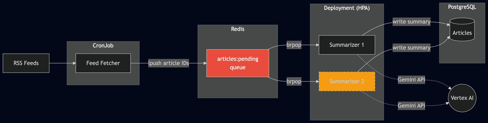
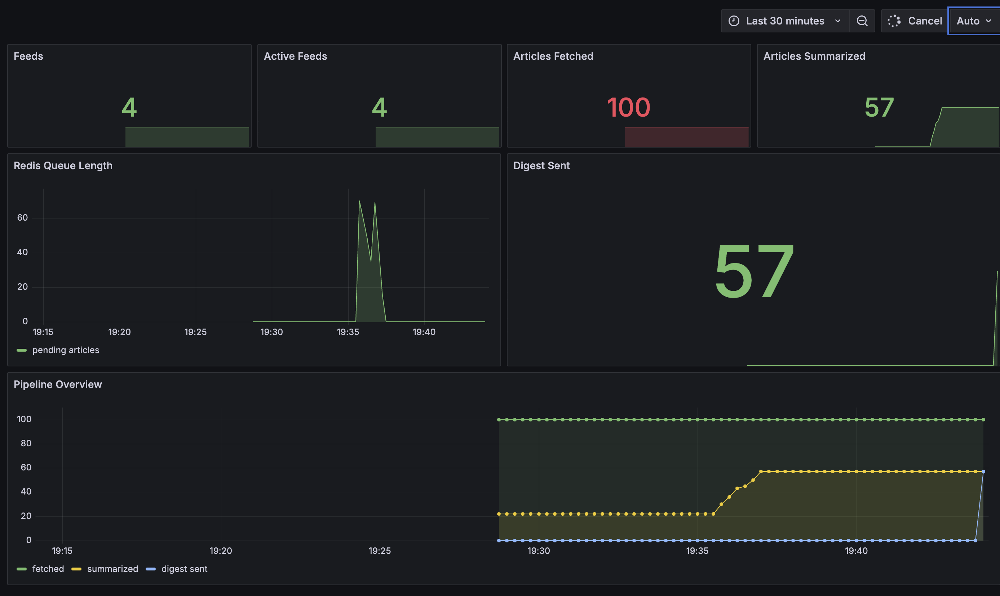
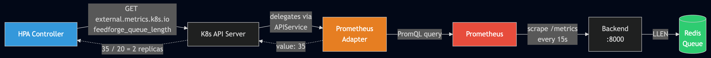

# Phase 6b - CPU-Based Autoscaling Was Wrong for My Queue Worker. Here's How I Switched to Custom Metrics.

*This is the fifteenth post in a series about learning Kubernetes by building FeedForge — an RSS feed aggregator with AI summarization on GKE. These posts are learning notes from someone figuring things out in real time. [Previous post here.](https://medium.com/@huchka)*

---

> Check out the [`phase-6-monitoring`](https://github.com/huchka/feedforge/tree/phase-6-monitoring) tag in the [FeedForge repo](https://github.com/huchka/feedforge) for the full source code at this point.

My summarizer worker had been scaling on CPU utilization. It worked, technically. But it was the wrong signal — the worker spends most of its time waiting on API responses from Gemini, not burning CPU. Meanwhile, 35 articles could pile up in Redis with the HPA sitting at 1 replica, perfectly content at 5% CPU usage.

This post covers the full journey: instrumenting the app with Prometheus, deploying a self-hosted monitoring stack, and wiring up an HPA that scales based on what actually matters — the number of items in the queue.

## The Problem with CPU-Based Scaling for Queue Workers

FeedForge's data pipeline works like this:



A CronJob fetches RSS feeds and pushes article IDs into a Redis list. The summarizer — a long-running Deployment — pops items from the list, sends them to the Gemini API for summarization, and writes the result to PostgreSQL.

The original HPA looked like this:

```yaml
metrics:
  - type: Resource
    resource:
      name: cpu
      target:
        type: Utilization
        averageUtilization: 70
```

The problem: summarizing an article is I/O-bound (waiting for Gemini to respond), not CPU-bound. The worker rarely hits 70% CPU, so the HPA almost never scales up, even with dozens of articles queued.

What I actually wanted: **if there are more than 20 articles in the queue, run 2 replicas. Otherwise, 1.**

## Step 1: Exposing Application Metrics

Before anything can scale on queue depth, something needs to know the queue depth. I added `prometheus-client` to the backend and created a `/metrics` endpoint that exposes business metrics alongside standard HTTP metrics:

```python
QUEUE_LENGTH = Gauge(
    "feedforge_queue_length",
    "Articles waiting in Redis queue",
)

def collect_business_metrics() -> None:
    r = redis.Redis(host=settings.redis_host, port=settings.redis_port)
    QUEUE_LENGTH.set(r.llen("feedforge:articles:pending"))
```

The `/metrics` endpoint handler calls `collect_business_metrics()` right before generating the Prometheus text output, so the gauge is refreshed on every scrape. I also added gauges for total articles fetched, summarized, and sent via digest — not needed for scaling, but useful for the Grafana dashboard.

The key design choice: these are **DB/Redis-derived gauges**, not per-request counters. The data already exists in the system. No worker code changes needed — the backend just queries it on each scrape.

## Step 2: Self-Hosted Prometheus + Grafana

I wanted to understand what Helm charts abstract away, so I wrote raw manifests.

**Prometheus** was straightforward — a Deployment with a ConfigMap for `prometheus.yml`:

```yaml
scrape_configs:
  - job_name: feedforge-backend
    metrics_path: /metrics
    static_configs:
      - targets: ["backend.feedforge.svc.cluster.local:8000"]
```

I used `static_configs` instead of `kubernetes_sd_config` because I only have one scrape target. Service discovery would require a ClusterRole for Prometheus to call the Kubernetes API — overkill for a single-service setup.

**Grafana** was more interesting. The challenge is making it declarative — if the pod restarts, the dashboard should come back automatically. This requires three ConfigMaps:

1. **Datasource** — tells Grafana where Prometheus lives
2. **Dashboard provider** — tells Grafana to load JSON files from a directory
3. **Dashboard JSON** — the actual panels and queries

Each ConfigMap gets mounted as a volume. Grafana reads them on startup and provisions everything automatically. No clicking through the UI.

The trickiest part was `readOnlyRootFilesystem`. Grafana writes to `/var/lib/grafana` (SQLite DB) and `/tmp`, so I needed emptyDir volumes at both paths. The dashboard ConfigMap had to mount at `/etc/grafana/dashboards` — not under `/var/lib/grafana` — to avoid being shadowed by the emptyDir.

### Different images, different UIDs

Each container image has its own non-root user convention:

| Image | UID | Why |
|-------|-----|-----|
| My app images | 999 | Custom user in Dockerfile |
| Prometheus | 65534 | `nobody` user |
| Grafana | 472 | Grafana's default |

You can't just pick `runAsUser: 999` for everything. The UID must match what the image expects — otherwise file ownership, writable directories, and entrypoint assumptions break. I learned this the hard way when Prometheus failed to start.

## Step 3: The Pipeline Dashboard

With metrics flowing, I built two Grafana dashboards. The "Backend" dashboard shows HTTP request rate, latency percentiles, and error rate. More useful was the "Pipeline" dashboard:



Four stat panels across the top (feeds, active feeds, articles fetched, articles summarized), a time series for Redis queue length, and a pipeline overview chart showing articles flowing through each stage. When the fetcher CronJob fires, you can watch the queue spike and then drain as the summarizer processes items.

## Step 4: Bridging Prometheus to the HPA

This is where it got interesting. The HPA can't query Prometheus directly. It can only read from the Kubernetes Metrics API. I needed a bridge:



**Prometheus Adapter** registers itself as a Kubernetes API extension server. When the HPA controller asks "what's `feedforge_queue_length`?", the Kubernetes API server delegates to the adapter, which translates it into a PromQL query against Prometheus.

This required several new concepts:

### APIService — Extending the Kubernetes API

```yaml
apiVersion: apiregistration.k8s.io/v1
kind: APIService
metadata:
  name: v1beta1.external.metrics.k8s.io
spec:
  service:
    name: prometheus-adapter
    namespace: feedforge
  group: external.metrics.k8s.io
  version: v1beta1
  insecureSkipTLSVerify: true
  groupPriorityMinimum: 100
  versionPriority: 100
```

This tells the Kubernetes API server: "when someone asks for `external.metrics.k8s.io/v1beta1`, forward the request to the `prometheus-adapter` Service in the `feedforge` namespace." This is the same mechanism that `metrics-server` uses for CPU/memory metrics.

### Cluster-Scoped RBAC

Until now, all my RBAC was namespace-scoped ServiceAccounts with `automountServiceAccountToken: false`. The adapter is different — it needs to authenticate with the Kubernetes API server, so `automountServiceAccountToken: true` was the first intentional exception in the project.

It also needs ClusterRoles (not just Roles):

- **`system:auth-delegator`** — lets the adapter participate in delegated authentication and authorization with the API server
- **resource-reader** — lets the adapter read namespaces and nodes for metric resolution
- **custom-metrics-server** — lets the adapter serve responses on the `external.metrics.k8s.io` API group

### The Adapter Config

The ConfigMap maps Prometheus metrics to the External Metrics API:

```yaml
externalRules:
  - seriesQuery: 'feedforge_queue_length'
    resources:
      overrides:
        namespace: {resource: "namespace"}
    name:
      matches: "^(.*)"
      as: "${1}"
    metricsQuery: 'feedforge_queue_length'
```

This says: "take the Prometheus metric `feedforge_queue_length` and serve it as-is through the External Metrics API."

## Step 5: The New HPA

With the metrics pipeline in place, the HPA change was the simplest part:

```yaml
metrics:
  - type: External
    external:
      metric:
        name: feedforge_queue_length
      target:
        type: Value
        value: "20"
```

For external metrics with `type: Value`, the HPA formula is: `desiredReplicas = ceil(currentReplicas * currentValue / targetValue)`. Starting from 1 replica:

- Queue = 15 items: `ceil(1 * 15/20) = 1` replica
- Queue = 21 items: `ceil(1 * 21/20) = 2` replicas
- Queue = 40 items: `ceil(1 * 40/20) = 2` replicas (capped by `maxReplicas: 2`)

Note that this formula means the behavior depends on the current replica count — it's proportional scaling, not a simple threshold. With `maxReplicas: 2` the distinction doesn't matter much here, but it's important to understand for larger scaling ranges.

After deploying, I added a new RSS feed and watched the fetcher pull 35 articles. The HPA saw `35/20` and immediately scaled to 2 summarizer replicas:

```
$ kubectl get hpa summarizer
NAME         REFERENCE               TARGETS   MINPODS   MAXPODS   REPLICAS   AGE
summarizer   Deployment/summarizer   35/20     1         2         2          6d2h
```

Exactly the behavior I wanted.

## The Debugging Gauntlet

Getting here wasn't smooth. Three issues in particular are worth documenting because they're the kind of problems you won't find in tutorials.

### 1. `readOnlyRootFilesystem` vs. Self-Signed Certs

The adapter crashed immediately:

```
unable to fetch server: error creating self-signed certificates:
mkdir apiserver.local.config: read-only file system
```

The adapter generates self-signed TLS certificates on startup (all Kubernetes API extension servers must serve HTTPS). It tries to write them to `apiserver.local.config/` in the working directory. With `readOnlyRootFilesystem: true`, this fails. The fix: mount an emptyDir at `/apiserver.local.config`.

This is a pattern I keep hitting: you want `readOnlyRootFilesystem` for security, but every image has its own writable paths. Sometimes you can find them in the image docs or by inspecting the Dockerfile, but often the fastest path is: apply the policy, watch the pod crash, read the error, add an emptyDir. Repeat until it starts.

### 2. Cross-Namespace RoleBinding vs. Kustomize

The adapter needs to read a ConfigMap in `kube-system` (the `extension-apiserver-authentication` ConfigMap containing the API server's CA cert). This requires a RoleBinding in `kube-system`:

```yaml
apiVersion: rbac.authorization.k8s.io/v1
kind: RoleBinding
metadata:
  name: prometheus-adapter:extension-apiserver-authentication-reader
  namespace: kube-system
```

But kustomize applies everything with the namespace from the kustomization — `feedforge`. A manifest targeting `kube-system` causes:

```
error: the namespace from the provided object "kube-system" does not
match the namespace "feedforge"
```

The solution: extract the RoleBinding into a standalone file and apply it separately, the same way I handle secrets. Not everything can go through kustomize, and that's fine.

### 3. ResourceQuota Exhaustion During Rolling Updates

This one was the most frustrating. After adding the monitoring stack, I deployed a new backend image and PostgreSQL disappeared. The rolling update temporarily doubled the backend's resource usage (old + new pod coexist), which exhausted the namespace CPU limits quota. With no room left, the StatefulSet controller couldn't schedule a new PostgreSQL pod:

```
exceeded quota: feedforge-quota, requested: limits.cpu=500m,
used: limits.cpu=3, limited: limits.cpu=3
```

The fix was bumping the quota with enough headroom for transient states. I learned to calculate worst-case quota by adding up every pod that could possibly exist at once — steady state + rolling update overlap + HPA max replicas + active CronJobs.

## A Stale Session Bug Along the Way

While testing the pipeline end-to-end, I discovered the summarizer wasn't processing new articles. The fetcher would insert 10 articles, but the summarizer would pick them from Redis and then fail silently because `db.get(Article, id)` returned `None`.

The root cause: the summarizer held a single SQLAlchemy session for its entire lifetime. A long-lived session means a long-lived transaction scope — the session's view of the database was stuck at the isolation snapshot from when the transaction started. When the fetcher (a separate process) inserted new articles and committed, the summarizer's stale session couldn't see those new rows.

The fix was creating per-request sessions:

```python
def process_one(article_id_str: str, client: genai.Client) -> bool:
    db = SessionLocal()
    try:
        article = db.get(Article, uuid.UUID(article_id_str))
        # ... summarize and commit
    finally:
        db.close()
```

This is a classic gotcha with long-running workers that use ORMs. Web frameworks handle it automatically (one session per HTTP request), but background workers don't get that for free.

## Things I Learned

- **CPU utilization is the wrong scaling signal for I/O-bound workers.** The worker was idle at low CPU while the queue grew. Custom metrics HPA is the right tool, but the gap between "I want this" and "it works" is large.

- **The Kubernetes Metrics API is an abstraction layer, not a data source.** The HPA doesn't know about Prometheus, Redis, or my app. It only speaks the Metrics API. Prometheus Adapter is the translator. Technically, Kubernetes distinguishes between "custom metrics" (per-pod, via `custom.metrics.k8s.io`) and "external metrics" (global, via `external.metrics.k8s.io`) — this post uses external metrics since queue length isn't per-pod. Understanding this architecture — APIService, API aggregation, auth delegation — is what makes it all click.

- **`readOnlyRootFilesystem` is often trial-and-error.** Every image has its own assumptions about writable paths. Sometimes the docs or Dockerfile tell you; often the fastest way is: apply the policy, read the crash log, add an emptyDir.

- **Quota math must account for transient states.** Steady-state pod count is not max pod count. Rolling updates, HPA scaling, and CronJobs can all run simultaneously. Calculate for the worst case or get surprised by a disappeared PostgreSQL pod.

- **Long-running workers need per-request database sessions.** This is obvious in hindsight — web frameworks do it automatically. But when you write a `while True` loop that processes queue items, you have to manage session lifecycle yourself.

- **Declarative Grafana provisioning via ConfigMaps is powerful but verbose.** Three ConfigMaps to avoid one manual click feels heavy. But when the pod restarts and the dashboard is just there, the investment pays off.

- **Not everything fits in kustomize.** Cross-namespace RoleBindings, pre-existing secrets, resources in other namespaces — some things need standalone `kubectl apply`. Fighting it wastes time. Accept it and document the manual step.
