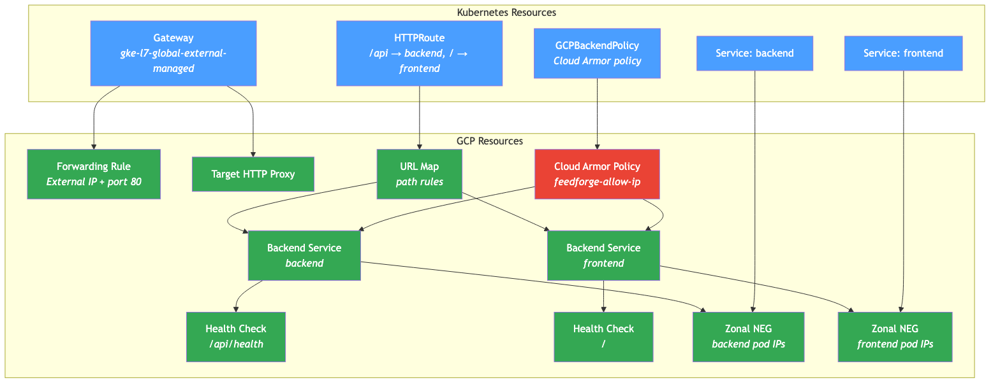
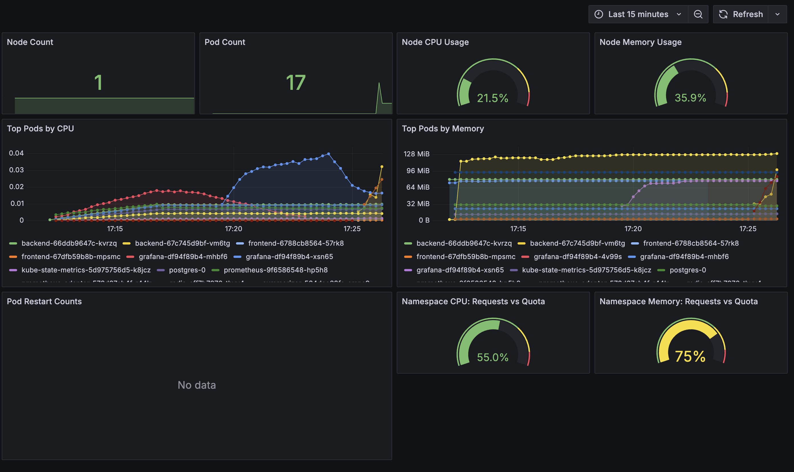

# Phase 7 - Kubernetes Ingress Is Frozen. Here's How I Migrated to Gateway API on GKE.

*This is the sixteenth post in a series about learning Kubernetes by building FeedForge — an RSS feed aggregator with AI summarization on GKE. These posts are learning notes from someone figuring things out in real time. [Previous post here.](https://medium.com/@huchka)*

---

> Check out the [`phase-7-gateway-api`](https://github.com/huchka/feedforge/tree/phase-7-gateway-api) tag in the [FeedForge repo](https://github.com/huchka/feedforge) for the full source code at this point.

Kubernetes SIG-Network has declared Ingress feature-complete. No new capabilities will be added. Gateway API is the official successor — it's where all the investment is going, and it's already GA on GKE.

I'd been running a GCE Ingress since day one. It worked fine, but if I'm learning Kubernetes, I should learn the thing that's actually moving forward. My routing was simple enough that migrating now was straightforward. Waiting would only make it harder.

This post covers the full migration. Along the way, I hit a CPU overcommit issue that had been silently degrading my cluster for weeks, and that led me to deploy cluster-wide monitoring I should have set up much earlier.

## Why Gateway API Over Ingress

Ingress is a single flat resource. Host rules, path rules, TLS config, and backend references all live in one object. Anything beyond basic routing requires vendor-specific annotations — and those annotations differ between nginx, GCE, AWS ALB, and every other controller. There's no standard way to do header-based routing, traffic splitting, or request mirroring.

Gateway API fixes this with a layered model:

- **GatewayClass** — what kind of load balancer (provided by the platform, e.g., GKE)
- **Gateway** — the load balancer instance (IP, ports, TLS certificates)
- **HTTPRoute** — routing rules (paths, headers, methods to backend services)
- **Policy CRDs** — backend behavior (health checks, Cloud Armor, timeouts)

The separation is intentional. In production organizations, platform teams own the Gateway (infrastructure), and application teams own their HTTPRoutes (routing logic). Each team manages their own resources without touching the other's. With Ingress, everything is tangled in one resource.

For a solo learning project the role separation doesn't matter much. But Gateway API also gives you concrete features Ingress lacks:

- **Path matching** — Ingress: Prefix and Exact only. Gateway API: adds RegularExpression* support.
- **Header-based routing** — Ingress: not supported. Gateway API: native.
- **Traffic splitting (canary)** — Ingress: not supported. Gateway API: native via `weight` on backendRefs.
- **Request mirror** — Ingress: not supported. Gateway API: native filter.
- **URL rewrite** — Ingress: annotation-dependent. Gateway API: native filter.
- **Cross-namespace routing** — Ingress: not supported. Gateway API: `ReferenceGrant` CRD.
- **Multiple protocols** — Ingress: HTTP/HTTPS. Gateway API: HTTP, gRPC, TCP, TLS.

*\*RegularExpression path matching depends on the Gateway implementation. GKE's `gke-l7-global-external-managed` currently supports Prefix and Exact only.*

And on GKE specifically: Ingress uses `BackendConfig` + annotations for Cloud Armor, health checks, and SSL. Gateway API uses typed CRDs (`GCPBackendPolicy`, `HealthCheckPolicy`) with proper validation. No more hoping your annotation string is correct.

### What GCP Resources Get Created Behind the Scenes

This is the part that confused me initially. When you apply a Gateway and HTTPRoute on GKE, the Gateway controller provisions the exact same GCP infrastructure that Ingress did:



- **Forwarding Rule** (from Gateway) — binds external IP + port to the target proxy
- **External IP** (from Gateway) — global or regional IP allocated by GKE
- **Target HTTP Proxy** (from Gateway) — terminates HTTP, forwards to URL Map
- **URL Map** (from HTTPRoutes) — all HTTPRoutes compile into one URL Map
- **Backend Service** (from HTTPRoute backendRef) — one per K8s Service referenced
- **Health Check** (auto per Backend Service) — configurable via HealthCheckPolicy
- **Zonal NEG** (from Service, auto) — pod IPs per zone, container-native load balancing
- **Cloud Armor Policy** (from GCPBackendPolicy) — IP allowlist / WAF rules

Same load balancer stack. Better Kubernetes abstractions on top. Understanding this made the migration less intimidating — nothing fundamentally changes at the GCP layer.

## The Migration

### Step 1: Enable Gateway API on the Cluster

My GKE Standard cluster didn't have Gateway API enabled — I had to opt in with one line in Terraform:

```hcl
gateway_api_config {
  channel = "CHANNEL_STANDARD"
}
```

This is an in-place cluster update — no node pool recreation. After `terraform apply`, `kubectl get gatewayclass` lists the available classes. I picked `gke-l7-global-external-managed` — the modern global external Application Load Balancer.

### Step 2: Replace Ingress with Gateway + HTTPRoute

My old Ingress had two path rules — `/api` to the backend, `/` to the frontend. The Gateway API equivalent:

```yaml
apiVersion: gateway.networking.k8s.io/v1
kind: Gateway
metadata:
  name: feedforge-gateway
spec:
  gatewayClassName: gke-l7-global-external-managed
  listeners:
    - name: http
      protocol: HTTP
      port: 80
---
apiVersion: gateway.networking.k8s.io/v1
kind: HTTPRoute
metadata:
  name: feedforge-route
spec:
  parentRefs:
    - kind: Gateway
      name: feedforge-gateway
  rules:
    - matches:
        - path:
            type: PathPrefix
            value: /api
      backendRefs:
        - name: backend
          port: 8000
    - matches:
        - path:
            type: PathPrefix
            value: /
      backendRefs:
        - name: frontend
          port: 8080
```

More YAML for the same routing, but structured instead of annotation-driven. The Gateway defines *what* the load balancer is. The HTTPRoute defines *where* traffic goes. They reference each other by name via `parentRefs`.

### Step 3: Cloud Armor via GCPBackendPolicy

The old setup used a `BackendConfig` resource plus a `cloud.google.com/backend-config` annotation on each Service. The Gateway API replacement is `GCPBackendPolicy` — one per service, targeting by name:

```yaml
apiVersion: networking.gke.io/v1
kind: GCPBackendPolicy
metadata:
  name: backend-armor
spec:
  default:
    securityPolicy: feedforge-allow-ip
  targetRef:
    group: ""
    kind: Service
    name: backend
```

No annotations on Services. No side-channel BackendConfig. The policy declares its target explicitly.

### The Health Check Gotcha

After deploying, the frontend loaded fine but API calls returned `503: no healthy upstream`. The backend pod was running — logs showed `200 OK` on `/api/health`. But mixed in were these:

```
35.191.222.131 - "GET / HTTP/1.1" 404 Not Found
35.191.222.133 - "GET / HTTP/1.1" 404 Not Found
```

The `35.191.x.x` IPs are Google's health check probes. The Gateway controller had created its own health check hitting `/` on the backend — which returns 404 because it's an API server with no root handler. The old Ingress-era health check (hitting `/api/health`) still existed separately, but the Gateway doesn't use it.

The fix is a `HealthCheckPolicy`:

```yaml
apiVersion: networking.gke.io/v1
kind: HealthCheckPolicy
metadata:
  name: backend-healthcheck
spec:
  default:
    config:
      type: HTTP
      httpHealthCheck:
        port: 8000
        requestPath: /api/health
  targetRef:
    group: ""
    kind: Service
    name: backend
```

After applying, health checks passed and the API responded through the Gateway. This is easy to miss — if your backend serves anything on `/`, you'd never notice the problem.

### The Old Load Balancer That Didn't Go Away

After everything was working on the Gateway, I checked the GCP console and found **two** load balancers running — the new one (`gkegw1-...`, "Application") from the Gateway API, and the old one (`k8s2-...`, "Application (Classic)") from the Ingress era.

I'd assumed removing the Ingress YAML from my kustomize manifests would clean it up. It didn't.

This is a critical thing to understand: **`kubectl apply` is additive, not subtractive.** When you remove a resource from your manifests and re-apply, Kubernetes doesn't delete the old resource from the cluster. It just stops being managed. The Ingress object was still sitting in the cluster, and the GKE Ingress controller was dutifully keeping its classic load balancer alive.

You need an explicit delete:

```bash
kubectl delete ingress feedforge-ingress -n feedforge
```

Only after this does GKE tear down the classic LB and its forwarding rules, backend services, and health checks. Until then, you're paying for two load balancers.

If you want kustomize to automatically prune resources that are no longer in the manifests, you can use:

```bash
kubectl apply -k k8s/overlays/dev --prune -l app.kubernetes.io/part-of=feedforge
```

The `--prune` flag deletes cluster resources that no longer appear in the manifest set, scoped to the label selector. But it's risky if your labels aren't consistent — it can accidentally delete things you didn't intend. For a learning project, explicit `kubectl delete` is the safer approach.

## The CPU Overcommit Problem I Didn't Know I Had

With the Gateway working, I went to check Grafana. `kubectl port-forward` connected but the browser showed nothing — just a blank page with broken pipe errors. Then `kubectl logs` started timing out entirely:

```
Get "https://10.0.0.26:10250/containerLogs/...": dial timeout, backstop
```

Port 10250 is the kubelet. The API server was trying to reach it and getting no response. But `kubectl get nodes` showed `Ready`. The node wasn't down — it was drowning.

### Diagnosing Without Metrics API

`kubectl top nodes` would have shown me CPU usage instantly, but it requires metrics-server which wasn't deployed on my cluster. The next best thing:

```bash
kubectl describe node | grep -A5 "Allocated resources"
```

This command shows the total resource requests and limits across all pods on the node, as a percentage of node capacity. No metrics server needed — it's computed from the pod specs:

```
Resource  Requests      Limits
cpu       1425m (73%)   10393m (538%)
```

**538% CPU limit overcommit.** My node has 2 vCPU (2000m). The pods on it were collectively allowed to burst to 10.4 vCPU.

### How Requests, Limits, and Autoscaling Actually Interact

This is worth understanding in detail because the behavior is counterintuitive.

**Requests** are what the scheduler uses for placement. Under CPU contention, they also determine how CPU time is proportionally divided between containers (via CFS shares). They're not a hard reservation — if nothing else is competing, a container can use more than its request. My requests totaled 1425m on a 2000m node. Plenty of room for scheduling. The scheduler was happy.

**Limits** are the maximum CPU a container can use. If a container tries to exceed its limit, the kernel throttles it (slows it down). Unlike memory limits, exceeding a CPU limit doesn't kill the container — it just gets less time on the processor.

**The autoscaler** watches for pods that can't be scheduled. If a pod is `Pending` because no node has enough *request* capacity, the autoscaler adds a node. But it never looks at limits. My requests were at 73% — the autoscaler saw no problem and would never trigger.

**What actually happens at runtime:** All containers can burst up to their limits simultaneously. My workloads had limits set to 4-5x their requests:

```
# Typical container in my manifests
resources:
  requests:
    cpu: 50m    # guaranteed minimum
  limits:
    cpu: 200m   # allowed to burst to 4x
```

Individually, a 4x burst ratio is normal. But multiply that across 10+ containers on one node:

- **My app pods** — requests: ~810m, limits: ~2,750m
- **GKE system pods** — requests: ~615m, limits: ~8,000m
- **Total** — requests: ~1,425m, limits: ~10,750m
- **Node capacity** — 2,000m

When multiple pods burst at the same time — during startup, health check storms, cron jobs firing — they all compete for 2,000m of real CPU. The Linux kernel divides time slices between them. Every process slows down, including the **kubelet** itself.

The kubelet is just another process on the node. When it can't get enough CPU to respond to API server requests within the timeout window, you get `dial timeout`. That's what was happening — the kubelet was being starved by the pods it was supposed to manage.

The irony: the system looked healthy from the control plane's perspective. Node status: Ready. Pods: Running. Autoscaler: nothing to do. But from inside the node, everything was fighting for CPU.

### Why GKE System Pods Make It Worse

I couldn't just fix my own pods. Running `kubectl describe node` with the full pod breakdown showed that GKE's system DaemonSets alone account for ~8,000m of CPU limits:

Each one with a 1,000m (1 full CPU) limit: `anetd` (Dataplane V2), `fluentbit-gke` (logging), `kube-dns`, `konnectivity-agent`, `gke-metrics-agent`, `netd`, `node-local-dns`, and `pdcsi-node` (CSI driver).

That's 8 CPU of limits from pods I didn't create and can't modify. On a 2 vCPU node, the system pods alone represent 400% overcommit. GKE sets these high limits as a safety net — system components need to burst during cluster operations. On my node, despite the high limits, their combined requests were ~615m and observed usage was low.

But it means my application pods' burst capacity stacks on top. The total can't be avoided on a single small node — the only lever I have is tightening my own limits.

### The Fix

Set all application CPU limits to 2x requests instead of 4-5x:

For workloads with 100m requests (backend, postgres, prometheus, backup job): limits went from 300-500m down to **200m**. For everything else at 50m requests (frontend, redis, summarizer, grafana, prometheus-adapter, fetcher, digest): limits went from 200m down to **100m**.

Also tightened the namespace-level guardrails:
- **LimitRange** default limit: 200m to 100m (catches containers without explicit resources)
- **LimitRange** max: 500m to 200m (prevents any single container from going too high)
- **ResourceQuota** limits.cpu: 6 to 3 (caps total namespace limits)

After redeploying, Grafana loaded immediately. The kubelet was responsive again. `kubectl logs` and `port-forward` worked without timeouts.

The total overcommit was still ~474% due to GKE system pods, but my application pods were no longer piling on. If I genuinely need more CPU (e.g., HPA scales up and requests don't fit), a pod will go `Pending` and the autoscaler will add a node — which is how it's supposed to work.

## Adding Cluster Monitoring

The overcommit issue made one thing clear: I was flying blind. My Prometheus only scraped the backend's `/metrics` endpoint. No node metrics, no pod metrics, no resource visibility. The only reason I found the overcommit was because I happened to run `kubectl describe node`.

### kube-state-metrics

Deployed `kube-state-metrics` — a single pod that watches the Kubernetes API and exposes object metrics as Prometheus gauges: pod status, restart counts, resource requests and limits, node conditions, quota usage, deployment replica counts.

It needs a ClusterRole with `list` and `watch` on core resources, but the security context is fully restrictive (no host access, read-only filesystem, non-root). It only talks to the API server.

### cAdvisor via Kubelet

For actual CPU and memory **usage** (not just what's requested), I needed cAdvisor metrics. On GKE, every kubelet exposes these at `/metrics/cadvisor`.

I considered deploying node-exporter, but it needs `hostPID`, `hostNetwork`, and access to `/proc` and `/sys` — all conflicting with my project's security context. Instead, I configured Prometheus to scrape cAdvisor through the Kubernetes API proxy:

```yaml
- job_name: kubelet-cadvisor
  scheme: https
  bearer_token_file: /var/run/secrets/kubernetes.io/serviceaccount/token
  tls_config:
    ca_file: /var/run/secrets/kubernetes.io/serviceaccount/ca.crt
    insecure_skip_verify: true
  kubernetes_sd_configs:
    - role: node
  relabel_configs:
    - target_label: __address__
      replacement: kubernetes.default.svc:443
    - source_labels: [__meta_kubernetes_node_name]
      target_label: __metrics_path__
      replacement: /api/v1/nodes/${1}/proxy/metrics/cadvisor
```

This routes through the API server which proxies to the kubelet. Prometheus needs a ClusterRole granting `get` on `nodes/proxy` and `nodes/metrics`, plus `automountServiceAccountToken: true` on its ServiceAccount (which I'd previously set to `false`).

### The Dashboard

Built a "GKE Cluster" Grafana dashboard:



Nine panels covering the three areas I wanted:
- **Node**: count, CPU usage %, memory usage %
- **Pods**: top 10 by CPU, top 10 by memory, restart counts
- **Namespace**: CPU requests vs quota, memory requests vs quota

One gotcha during dashboard development: the Node CPU/Memory gauges initially showed "No data." The queries used `on(node) group_left` to join cAdvisor metrics with kube-state-metrics — but the `node` label values didn't match between the two sources. Fixed by using cAdvisor's own `machine_cpu_cores` and `machine_memory_bytes` directly, avoiding cross-source joins entirely.

## Things I Learned

- **Ingress is frozen, Gateway API is the future.** Kubernetes SIG-Network won't add new features to Ingress. If you're starting a new project or your routing is still simple, migrate now. It only gets harder later.

- **Gateway API creates the same GCP resources as Ingress.** Forwarding rules, target proxies, URL maps, backend services, NEGs — all identical. The difference is purely in the Kubernetes abstraction. Don't let the new resource types intimidate you.

- **The Gateway controller creates its own health checks.** It doesn't inherit from Ingress. If your backend doesn't respond 200 on `/`, you need a `HealthCheckPolicy`. This will bite you silently — the frontend works fine, only API calls fail with 503.

- **`kubectl apply` doesn't delete resources you remove from manifests.** It's additive. After migrating from Ingress to Gateway API, the old Ingress resource stayed in the cluster and its classic load balancer kept running — costing money. You need an explicit `kubectl delete` to clean up.

- **CPU limit overcommit is invisible to the cluster autoscaler.** The autoscaler only watches request capacity. You can have 500% limit overcommit causing kubelet starvation and the autoscaler will happily report zero scaling needed. `kubectl describe node | grep -A5 "Allocated resources"` is your friend.

- **GKE system DaemonSets alone create ~400% limit overcommit on small nodes.** You can't change this. On `e2-standard-2`, tighten your own limits and accept that the total will still be high. If it causes real issues, scale to 2 nodes.

- **cAdvisor from kubelet is enough for node monitoring on GKE.** Skip node-exporter if your security context is restrictive. `machine_cpu_cores`, `machine_memory_bytes`, and per-container usage metrics cover the essentials.

- **My Prometheus deployment didn't auto-reload config changes.** After updating the scrape config ConfigMap, I had to delete the pod to pick up changes. Many production setups use a reloader sidecar or `/-/reload` endpoint, but with raw manifests this is easy to forget.

---

*Next up: LINE notifications when there's no news to report, and evaluating CloudSQL vs the current in-pod PostgreSQL.*
