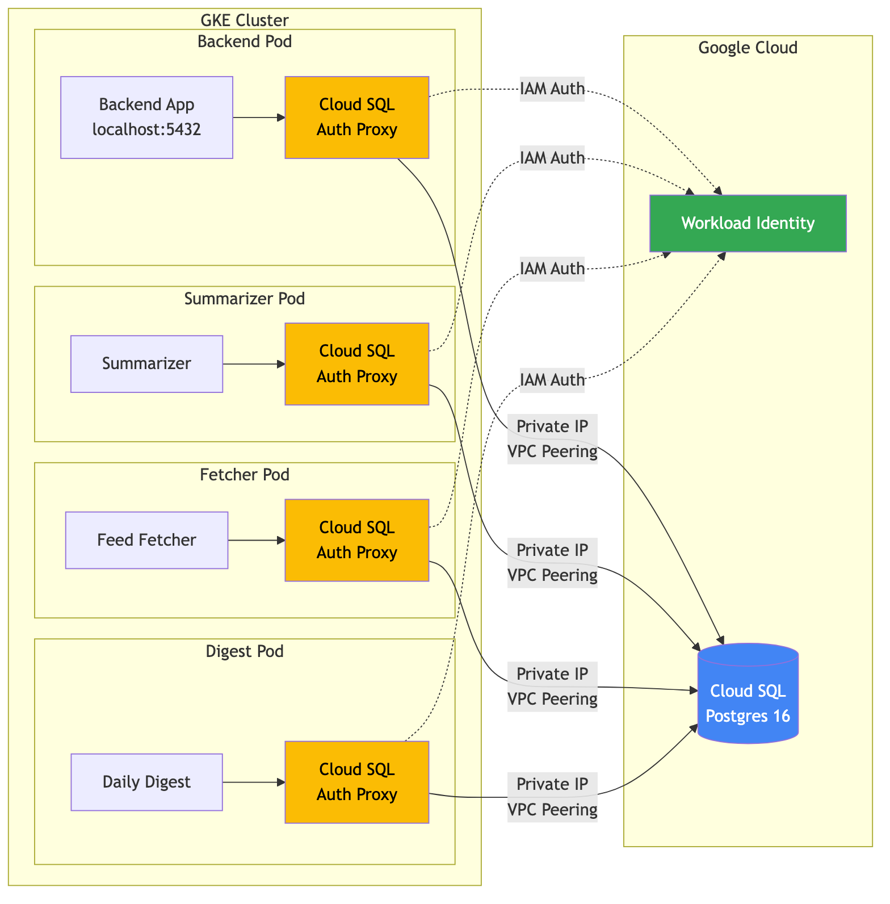

# Phase 7b - I Moved My Database Out of Kubernetes. Here's What Broke Along the Way.

*This is the seventeenth post in a series about learning Kubernetes by building FeedForge — an RSS feed aggregator with AI summarization on GKE. These posts are learning notes from someone figuring things out in real time. [Previous post here.](https://medium.com/@huchka)*

---

> Check out the [`phase-7-cloud-sql`](https://github.com/huchka/feedforge/tree/phase-7-cloud-sql) tag in the [FeedForge repo](https://github.com/huchka/feedforge) for the full source code at this point.

Before writing any code this session, I had a list of things on my mind. Not tasks — questions. The kind you need to think through before touching infrastructure.

- Should I move Postgres from an in-cluster StatefulSet to Cloud SQL?
- Is it safe to run `terraform apply` on a cluster with running pods?
- Should I switch from Cloud Build to GitHub Actions?
- Where is my Postgres data actually stored right now?

I didn't have full answers for any of them. So I started there.

## The Questions Before the Code

### Where is my data, actually?

I opened the GCE Disks page and found three disks:

- One 30 GB `pd-standard` — the GKE node boot disk
- Two 10 GB `pd-balanced` — both PVC-backed

Two PVC disks, but only Postgres should have a PVC. Redis and Prometheus both use `emptyDir`. The second disk was an orphan — left over from a previous `kubectl delete` and redeploy cycle.

This is by design. By default, when you delete a StatefulSet, Kubernetes does *not* delete its PersistentVolumeClaims. (Newer versions support `persistentVolumeClaimRetentionPolicy` to change this, but the default is to keep them.) The underlying GCE disk survives, silently sitting there. Good for data safety. Bad for awareness if you're not looking.

### Is `terraform apply` safe on a running cluster?

This one worried me. My cluster has live pods serving traffic. Would changing Terraform blow them away?

The answer: **it depends on what you change.**

- **Node pool changes** (machine type, disk size): Can trigger node or node-pool replacement. Nodes get drained and pods reschedule. If you don't have PodDisruptionBudgets, pods just get evicted.
- **Cluster-level settings** (logging config, maintenance window): Usually non-destructive. No pod impact.
- **Network changes** (VPC, subnets, secondary ranges): Potentially dangerous. Can force cluster recreation. Terraform will show `must be replaced` in the plan.
- **IAM, Artifact Registry, Cloud Build**: No impact on running pods at all.

The golden rule: **always run `terraform plan` first and read the output.** Look for `~ update in-place` (safe) vs `+/- must be replaced` (destructive). Never `apply` without reviewing.

### Cloud Build vs GitHub Actions?

I compared them side by side. Cloud Build has native GCP integration and I already had it Terraform-managed. GitHub Actions has a bigger ecosystem and is more portable. Both work fine. I decided to defer this to a separate task — two big infrastructure changes at once is asking for trouble.

### StatefulSet vs Cloud SQL?

This was the real decision. Here's how I thought about it:

| | In-pod (StatefulSet) | Cloud SQL |
|---|---|---|
| **Cost** | Free (runs on existing nodes) | ~$7-9/mo (db-f1-micro, us-central1, as of early 2026) |
| **Ops burden** | You manage backups, upgrades, failover | Google handles all of it |
| **HA/failover** | Manual | Built-in option |
| **Learning value** | High for StatefulSets | High for managed service integration |
| **Backup** | Custom pg_dump Job to GCS | Automated daily backups |

For a learning project, the StatefulSet was great — I learned about PVCs, headless services, and backup jobs. But I wanted to learn the managed service pattern too. Cloud SQL with Auth Proxy and Workload Identity is a common production pattern on GKE, and I hadn't done it before.

Decision made. Let's migrate.

## The Plan

The migration had three layers:

1. **Terraform** — create the Cloud SQL instance, VPC peering, and IAM
2. **Kubernetes** — add Auth Proxy sidecars, remove the Postgres StatefulSet
3. **Cleanup** — delete orphaned resources

The connection pattern looks like this:



Every pod that needs database access gets a `cloud-sql-proxy` sidecar container. The proxy authenticates to Cloud SQL via Workload Identity — no service account key files needed. The app still uses a database username and password (from a Kubernetes Secret), but the network-level auth and encrypted tunnel are handled by the proxy. The main application-level change was the hostname — from `postgres.feedforge.svc.cluster.local` to `localhost`.

## Terraform: Three New Modules' Worth of Changes

### Cloud SQL Module

A new Terraform module creates the instance:

```hcl
resource "google_sql_database_instance" "postgres" {
  name             = "feedforge-postgres"
  database_version = "POSTGRES_16"
  deletion_protection = false

  settings {
    edition           = "ENTERPRISE"
    tier              = "db-f1-micro"
    availability_type = "ZONAL"

    ip_configuration {
      ipv4_enabled    = false
      private_network = var.network_id
    }

    backup_configuration {
      enabled    = true
      start_time = "03:00"
      backup_retention_settings {
        retained_backups = 7
      }
    }
  }
}
```

Several things bit me here that I'll cover in the "what broke" section.

### VPC Peering for Private IP

Cloud SQL with private IP requires private services access — implemented via VPC peering with Google's service networking. Google runs Cloud SQL in their own VPC, and a peering connection gives your network a private path to the instance:

```hcl
resource "google_compute_global_address" "private_services" {
  name          = "feedforge-private-services"
  purpose       = "VPC_PEERING"
  address_type  = "INTERNAL"
  prefix_length = 16
  network       = google_compute_network.vpc.id
}

resource "google_service_networking_connection" "private_services" {
  network                 = google_compute_network.vpc.id
  service                 = "servicenetworking.googleapis.com"
  reserved_peering_ranges = [google_compute_global_address.private_services.name]
}
```

The first resource reserves an IP range in your VPC for Google's services. The second establishes the peering. Without this, your VPC has no private path to the Cloud SQL instance.

### IAM: Out with Backup, In with Proxy

I replaced the `db-backup` service account and GCS bucket with a `cloudsql-proxy` service account:

```hcl
resource "google_service_account" "cloudsql_proxy" {
  account_id   = "feedforge-cloudsql-proxy"
  display_name = "FeedForge Cloud SQL Proxy Service Account"
}

resource "google_project_iam_member" "cloudsql_proxy_client" {
  role   = "roles/cloudsql.client"
  member = "serviceAccount:${google_service_account.cloudsql_proxy.email}"
}
```

The Workload Identity bindings connect Kubernetes service accounts to this GCP service account. Backend, fetcher, and digest SAs all map to the proxy SA. The summarizer already had its own Workload Identity binding (for Vertex AI), so I added `roles/cloudsql.client` to its existing GCP SA instead.

## Kubernetes: The Sidecar Pattern

### Why Native Sidecars Matter

I couldn't just add the proxy as a regular container. The backend deployment has an init container that runs `alembic upgrade head` (database migrations). Init containers run *before* regular containers start. If the proxy were a regular container, alembic would try connecting to `localhost:5432` with nothing listening.

The fix: Kubernetes supports **native sidecars** (introduced in 1.28 alpha, enabled by default since 1.29) — init containers with `restartPolicy: Always`. They start before other init containers and keep running through the pod's lifetime. GKE supports this out of the box:

```yaml
initContainers:
  - name: cloud-sql-proxy
    image: gcr.io/cloud-sql-connectors/cloud-sql-proxy:2.15.2
    restartPolicy: Always  # native sidecar — starts first, stays running
    args:
      - "--structured-logs"
      - "--private-ip"
      - "--port=5432"
      - "$(CLOUD_SQL_INSTANCE)"
  - name: run-migrations
    # This runs AFTER the proxy is ready
    command: ["alembic", "upgrade", "head"]
```

The proxy starts first, then alembic runs with a working database connection, then the main containers start.

This also solves a problem with CronJobs. The fetcher and digest are CronJobs — they run, complete their work, and should terminate. A regular sidecar container would keep running after the main container exits, and the Job would never complete. Native sidecars are terminated automatically by Kubernetes when all regular containers finish.

### The ConfigMap Change

The only application-level change:

```yaml
# Before
FEEDFORGE_DB_HOST: "postgres.feedforge.svc.cluster.local"

# After
FEEDFORGE_DB_HOST: "localhost"
```

The app still connects to port 5432. It doesn't know or care that the proxy is forwarding traffic to a Cloud SQL instance across a VPC peering connection. That's the beauty of the sidecar pattern.

## What Broke (A Lot)

### 1. ENTERPRISE_PLUS Edition Default

First `terraform apply`:

```
Error: Invalid Tier (db-f1-micro) for (ENTERPRISE_PLUS) Edition
```

The Google Terraform provider now defaults to `ENTERPRISE_PLUS`, which only supports larger instance tiers. `db-f1-micro` requires explicitly setting `edition = "ENTERPRISE"`. And it goes inside the `settings` block, not at the top level — I put it in the wrong place the first time.

### 2. Bucket Deletion with Objects

Terraform tried to delete the old backup GCS bucket but failed:

```
Error: Error trying to delete bucket without `force_destroy` set to true
```

The bucket still had backup files in it. I'd already removed the resource from Terraform, so I opted to clean it up manually rather than temporarily re-adding it with `force_destroy`:

```bash
gsutil rm -r gs://feedforge-db-backup-project-76da2d1f-231c-4c94-ae9
```

Even that failed the first time — zsh expanded the `**` glob in the path. Had to quote it or drop the glob entirely.

### 3. Missing Cloud SQL Admin API

The proxy started fine but couldn't connect:

```json
{"severity":"ERROR","message":"Cloud SQL Admin API has not been used in project..."}
```

The proxy calls the Cloud SQL Admin API to look up instance metadata. This API (`sqladmin.googleapis.com`) wasn't enabled in the project — Terraform creating the instance uses a different API. Quick fix:

```bash
gcloud services enable sqladmin.googleapis.com
```

### 4. Missing `--private-ip` Flag

Next error after the API was enabled:

```json
{"message":"instance does not have IP of type \"PUBLIC\""}
```

The proxy defaults to connecting via public IP. My instance only has private IP (intentionally — keeps traffic internal). Adding `--private-ip` to the proxy args fixed it. Four manifests to update.

### 5. Orphaned Resources After Migration

After the new setup was running, the old Postgres pod was still there. Removing resources from `kustomization.yaml` means `kubectl apply -k` won't *create* them, but it doesn't *prune* existing ones either (unless you use `--prune`). I had to manually clean up:

```bash
kubectl delete statefulset postgres -n feedforge
kubectl delete service postgres -n feedforge
kubectl delete serviceaccount postgres db-backup -n feedforge
kubectl delete pvc -n feedforge -l app.kubernetes.io/name=postgres
kubectl delete job db-backup -n feedforge
```

I also noticed dozens of stale ReplicaSets — all those `0/0/0` entries from repeated deployments. Every time you apply a Deployment with any change to the pod template, Kubernetes creates a new ReplicaSet and scales the old one to zero. They're kept for rollback (`kubectl rollout undo`). By default, Kubernetes retains the last 10. Harmless, but noisy. You can trim them with `spec.revisionHistoryLimit: 3`.

## The Bonus Bug

While testing the full cycle (fetch -> summarize -> digest), the summarizer hit Gemini API rate limits. Expected — I was processing 60+ articles at once. But instead of retrying with backoff, it crashed:

```
AttributeError: 'ClientError' object has no attribute 'status_code'
```

The retry handler was using `exc.status_code`, but the google-genai SDK's `ClientError` uses `exc.code`. One character difference. This bug had been there since the summarizer was written — it just never triggered because the daily batch was small enough to stay under rate limits.

I fixed the attribute name and bumped the request delay from 1 second to 3 seconds between API calls. For normal daily runs (5-10 articles), this is plenty. The bulk catch-up scenario still hits limits, but now the exponential backoff actually works instead of crashing.

## Things I Learned

- **StatefulSet PVCs survive deletion by default.** When you delete a StatefulSet, the PVC and its underlying disk persist. Newer Kubernetes versions offer `persistentVolumeClaimRetentionPolicy` to change this, but out of the box you'll accumulate orphaned disks if you're not watching.

- **`terraform plan` is non-negotiable.** The difference between `~ update in-place` and `+/- must be replaced` is the difference between zero-downtime and a full cluster recreation. Always read the plan.

- **Native sidecars solve two real problems.** Init containers that need a running service (like database migrations needing a proxy) and CronJobs that need sidecars to terminate. The `restartPolicy: Always` pattern on init containers is elegant and worth knowing.

- **The Cloud SQL Auth Proxy needs more than `cloudsql.client`.** It also needs the Cloud SQL Admin API (`sqladmin.googleapis.com`) enabled in the project. Terraform creating the instance uses a different API, so this isn't automatic.

- **Private IP requires explicit opt-in on both sides.** VPC peering in Terraform *and* `--private-ip` on the proxy. Missing either one gives you a confusing error about the wrong IP type.

- **`kubectl apply -k` doesn't prune removed resources.** Removing a resource from `kustomization.yaml` stops it from being created, but doesn't delete existing copies in the cluster. You need to clean up orphans manually, or use `--prune` / a GitOps controller for automatic garbage collection.

- **Stale ReplicaSets are normal.** Every Deployment change creates one. They're kept for rollback history. `revisionHistoryLimit` controls how many.
