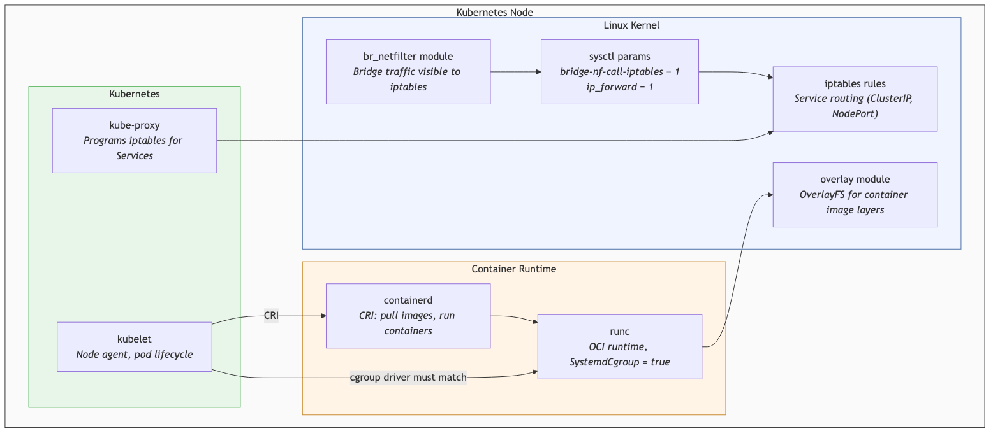

# K8s from Scratch #1: Every kubeadm Tutorial Lists These 5 Steps. Here's What They Actually Do.

*This is the second post in a mini-series about building Kubernetes from scratch on local VMs. [Previous post: why I'm doing this, the setup, and the full plan.](TODO) These are learning notes from someone pulling the curtain back on what managed K8s does for you.*

---

Every kubeadm setup guide starts the same way. Before you get anywhere near `kubeadm init`, there's a block of prerequisite commands you're told to run on every node. Load some kernel modules. Set some sysctl params. Disable swap. Install containerd. Install kubeadm.

Most people — including me, the first time — just copy-paste them and move on to the interesting part. But when I decided to build a cluster from scratch on local VMs, I wanted to actually understand what each step does at the Linux level and why Kubernetes breaks without it.

This post breaks down all five prerequisites. Not "run this command" — but what's happening in the kernel, why Kubernetes needs it, and what fails if you skip it.

---

## The Setup

Three arm64 Ubuntu 22.04 VMs on Apple Silicon (M2) using [Multipass](https://multipass.run/). One control plane node, two workers. All OS-level setup is automated through a single cloud-init YAML file — every node gets the same config.

> The full cloud-init config and lab scripts are in the [`k8s-bare-metal` repo](https://github.com/huchka/k8s-bare-metal). The code at this point is tagged [`phase-1`](https://github.com/huchka/k8s-bare-metal/tree/phase-1).

```bash
# Launch a VM with cloud-init
multipass launch 22.04 --name cp1 --cpus 2 --memory 2G --disk 20G \
  --cloud-init cloud-init/common.yaml
```

---

## 1. Kernel Modules: `overlay` and `br_netfilter`

```yaml
write_files:
  - path: /etc/modules-load.d/k8s.conf
    content: |
      overlay
      br_netfilter

runcmd:
  - modprobe overlay
  - modprobe br_netfilter
```

**`overlay`** enables OverlayFS — a union filesystem that lets you stack read-only layers on top of each other with a writable layer on top. This is how container images work. A container image is a stack of filesystem layers (base OS, dependencies, app code), and when you run a container, containerd uses OverlayFS to combine them into a single view with a thin writable layer for runtime changes. Without this module, containerd's default snapshotter won't work — and that's what virtually every standard setup uses.

**`br_netfilter`** makes traffic crossing a Linux bridge visible to iptables. This one is less obvious. In a typical kubeadm setup with bridge-based CNI networking, containers connect to a virtual bridge (think of it as a virtual network switch inside the node). When a packet moves from one container to another on the same node, it crosses this bridge. By default, Linux bridge traffic bypasses iptables entirely — the kernel treats it as Layer 2 switching, not Layer 3 routing.

The problem: in iptables-based setups, kube-proxy programs iptables rules to route traffic to Services (ClusterIP, NodePort). If bridge traffic can't be seen by iptables, those rules never fire. A pod trying to reach a Service on the same node would get no response — the iptables rule that rewrites the Service IP to a pod IP never executes. (Some modern CNIs like Cilium use eBPF instead of iptables, but kubeadm still requires these modules regardless.)

**Verification:**

```bash
$ lsmod | grep br_netfilter
br_netfilter           32768  0
bridge                356352  1 br_netfilter

$ lsmod | grep overlay
overlay               155648  0
```

---

## 2. Sysctl Network Parameters

```yaml
write_files:
  - path: /etc/sysctl.d/k8s.conf
    content: |
      net.bridge.bridge-nf-call-iptables = 1
      net.bridge.bridge-nf-call-ip6tables = 1
      net.ipv4.ip_forward = 1

runcmd:
  - sysctl --system
```

Loading `br_netfilter` makes bridge-to-iptables *possible*. These sysctl params actually *enable* it.

**`net.bridge.bridge-nf-call-iptables = 1`** tells the kernel: when a packet crosses a bridge, run it through the iptables rules. This is what makes kube-proxy's Service routing work for pod-to-pod traffic on the same node. The IPv6 counterpart (`bridge-nf-call-ip6tables`) does the same for IPv6 traffic.

**`net.ipv4.ip_forward = 1`** allows the node to act as a router — forwarding packets that aren't destined for itself. Without this, when Pod A on Node 1 sends a packet to Pod B on Node 2, Node 1 would just drop it. The packet's destination IP is Pod B (not Node 1), so the kernel says "not for me" and discards it. With forwarding enabled, the kernel checks its routing table and sends the packet toward Node 2.

**What breaks without these:** In bridge-and-iptables setups (which is what kubeadm gives you by default), missing bridge-nf-call means Service routing can fail for same-node traffic. Missing ip_forward means pods on different nodes can't communicate at all. You'd see pods running but unable to reach each other or any Service.

**Verification:**

```bash
$ sysctl net.bridge.bridge-nf-call-iptables
net.bridge.bridge-nf-call-iptables = 1

$ sysctl net.ipv4.ip_forward
net.ipv4.ip_forward = 1
```

---

## 3. Disable Swap

```yaml
runcmd:
  - swapoff -a
  - sed -i '/\sswap\s/d' /etc/fstab
```

kubelet refuses to start if swap is active. This isn't a soft preference — it's a hard check.

The reason is predictable memory accounting. Kubernetes uses memory `requests` for scheduling (deciding which node a pod fits on) and `limits` as a hard cap. The entire model assumes the kernel's OOM killer is the enforcement mechanism. If swap is active, a container that exceeds its limit doesn't get OOMKilled — it spills into swap instead. Now resource accounting is unreliable: the scheduler placed pods based on available RAM, but actual memory usage is invisible on disk. Other pods may not get the memory they were promised, and performance degrades unpredictably (swap is orders of magnitude slower than RAM).

Kubernetes made a design choice: deterministic memory behavior over flexibility. If a pod hits its limit, it gets OOMKilled — loud, visible, and debuggable. Silently swapping is none of those things. kubelet enforces this via `failSwapOn: true` by default.

`swapoff -a` disables swap immediately. The `sed` command removes swap entries from `/etc/fstab` so it stays off after reboot.

**Note:** Kubernetes 1.28+ has experimental swap support (`NodeSwap` feature gate), but it's off by default and not widely adopted. For a learning setup, keep swap off — it's one less variable when debugging.

**Verification:**

```bash
$ free -h
              total    used    free    shared  buff/cache  available
Mem:          1.9Gi   169Mi   466Mi   1.0Mi      1.3Gi      1.7Gi
Swap:            0B      0B      0B
```

---

## 4. containerd with Systemd Cgroup Driver

```yaml
write_files:
  - path: /etc/containerd/config.toml
    content: |
      version = 2
      [plugins."io.containerd.grpc.v1.cri".containerd.runtimes.runc]
        runtime_type = "io.containerd.runc.v2"
        [plugins."io.containerd.grpc.v1.cri".containerd.runtimes.runc.options]
          SystemdCgroup = true

runcmd:
  - apt-get install -y containerd
  - systemctl restart containerd
  - systemctl enable containerd
```

containerd is the container runtime — the thing that actually pulls images, creates containers, and manages their lifecycle. Kubernetes talks to it through the CRI (Container Runtime Interface). When kubelet needs to start a pod, it tells containerd "pull this image and run this container with these settings."

The critical config here is `SystemdCgroup = true`. This controls how container resource limits (CPU, memory) are enforced.

Linux uses cgroups (control groups) to limit what resources a process can use. There are two programs that can manage cgroups: **systemd** (the system init process) and **cgroupfs** (a standalone filesystem-based manager). The problem is when containerd uses one and kubelet uses the other. Both try to manage the same cgroup hierarchy but with different views of it. The result: inconsistent resource accounting, kubelet warnings or startup failures, and unstable pod behavior — resource limits may not be enforced correctly, and nodes can flicker between Ready and NotReady.

kubelet defaults to systemd as its cgroup driver on modern systems. So containerd must match. `SystemdCgroup = true` ensures they agree, and the cgroup hierarchy stays consistent.

**Verification:**

```bash
$ systemctl status containerd
● containerd.service - containerd container runtime
     Active: active (running)

$ grep SystemdCgroup /etc/containerd/config.toml
    SystemdCgroup = true
```

---

## 5. kubeadm, kubelet, kubectl

```yaml
runcmd:
  - apt-get install -y apt-transport-https ca-certificates curl gpg
  - mkdir -p -m 755 /etc/apt/keyrings
  - curl -fsSL https://pkgs.k8s.io/core:/stable:/v1.35/deb/Release.key | gpg --dearmor -o /etc/apt/keyrings/kubernetes-apt-keyring.gpg
  - echo 'deb [signed-by=/etc/apt/keyrings/kubernetes-apt-keyring.gpg] https://pkgs.k8s.io/core:/stable:/v1.35/deb/ /' | tee /etc/apt/sources.list.d/kubernetes.list
  - apt-get update
  - apt-get install -y kubelet kubeadm kubectl
  - apt-mark hold kubelet kubeadm kubectl
  - systemctl enable kubelet
```

Three components, three different jobs:

- **kubeadm** — the cluster bootstrapper. On the control plane, `kubeadm init` creates etcd, the API server, the scheduler, and the controller manager as static pods. On workers, `kubeadm join` registers the node with the cluster. After setup, you rarely touch it again.
- **kubelet** — the node agent that runs on every node, forever. It watches the API server for pod assignments, tells containerd to run containers, reports node status, and enforces resource limits. If kubelet stops, the control plane eventually marks the node `NotReady` (after missed heartbeats) and may reschedule its pods — though existing containers keep running until the node is cleaned up.
- **kubectl** — the CLI for talking to the API server. Strictly speaking, workers don't need it, but it's useful for debugging on any node.

**`apt-mark hold`** pins the package versions. This matters because Kubernetes has a strict version skew policy — kubelet must not be newer than the API server and can only be a limited number of minor versions behind it. An unplanned `apt upgrade` could bump kubelet to a version your control plane doesn't support, taking the node offline.

One thing that confused me the first time: after installing kubelet, systemd starts it and it immediately exits, over and over. This is normal — kubelet needs configuration that only exists after `kubeadm init` or `kubeadm join` writes it. systemd keeps restarting it until that config appears. It's not broken — it's waiting.

**Verification:**

```bash
$ kubeadm version
kubeadm version: v1.35.3

$ kubelet --version
Kubernetes v1.35.3

$ apt-mark showhold
kubeadm
kubectl
kubelet
```

---

## How It All Connects

Here's how these five prerequisites fit together at runtime:



The kernel modules and sysctl params create the networking foundation. containerd provides the container runtime. kubelet sits on top, orchestrating everything through the CRI. And kube-proxy (installed later by kubeadm) programs the iptables rules that rely on all of this being in place.

Skip any one piece and something downstream breaks — often silently.

---

## Things I Learned

**cloud-init's `write_files` creates parent directories automatically.** I initially had a `mkdir -p /etc/containerd` in my runcmd before writing the config file. Unnecessary — cloud-init handles it. Small thing, but it's the kind of thing you only learn by actually writing the config instead of copy-pasting a script.

**YAML comment syntax matters in cloud-init.** I wrote `- # install containerd` as a runcmd item, thinking it was a comment. It's not — `- ` makes it a list item (an empty string). cloud-init would try to execute an empty command. Comments in a YAML list need to be standalone lines without the list marker: `# install containerd`, not `- # install containerd`.

**The cgroup driver mismatch is a sneaky source of instability.** When containerd and kubelet disagree on the cgroup driver, you don't get a clear error at startup. You get inconsistent resource enforcement, pods behaving unpredictably, and nodes flickering between Ready and NotReady. The fix is simple (set `SystemdCgroup = true`), but diagnosing it without knowing the cause is painful.

**Building from scratch makes you appreciate managed K8s.** After spending a session configuring kernel modules and sysctl params, I have a much better understanding of what GKE handles for you. Every GKE node comes with all of this already configured. When you're debugging networking issues on a managed cluster, knowing that `br_netfilter` and `bridge-nf-call-iptables` exist — and what they do — gives you a mental model that "it just works" never will.

---

## What's Next

Phase 2: setting up Ansible to manage the cluster nodes, then bootstrapping the control plane with `kubeadm init`. That's where the real Kubernetes begins — static pods, etcd, and the API server.

---

*Building a K8s cluster from scratch on local VMs. Follow along for posts about what's actually happening under the Kubernetes hood.*
