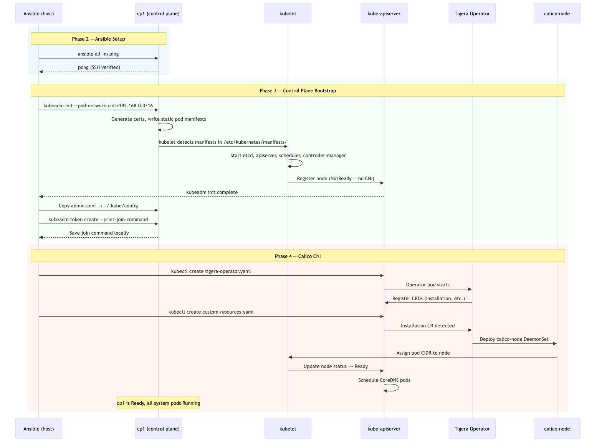

# K8s from Scratch #2: From Three Disconnected VMs to a Running Control Plane

*This is post #2 in a mini-series about building Kubernetes from scratch on local VMs. [Previous post: the five OS-level prerequisites and what they actually do.](TODO) These are learning notes from someone pulling the curtain back on what managed K8s does for you.*

---

At the end of Phase 1, I had three Ubuntu VMs with the right kernel modules loaded, containerd installed, and kubeadm ready to go. Three identically prepared machines that knew nothing about each other. No cluster. No orchestration. Just Linux boxes waiting for instructions.

This post covers three phases that turn those VMs into a working Kubernetes control plane: wiring them together with Ansible, bootstrapping the cluster with `kubeadm init`, and installing Calico so the control-plane node actually goes `Ready`. By the end, cp1 has a running API server, etcd, scheduler, controller manager, CoreDNS, and a full CNI — all verified.

> The full project is at [`huchka/k8s-bare-metal`](https://github.com/huchka/k8s-bare-metal) on GitHub. The code at this point is tagged [`phase-4`](https://github.com/huchka/k8s-bare-metal/tree/phase-4).

Here's the full bootstrap flow across all three phases:



---

## Phase 2: Ansible Setup

### Why Ansible

I could SSH into each VM and run commands manually. For three nodes, it's manageable. But the moment you rebuild the cluster (and you will — I've destroyed and recreated mine multiple times already), repeating commands across three nodes gets tedious and error-prone.

Ansible solves this with two properties: **targeting** (run this on control plane nodes, run that on workers) and **idempotency** (run the playbook twice, get the same result). Both matter more than you'd expect on a learning project — you're constantly tweaking and re-running things.

### The Inventory

Ansible needs to know what machines exist and how to reach them. That's the inventory file:

```ini
[control_plane]
cp1 ansible_host=192.168.2.5

[workers]
worker1 ansible_host=192.168.2.6
worker2 ansible_host=192.168.2.7

[k8s:children]
control_plane
workers

[k8s:vars]
ansible_user=ubuntu
ansible_ssh_private_key_file=~/.ssh/multipass_default
ansible_python_interpreter=/usr/bin/python3.10
```

Three things to understand here:

**Groups** — `[control_plane]` and `[workers]` let you target commands by role. `kubeadm init` only runs on the control plane. `kubeadm join` only runs on workers. Without groups, you'd need separate inventory files or awkward conditionals.

**`[k8s:children]`** — A parent group that includes both. When you need something on all nodes (like checking connectivity), you target `k8s` instead of listing both groups.

**`[k8s:vars]`** — Shared connection settings. `ansible_user=ubuntu` because that's Multipass's default user. The SSH key and Python interpreter apply to every node in the group.

### SSH Connectivity

Multipass manages its own SSH keys, stored at `/var/root/Library/Application Support/multipassd/ssh-keys/id_rsa` on macOS. That path is owned by root, so Ansible can't use it directly. The fix is straightforward — copy the key to your user's SSH directory:

```bash
sudo cp "/var/root/Library/Application Support/multipassd/ssh-keys/id_rsa" \
  ~/.ssh/multipass_default
sudo chown $(whoami) ~/.ssh/multipass_default
chmod 600 ~/.ssh/multipass_default
```

Then verify:

```bash
$ ansible all -i ansible/inventory.ini -m ping
worker2 | SUCCESS => { "ping": "pong" }
worker1 | SUCCESS => { "ping": "pong" }
cp1     | SUCCESS => { "ping": "pong" }
```

Three pongs. Ansible can reach all nodes. Phase 2 done.

### A Side Lesson: Idempotency Before Ansible

Before I even touched Ansible, I ran into an idempotency problem with my own `lab.sh` script. The `up` command would fail if VMs already existed — even if they were just stopped:

```
$ ./lab.sh up
Error: VM 'cp1' already exists. Run './lab.sh destroy' first.
```

Destroy and recreate just because the VM was stopped? That's the opposite of what `up` should mean. The fix was to check each VM's state and handle all three cases:

```bash
cmd_up() {
  for vm in "${NODES[@]}"; do
    state=$(multipass info "$vm" --format csv 2>/dev/null | tail -1 | cut -d, -f2 || echo "")
    if [ "$state" = "Running" ]; then
      echo "  $vm already running"
    elif [ -n "$state" ]; then
      echo "  Starting $vm..."
      multipass start "$vm"
    else
      echo "  Launching $vm..."
      multipass launch $UBUNTU_VERSION --name "$vm" --cpus $CPUS --memory $MEMORY --disk $DISK \
        --cloud-init "$CLOUD_INIT"
    fi
  done
}
```

Running → skip. Stopped → start. Doesn't exist → launch. Now `./lab.sh up` is safe to run anytime. The same principle that makes Ansible playbooks reliable applies to every script you write around infrastructure.

---

## Phase 3: Bootstrapping the Control Plane

### What kubeadm init Actually Creates

`kubeadm init` is one command that does a lot. Here's what it creates on the control plane node:

```bash
kubeadm init \
  --pod-network-cidr=192.168.0.0/16 \
  --apiserver-advertise-address=192.168.2.5
```

After this runs, four components are running as **static pods** — containers defined by manifest files that kubelet reads directly from disk at `/etc/kubernetes/manifests/`. kubelet watches that directory and runs whatever it finds, no API server needed (since the API server itself is one of these pods):

- **etcd** — The cluster's key-value store. Every piece of cluster state — every Deployment, every Pod spec, every ConfigMap — lives here. It's the single source of truth. If etcd dies, your cluster loses its memory.
- **kube-apiserver** — The front door to the cluster. Every `kubectl` command, every kubelet heartbeat, every controller reconciliation loop goes through the API server. It validates requests, writes to etcd, and serves watch events.
- **kube-scheduler** — Watches for unscheduled pods and picks a node for each one based on resource requests, affinity rules, and constraints. It makes the scheduling decision but doesn't run the pod — that's kubelet's job.
- **kube-controller-manager** — Runs the reconciliation loops that make Kubernetes declarative. The Deployment controller creates ReplicaSets. The ReplicaSet controller creates Pods. The Node controller marks nodes as `NotReady` when heartbeats stop. Each controller watches the desired state in etcd and drives reality toward it.

### The Two Flags

**`--pod-network-cidr=192.168.0.0/16`** — Tells the cluster what IP range to use for pods. This value must match what your CNI plugin expects (or what you configure it to use). Calico defaults to `192.168.0.0/16`. Flannel uses `10.244.0.0/16`. Get this wrong and your CNI won't assign pod IPs correctly.

**`--apiserver-advertise-address=192.168.2.5`** — Tells the API server which IP to bind to and advertise to other components. On a multi-NIC node, this ensures the API server listens on the right interface.

### kubeconfig: How kubectl Authenticates

After init, kubeadm writes `/etc/kubernetes/admin.conf` — a kubeconfig file containing the cluster CA certificate and an admin client certificate. kubectl uses this to authenticate with the API server over TLS.

The playbook copies it to the ubuntu user's home:

```yaml
- name: Copy admin kubeconfig to ubuntu user
  copy:
    src: /etc/kubernetes/admin.conf
    dest: /home/ubuntu/.kube/config
    remote_src: true
    owner: ubuntu
    mode: "0600"
```

Without this, every kubectl command would need `sudo` and `--kubeconfig=/etc/kubernetes/admin.conf`.

### The Join Command

Workers need a way to securely join the cluster. `kubeadm token create --print-join-command` generates a command containing a bootstrap token (valid 24 hours) and the CA certificate hash. Together, they let a worker verify it's talking to the real API server and authenticate itself.

The playbook saves this to a local file for the worker playbook to use later. The join command is a secret — it contains a token that allows a node to bootstrap into the cluster — so it's gitignored.

### The Expected Broken State

Right after `kubeadm init`, the node is `NotReady` and CoreDNS pods are `Pending`:

```
$ kubectl get nodes
NAME   STATUS     ROLES           AGE   VERSION
cp1    NotReady   control-plane   38s   v1.35.3

$ kubectl get pods -n kube-system
coredns-7d764666f9-c5gh7   0/1   Pending   0   29s
coredns-7d764666f9-tvzh8   0/1   Pending   0   29s
```

This is normal, not broken. Without a CNI plugin, the node's network plugin is not initialized. kubelet reports the node as `NotReady`, and kubeadm applies a `node.kubernetes.io/not-ready` taint. CoreDNS pods don't tolerate that taint, so the scheduler won't place them. Once a CNI is installed and the network plugin reports healthy, the taint is removed, and CoreDNS gets scheduled.

---

## Phase 4: Installing Calico

### Why Calico

Three mainstream options, each with different tradeoffs:

| CNI | Approach | NetworkPolicy | Learning Value |
|-----|----------|--------------|----------------|
| Flannel | VXLAN overlay | No | Simplest, minimal config |
| Calico | BGP or VXLAN | Yes | Production-grade, more to explore |
| Cilium | eBPF | Yes | Most powerful, steepest curve |

I went with Calico. It supports NetworkPolicy (which I plan to use in Phase 7) without requiring eBPF knowledge. It's what I'd recommend for anyone who wants more than the bare minimum without going deep on kernel-level networking.

### Operator-Based Install

Calico's recommended install uses the Tigera operator pattern:

1. **Install the operator** — A controller that watches for Calico-specific custom resources
2. **Apply the custom resource** — An `Installation` CR that tells the operator what to deploy

```yaml
- name: Install Tigera operator
  command: kubectl create -f {{ calico_base_url }}/tigera-operator.yaml

- name: Apply Calico custom resources
  command: kubectl create -f {{ calico_base_url }}/custom-resources.yaml
```

The operator then creates everything: the `calico-node` DaemonSet (runs on every node, programs routes and enforces NetworkPolicy), `calico-typha` (a fan-out proxy that reduces API server load), `calico-kube-controllers` (syncs Kubernetes resources into Calico's datastore), and the CSI node driver.

### The Race Condition

My first run failed:

```
TASK [Apply Calico custom resources]
fatal: [cp1]: FAILED! =>
  "no matches for kind \"Installation\" in version \"operator.tigera.io/v1\""
  "ensure CRDs are installed first"
```

The operator manifest was applied, but the API server hadn't finished establishing the new CRDs yet when the playbook tried to create the custom resource. The CRDs are part of the operator manifest, but after `kubectl create` returns, the API server still needs time to recognize them as servable resource types. The playbook moved on immediately and hit a wall.

The fix: wait for both the operator deployment and the CRD registration before applying the CR:

```yaml
- name: Wait for Tigera operator to be ready
  command: >
    kubectl rollout status deployment/tigera-operator
    -n tigera-operator --timeout=120s
  retries: 3
  delay: 10

- name: Wait for Installation CRD to be registered
  command: kubectl get crd installations.operator.tigera.io
  retries: 12
  delay: 5
```

This is a common pattern with CRD-heavy installs — the API server needs time to establish new resource types after the manifests are applied. Any playbook or script that creates CRDs and then immediately creates custom resources based on them needs a wait step in between.

### The Moment It Works

After Calico finishes deploying:

```
$ kubectl get nodes
NAME   STATUS   ROLES           AGE   VERSION
cp1    Ready    control-plane   15m   v1.35.3
```

`Ready`. That single word means the node has a functioning CNI, a pod CIDR assigned, and kubelet is reporting healthy. CoreDNS is finally running too — it was waiting for exactly this.

---

## Understanding the Two IP Spaces

Something that confused me initially: control plane pods showed the node's IP (`192.168.2.5`), not an IP from the pod CIDR (`192.168.0.0/16`).

There are two separate IP spaces in a Kubernetes cluster:

| What | Range | Managed by |
|------|-------|-----------|
| Node IPs | `192.168.2.x` | Multipass (host network) |
| Pod CIDR | `192.168.0.0/16` | Calico |

Control plane static pods (etcd, apiserver, scheduler, controller-manager) use `hostNetwork: true` — they bind directly to the node's IP because they need to be reachable before pod networking exists. Regular pods get IPs from the pod CIDR. Calico allocates each node a block from the pool (by default `/26` — 64 IPs per node, expandable as needed).

One thing worth noting: my node network (`192.168.2.x`) falls within the pod CIDR (`192.168.0.0/16`). This is a configuration mistake I got away with in a small cluster, but it's wrong. If Calico ever allocates a block that includes `192.168.2.0/24`, traffic destined for a pod IP could be confused with traffic to a node — routing becomes ambiguous. In production (or any setup you don't want to debug at 2am), use non-overlapping ranges. I'll likely fix this in a rebuild.

---

## Playbook Design Choices

### Idempotency Through Pre-Checks

Every playbook checks state before acting. The control plane playbook checks for `/etc/kubernetes/admin.conf` — if it exists, `kubeadm init` already ran:

```yaml
- name: Check if cluster is already initialized
  stat:
    path: /etc/kubernetes/admin.conf
  register: kubeadm_already_init

- name: Run kubeadm init
  command: kubeadm init ...
  when: not kubeadm_already_init.stat.exists
```

The Calico playbook checks for the tigera-operator namespace and the Installation resource. Without these checks, re-running a playbook would fail — `kubeadm init` and `kubectl create` both error on duplicate resources.

### One Playbook Per Phase

I kept each phase in its own playbook file rather than combining them:

- `init-control-plane.yaml` — kubeadm init, kubeconfig, join command
- `install-calico.yaml` — operator + custom resources + wait

This lets you re-run phases independently. If Calico needs troubleshooting, you don't re-run the entire bootstrap. Each playbook is a self-contained, re-runnable unit.

---

## Things I Learned

**The Multipass SSH key is root-owned.** On macOS, Multipass stores its SSH key at `/var/root/Library/Application Support/multipassd/ssh-keys/id_rsa`. You need `sudo` to copy it. Small detail, but it's the kind of thing that blocks you for 10 minutes if you don't expect it.

**CRD establishment is not instant.** Applying a manifest that includes CRDs and then immediately creating resources of those types will fail. The API server needs time to recognize new CRDs as servable. This is true for any CRD-heavy install, not just Calico's. Always add a wait step between CRD creation and custom resource creation.

**`NotReady` after `kubeadm init` is expected.** The first time I saw it, I thought something was wrong. It's not — it's the normal state before a CNI is installed. Same with CoreDNS stuck in `Pending`. Both resolve themselves once Calico (or any CNI) is deployed.

**The Python interpreter warning is worth fixing — for your specific environment.** Ansible's auto-discovery of the Python interpreter generates a noisy warning on every run. Pinning `ansible_python_interpreter=/usr/bin/python3.10` in the inventory silences it for Ubuntu 22.04, but the path will be different on other OS versions. It's an environment-specific fix, not a universal best practice.

**Idempotency lessons start before the tools that teach them.** I hit a non-idempotent `lab.sh up` command before I even touched Ansible. The same principle — check current state before acting, handle all cases — applies at every level: shell scripts, playbooks, Kubernetes controllers. It's the most transferable concept in infrastructure automation.

**The pod CIDR choice is locked in at `kubeadm init` time.** You can't easily change it later — it's baked into the controller-manager config and affects every CNI and pod going forward. If you realize the CIDR conflicts with your node network after init, you're looking at a cluster rebuild. Choose carefully.

---

## What's Next

Phase 5: joining worker1 and worker2 to the cluster. The join command is saved, the playbook is written — we just need to run it and verify all three nodes are `Ready`. Then Phase 6: deploying real workloads, testing cross-node pod networking, and verifying DNS.

The cluster is about to become useful.

---

*Building a K8s cluster from scratch on local VMs. Follow along for posts about what's actually happening under the Kubernetes hood.*
