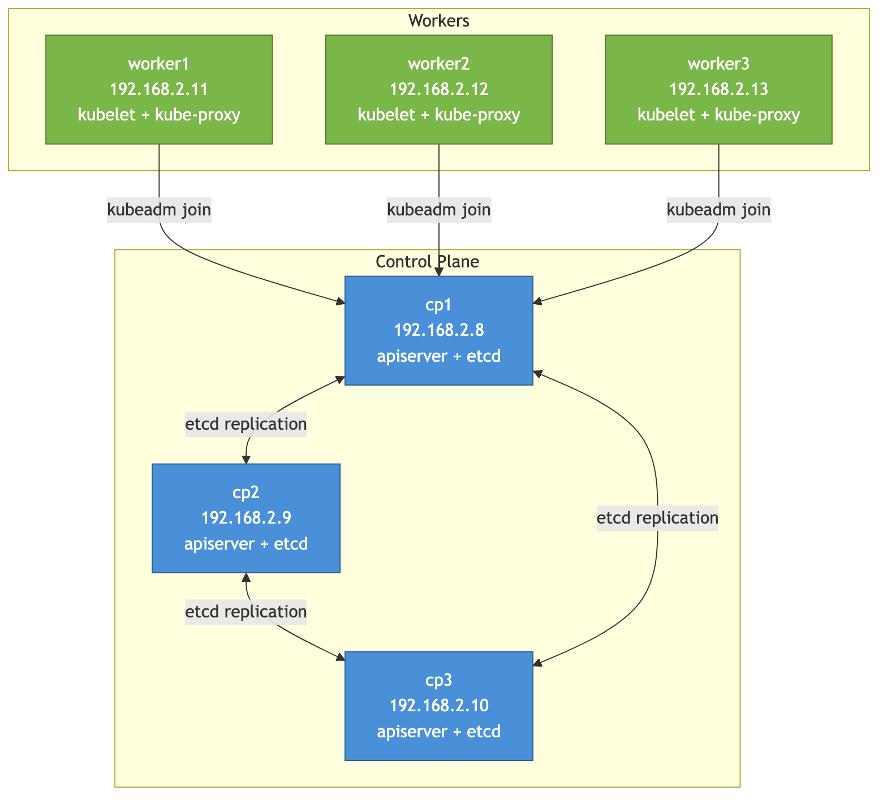

# K8s from Scratch #3: From a Lonely Control Plane to a 6-Node HA Cluster

*This is post #3 in a mini-series about building Kubernetes from scratch on local VMs. [Previous post: Ansible setup, kubeadm init, and Calico CNI.](TODO) These are learning notes from someone pulling the curtain back on what managed K8s does for you.*

---

At the end of post #2, cp1 was `Ready` with a running API server, etcd, and Calico. But it was alone — no workers, no workloads, and a single point of everything. Not much of a cluster.

This post finishes the build: joining workers, validating that networking and DNS actually work end-to-end, then tearing the whole thing down and rebuilding it as a 6-node HA cluster with 3 control plane nodes. Along the way, I made the topology configurable so I could experiment with different cluster sizes without editing five files.

> The full project is at [`huchka/k8s-bare-metal`](https://github.com/huchka/k8s-bare-metal) on GitHub. The code at this point is tagged [`phase-6`](https://github.com/huchka/k8s-bare-metal/tree/phase-6).

---

## Phase 5: Joining Workers

### What kubeadm join Does

During the control plane bootstrap, we saved a join command that looks like this:

```
kubeadm join 192.168.2.8:6443 --token <token> --discovery-token-ca-cert-hash sha256:<hash>
```

When a worker runs this command, three things happen:

1. **Token authentication** — The token proves the node is authorized to join. It's a bootstrap token with a 24-hour TTL, stored as a Secret in `kube-system`. After 24 hours, you'd need to generate a new one.

2. **CA verification** — The `--discovery-token-ca-cert-hash` is a SHA-256 hash of the cluster CA's public key (specifically, the Subject Public Key Info). The joining node uses this to verify that the CA it receives from the API server is the real one — preventing a man-in-the-middle from presenting a fake cluster.

3. **kubelet registration** — Once authenticated, kubeadm writes kubelet configuration, and kubelet registers itself with the API server. The node appears in `kubectl get nodes`. The scheduler can now place pods on it.

### The Playbook

The join playbook reads the saved command and runs it on all workers:

```yaml
- name: Read join command
  slurp:
    src: "{{ playbook_dir }}/../../ansible/join-command.txt"
  delegate_to: localhost
  run_once: true
  register: join_command_raw

- name: Join node to cluster
  command: "{{ join_command }}"
  when: not kubelet_conf.stat.exists
```

The playbook checks for `/etc/kubernetes/kubelet.conf` before joining — if it exists, the node already joined and the step is skipped. The health check waits for all nodes to report `Ready`, using the inventory group size instead of a hardcoded number:

```yaml
until: ready_count.stdout | int == (groups['k8s'] | length)
```

After running, all nodes are up:

```
NAME      STATUS   ROLES           AGE   VERSION
cp1       Ready    control-plane   48m   v1.35.3
worker1   Ready    <none>          34s   v1.35.3
worker2   Ready    <none>          34s   v1.35.3
```

---

## Phase 6: Validating the Cluster

A cluster that says `Ready` isn't necessarily working. Three tests prove it is.

### Test 1: Deploy a Workload

```bash
kubectl create deployment nginx --image=nginx --replicas=3
kubectl expose deployment nginx --port=80 --type=NodePort
```

```
NAME                     READY   STATUS    IP                NODE
nginx-56c45fd5ff-fscq5   1/1     Running   192.168.235.130   worker1
nginx-56c45fd5ff-k7cwt   1/1     Running   192.168.189.66    worker2
nginx-56c45fd5ff-pzmfj   1/1     Running   192.168.189.67    worker2
```

Two things to notice: pods landed on workers only (the control plane has a `NoSchedule` taint from kubeadm), and they got IPs from the Calico pod CIDR — not the node network. The NodePort service got port `30900`, meaning I can reach it from my Mac:

```bash
$ curl http://192.168.2.6:30900
Welcome to nginx!
```

Traffic flows: Mac → worker1's node IP on port 30900 → kube-proxy iptables rule → pod IP on port 80. The NodePort is the same on every node — I could have used any worker's IP.

### Test 2: Pod-to-Pod Networking

The deployment put pods on both worker1 and worker2. Can they talk to each other across nodes?

```bash
$ kubectl run test-net --image=busybox --rm -it --restart=Never \
    -- wget -qO- --timeout=3 192.168.235.130
Welcome to nginx!
```

This spins up a temporary busybox pod, hits the nginx pod on worker1 by its pod IP, and cleans up. Since the busybox pod could land on either worker, this test may or may not cross a node boundary. A stricter test would pin the test pod to worker2 with `--overrides` to guarantee cross-node traffic. In practice, the combination of this test with the NodePort test (which definitively crosses the host-to-pod boundary) gives confidence that Calico's routing is working.

### Test 3: DNS

```bash
$ kubectl run test-dns --image=busybox --rm -it --restart=Never \
    -- nslookup nginx.default.svc.cluster.local
Server:    10.96.0.10
Name:      nginx.default.svc.cluster.local
Address:   10.96.154.124
```

CoreDNS resolved the service name to the ClusterIP. This is how pods find each other in a real application — by service name, not by IP. The `10.96.0.10` server is the `kube-dns` Service ClusterIP — a virtual IP that fronts the CoreDNS pods. kubelet configures this as the nameserver in every pod's `/etc/resolv.conf`.

---

## Making the Topology Dynamic

At this point the cluster worked, but every node was hardcoded: `lab.sh` had `NODES=(cp1 worker1 worker2)`, the inventory had static IPs, and the health check assumed exactly 3 nodes. Changing the topology meant editing multiple files.

### cluster.yaml

I added a single config file that defines everything:

```yaml
cluster:
  ubuntu_version: "22.04"
  cloud_init: "cloud-init/common.yaml"
  control_plane:
    count: 3
    cpus: 2
    memory: 2G
    disk: 20G
  workers:
    count: 3
    cpus: 2
    memory: 2G
    disk: 20G
```

Change `count` and the entire pipeline adapts — node names are generated (`cp1..cpN`, `worker1..workerM`), and control plane and worker nodes can have different resource specs.

### Auto-Generated Inventory

`lab.sh` now has an `inventory` command that queries Multipass for IPs and writes `ansible/inventory.ini`:

```bash
$ ./lab.sh up
  Launching cp1...
  Launching cp2...
  ...
  Launching worker3...

Generating inventory...
  Written to ansible/inventory.ini
```

No more manually looking up IPs and editing files. The `up` command auto-runs `inventory` after all VMs are launched.

---

## Going HA: 3 Control Plane Nodes

With the topology configurable, I set `control_plane.count: 3` and rebuilt. This is where things get interesting.

### What Changes in kubeadm init

A single-CP `kubeadm init` creates one etcd instance, one API server, and keeps all certs local. For HA, two flags make the multi-master bootstrap work:

**`--control-plane-endpoint=192.168.2.8:6443`** — Cluster-wide clients and generated kubeconfigs are configured to reach the API server at this address. It gets baked into kubelet configs and kubeconfigs across the cluster. Some control-plane components talk to the local API server directly, but everything else depends on this endpoint. In production, this would be a load balancer IP. In my learning cluster, it's cp1's IP — a limitation I'll address later.

**`--upload-certs`** — This is what makes multi-master possible. kubeadm generates the cluster's shared control-plane certificates and keys (CA, etcd CA, front proxy CA, service account signing key) and normally keeps them only on cp1. With `--upload-certs`, it encrypts these shared certs with a randomly generated certificate key and stores them as a Kubernetes Secret. Additional CP nodes use this key to download and decrypt the certs during join. The Secret auto-deletes after 2 hours.

### How Additional CP Nodes Join

cp2 and cp3 join with a different command than workers:

```
kubeadm join 192.168.2.8:6443 --token <token> \
  --discovery-token-ca-cert-hash sha256:<hash> \
  --control-plane --certificate-key <cert-key>
```

The `--control-plane` flag tells kubeadm this isn't a worker — it should:

1. Download and decrypt the shared certs from the Secret
2. Generate its own API server certificate (with its own IP as a SAN)
3. Join the etcd cluster as a new member
4. Start its own static pods: apiserver, scheduler, controller-manager, etcd

The playbook processes CP nodes one at a time (`serial: 1`). Joining sequentially avoids racey etcd membership changes and makes the HA bootstrap easier to reason about — each node fully joins before the next starts.

### The etcd Quorum Progression

| State | etcd Members | Quorum | Fault Tolerance |
|-------|-------------|--------|-----------------|
| After cp1 init | 1 | 1/1 | 0 — any failure is fatal |
| After cp2 joins | 2 | 2/2 | 0 — worse, both must agree |
| After cp3 joins | 3 | 2/3 | **1 node can go down** |

This is why 3 is the minimum for real HA, and why you should never run 2 control plane nodes — it's strictly worse than 1 for fault tolerance.

After all three joined, I verified etcd membership:

```
$ etcdctl member list
49a9c4f8..., started, cp2, https://192.168.2.9:2380, ...
8870c6a0..., started, cp1, https://192.168.2.8:2380, ...
dcccef19..., started, cp3, https://192.168.2.10:2380, ...
```

Three members. Here's the full HA topology:



The full cluster:

```
NAME      STATUS   ROLES           AGE     VERSION
cp1       Ready    control-plane   4m38s   v1.35.3
cp2       Ready    control-plane   3m55s   v1.35.3
cp3       Ready    control-plane   3m30s   v1.35.3
worker1   Ready    <none>          2m45s   v1.35.3
worker2   Ready    <none>          2m45s   v1.35.3
worker3   Ready    <none>          2m45s   v1.35.3
```

### Testing HA — and Its Limits

I stopped cp1 to see what would happen:

```bash
$ multipass stop cp1
$ multipass exec cp2 -- kubectl get nodes
Unable to connect to the server: dial tcp 192.168.2.8:6443: i/o timeout
```

The API was unreachable — even from cp2, which has its own running API server. Why?

Because the kubeconfig on every node (including cp2) points at `192.168.2.8:6443` — cp1's IP. That's the `--control-plane-endpoint` we set during init. When cp1 goes down, nobody can reach the API server through the configured endpoint, even though cp2 and cp3's API servers are perfectly healthy.

Proof that cp2's API server was alive:

```bash
$ multipass exec cp2 -- kubectl get nodes --server=https://192.168.2.9:6443
```

This worked. The components are HA — etcd has quorum (2/3), and the schedulers and controller-managers use leader election (one active leader, the others ready to take over). But the **access path** is not HA.

This is the gap between "HA components" and "HA access." In production, you'd solve this by pointing `--control-plane-endpoint` at a load balancer (HAProxy, nginx, or a cloud LB) that distributes traffic across all API servers. When cp1 goes down, the LB routes to cp2/cp3 automatically.

---

## Things I Learned

**The control-plane-endpoint is hard to change later.** Whatever IP you set during `kubeadm init` gets baked into generated kubeconfigs and kubelet configs across the cluster. Changing it later is possible but tedious and risky — you'd need to update configs on every node. Choose carefully, and if you're doing HA, use a load balancer IP from the start.

**The certificate key expires in 2 hours.** The encrypted certs Secret that `--upload-certs` creates auto-deletes for security. If you need to add another CP node later, you need to re-upload certs with `kubeadm init phase upload-certs --upload-certs`. This is a security feature, not a bug — those certs are the keys to the kingdom.

**Two etcd members is worse than one.** With 1 member, etcd works as long as that member is up. With 2 members, *both* must be up (quorum = 2/2). You lose fault tolerance by adding the second node. Only after the third joins (quorum = 2/3) do you gain the ability to survive a failure. Always use odd numbers: 1, 3, or 5.

**Sequential CP joins keep things predictable.** I ran the join playbook with `serial: 1` — one CP node at a time. Joining sequentially avoids racey etcd membership changes and makes failures easier to diagnose. Each node fully joins and stabilizes before the next one starts.

**Concurrent cluster-wide operations race.** My Calico playbook originally targeted all CP nodes. Since all three share the same cluster state, three nodes running non-idempotent `kubectl create` simultaneously caused `AlreadyExists` errors. Cluster-wide operations should target a single node. Fixed by targeting `groups['control_plane'][0]` instead of the whole group.

**Making things configurable pays off immediately.** Adding `cluster.yaml` and dynamic inventory took maybe 30 minutes. It paid for itself the first time I destroyed the 3-node cluster and rebuilt it as a 6-node HA cluster — zero files to edit, just changed two numbers and ran `./lab.sh up`.

---

## What's Next

The cluster is functionally complete — 6 nodes, HA control plane, validated networking and DNS. But the HA story has an obvious gap: the control-plane-endpoint is a single point of failure.

The fix is **keepalived + HAProxy** on the control plane nodes:

- **Keepalived** manages a virtual IP (VIP) that floats between CP nodes. If the node holding the VIP goes down, another takes over within seconds.
- **HAProxy** on each CP node load-balances port 6443 across all API servers.
- **`--control-plane-endpoint`** points at the VIP instead of a specific node.

```
          ┌─── VIP: 192.168.2.100 ───┐
          │   (floats between nodes)  │
          └───────────┬───────────────┘
                      │
       ┌──────────────┼──────────────┐
       │              │              │
  cp1 (HAProxy)  cp2 (HAProxy)  cp3 (HAProxy)
  keepalived     keepalived     keepalived
  apiserver      apiserver      apiserver
  etcd           etcd           etcd
```

That's the next build.

---

*Building a K8s cluster from scratch on local VMs. Follow along for posts about what's actually happening under the Kubernetes hood.*
