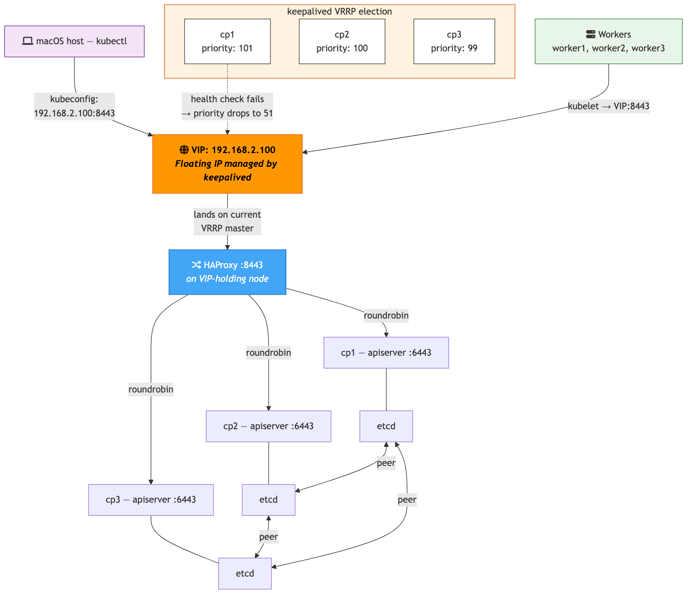

# K8s from Scratch #4: Your Multi-Master Cluster Has a Single Point of Failure

*This is post #4 in a mini-series about building Kubernetes from scratch on local VMs. [Previous post: joining workers, validation, and HA control plane.](TODO) These are learning notes from someone pulling the curtain back on what managed K8s does for you.*

---

At the end of the last post, I had a 6-node HA cluster with 3 control plane nodes. etcd had quorum. The scheduler and controller-manager had leader election. Everything was redundant — except the one thing every node uses to reach the cluster.

I stopped cp1 and ran `kubectl get nodes` from cp2:

```
Unable to connect to the server: dial tcp 192.168.2.14:6443: i/o timeout
```

Three API servers existed and etcd still had quorum. Zero access. The `--control-plane-endpoint` pointed at cp1's IP, and cp1 was down. Every kubeconfig in the cluster had that IP baked in.

This post fixes that with keepalived and HAProxy — the same tools that production bare-metal clusters use for control plane HA.

> The full project is at [`huchka/k8s-bare-metal`](https://github.com/huchka/k8s-bare-metal) on GitHub. The code at this point is tagged [`phase-7`](https://github.com/huchka/k8s-bare-metal/tree/phase-7).

---

## The Problem: HA Components, Single-Point Access

Here's what my cluster looked like after post #3:

```
          cp1 (endpoint: 192.168.2.14:6443)
           │
           │  ← every kubeconfig points here
           │
    ┌──────┼──────┐
    │      │      │
   cp1    cp2    cp3
   api    api    api
   etcd   etcd   etcd
```

cp2 and cp3 each have a running API server and etcd member. But nobody talks to them directly. All traffic goes through cp1's IP because that's what `--control-plane-endpoint` was set to during `kubeadm init`.

I proved cp2's API server was alive by hitting it directly:

```bash
$ kubectl get nodes --server=https://192.168.2.15:6443
NAME      STATUS   ROLES           AGE   VERSION
cp1       Ready    control-plane   19m   v1.35.3
...
```

The components are HA. The access path is not. That's the gap.

---

## Three Ways to Fix It

| Approach | How | Tradeoff |
|----------|-----|----------|
| **HAProxy on each node** | Every node runs HAProxy, load-balances to all API servers. Endpoint is `localhost:6443`. | Simple. But every node needs config updated when CP nodes change. |
| **Dedicated LB VM** | A separate VM runs HAProxy/nginx. Endpoint points at the LB. | Clean separation. But the LB itself is a SPOF unless paired with keepalived. |
| **keepalived + HAProxy (VIP)** | keepalived manages a floating virtual IP across CP nodes. HAProxy on each CP node load-balances API traffic. Endpoint points at the VIP. | True HA — no single point of failure. Most complex to set up. |

Option 3 is a common production pattern on bare metal. It's also the most educational, which is the point of this project.

---

## How It Works



Two components, each solving a different part of the problem:

**keepalived** runs on all three CP nodes. It implements VRRP (Virtual Router Redundancy Protocol) — a protocol designed for exactly this use case. All three nodes join the same VRRP group and elect a master based on priority. The master adds a virtual IP (VIP) to its network interface. If the master dies, another node takes over and claims the VIP — usually within a few seconds. From the outside, the IP never changes; which node holds it does.

**HAProxy** runs on each CP node as a TCP proxy. It listens on port 8443 and forwards connections to all three API servers on port 6443. Health checks every 3 seconds remove downed backends from the pool. So even though the VIP lands on one node, requests get distributed across all healthy API servers.

**`--control-plane-endpoint=192.168.2.100:8443`** — every kubeconfig in the cluster uses this. The VIP never changes, even when nodes go down.

---

## The Port 6443 Trap

My first instinct was to run HAProxy on port 6443 — the standard Kubernetes API port. But HAProxy runs on the same node as kube-apiserver, and kube-apiserver already binds `0.0.0.0:6443`. If HAProxy also tries to bind 6443, they collide.

Two options:

1. **HAProxy on a different port (8443)** — no conflict. `--control-plane-endpoint` uses `VIP:8443`. Non-standard port, but simple.

2. **HAProxy on 6443 with `ip_nonlocal_bind`** — HAProxy binds specifically to `VIP:6443`, and kube-apiserver binds to `NODE_IP:6443` via `--bind-address`. Keeps the standard port, but tighter coupling and more config.

I went with option 1. Port 8443 is a convention in many bare-metal guides, and the simplicity is worth the non-standard port for a learning project.

---

## keepalived: How VRRP Election Works

VRRP isn't like Raft (which etcd uses for consensus). There's no log replication or quorum. It's simpler:

- Each node has a **priority** (an integer). cp1 gets 101, cp2 gets 100, cp3 gets 99.
- All nodes start in **BACKUP** state. The node with the highest priority becomes master and takes the VIP.
- The master sends **heartbeats** every second (`advert_int 1`). If other nodes don't hear from the master for ~3 missed intervals, they start a new election.
- That's it. Highest priority wins. If two nodes have the same priority, the higher IP wins.

Why start all nodes as BACKUP instead of marking cp1 as MASTER? The `state` keyword is mainly an initial hint — it affects startup behavior, not the final election. But setting one node to MASTER makes it grab the VIP immediately on startup before health checks have run, which can mask a still-recovering node. Starting all as BACKUP keeps the election purely driven by effective priority and health checks.

Here's the keepalived config:

```
vrrp_script check_apiserver {
    script "/etc/keepalived/check_apiserver.sh"
    interval 3
    weight -50
    fall 3
    rise 2
}

vrrp_instance K8S_APISERVER {
    state BACKUP
    interface enp0s1
    virtual_router_id 51
    priority 101          # cp1=101, cp2=100, cp3=99
    advert_int 1

    authentication {
        auth_type PASS
        auth_pass k8svip
    }

    virtual_ipaddress {
        192.168.2.100/24
    }

    track_script {
        check_apiserver
    }
}
```

The `weight -50` on the health check is the key mechanism. If the local API server goes down, keepalived subtracts 50 from the node's priority. cp1 drops from 101 to 51 — lower than cp2 (100) or cp3 (99). The VIP moves to cp2. When cp1 recovers, its priority goes back to 101 and — because keepalived defaults to preemption — it reclaims the VIP automatically.

---

## The Health Check Chicken-and-Egg

The health check script curls the local API server:

```bash
#!/bin/bash
if ! curl -sk https://localhost:6443/healthz -o /dev/null 2>/dev/null; then
    if [ -f /etc/kubernetes/manifests/kube-apiserver.yaml ]; then
        exit 1
    fi
fi
exit 0
```

There's a subtlety here. keepalived + HAProxy must be running **before** `kubeadm init` — because kubeadm needs the VIP to be reachable as the control-plane-endpoint from the start. But before kubeadm init, there's no API server to health-check.

If the script returned "unhealthy" pre-init, keepalived would subtract weight from all nodes' priorities. The VIP would still be assigned (the node with the highest reduced priority wins), but all nodes would have unnecessarily degraded priorities — a messy starting state.

The fix: only report failure if the API server manifest exists (`/etc/kubernetes/manifests/kube-apiserver.yaml`). Before kubeadm init, that file doesn't exist — no manifest means no API server is expected, so the health check returns healthy and the VIP stays assigned normally. After kubeadm init creates the manifest, a non-responding API server correctly triggers failover.

---

## HAProxy: TCP Passthrough

HAProxy runs in TCP (layer 4) mode, not HTTP. It doesn't terminate TLS — it just forwards the raw TCP stream. The kube-apiserver handles its own TLS, and HAProxy doesn't have (or need) the API server's certificates.

```
frontend k8s-api
    bind *:8443
    default_backend k8s-api-servers

backend k8s-api-servers
    option tcp-check
    balance roundrobin
    server cp1 192.168.2.14:6443 check inter 3s fall 3 rise 2
    server cp2 192.168.2.15:6443 check inter 3s fall 3 rise 2
    server cp3 192.168.2.16:6443 check inter 3s fall 3 rise 2
```

`check inter 3s fall 3 rise 2` means: check every 3 seconds, mark down after 3 consecutive failures, mark up after 2 consecutive successes. In `mode tcp`, the `check` keyword on each server line already does a TCP connect test — if the backend accepts the connection, it's healthy. (`option tcp-check` enables an explicit check sequence if you need more sophisticated probing, but with no extra `tcp-check` directives defined, the effective behavior is the same simple connect test.)

I also added a stats page on port 9000 for debugging — it shows which backends are up and how traffic is distributed.

---

## The Proof

### Initial state — VIP on cp1

After running the setup playbook and bootstrapping the cluster:

```bash
$ multipass exec cp1 -- ip addr show enp0s1 | grep 192.168.2.100
    inet 192.168.2.100/24 scope global secondary enp0s1
```

cp1 holds the VIP (highest priority). API is reachable through it:

```bash
$ curl -sk https://192.168.2.100:8443/healthz
ok
```

All nodes ready:

```
NAME      STATUS   ROLES           AGE     VERSION
cp1       Ready    control-plane   4m26s   v1.35.3
cp2       Ready    control-plane   3m49s   v1.35.3
cp3       Ready    control-plane   3m19s   v1.35.3
worker1   Ready    <none>          67s     v1.35.3
worker2   Ready    <none>          67s     v1.35.3
worker3   Ready    <none>          66s     v1.35.3
```

### Failover — stop cp1

```bash
$ multipass stop cp1
$ sleep 10
```

VIP moved to cp2:

```bash
$ multipass exec cp2 -- ip addr show enp0s1 | grep 192.168.2.100
    inet 192.168.2.100/24 scope global secondary enp0s1
```

API still works through the same VIP:

```bash
$ curl -sk https://192.168.2.100:8443/healthz
ok
```

And from my Mac — not from inside any VM, but from my local terminal:

```bash
$ kubectl get nodes
NAME      STATUS     ROLES           AGE   VERSION
cp1       NotReady   control-plane   19m   v1.35.3
cp2       Ready      control-plane   18m   v1.35.3
cp3       Ready      control-plane   18m   v1.35.3
worker1   Ready      <none>          16m   v1.35.3
worker2   Ready      <none>          16m   v1.35.3
worker3   Ready      <none>          16m   v1.35.3
```

cp1 shows `NotReady` — the node is down — but the cluster is fully operational. `kubectl` on my Mac didn't care that cp1 was gone. The kubeconfig points at `192.168.2.100:8443`, and via VRRP failover, that IP is now on cp2.

---

## "Stopping kubelet Doesn't Kill the API Server"

During testing, I first tried stopping just kubelet on cp1 instead of the whole VM:

```bash
$ multipass exec cp1 -- sudo systemctl stop kubelet
```

I expected the health check to fail and the VIP to move. It didn't. The VIP stayed on cp1 and the API server kept responding.

Why? kube-apiserver runs as a **static pod** — a container managed by kubelet but running under containerd. When you stop kubelet, it stops managing the containers, but the containers themselves keep running. They're orphaned, not killed.

```bash
$ multipass exec cp1 -- sudo crictl ps | grep kube-apiserver
2e41d889ea067  ...  Running  kube-apiserver  ...
```

Kubelet is down, but the apiserver container is alive and serving requests. The health check curls `localhost:6443`, gets a response, and reports healthy. Correct behavior — the API server *is* healthy.

The real failover scenario is the whole node going down (hardware failure, power loss, VM stopped). That's what `multipass stop` simulates, and that's when the VIP properly moves.

---

## Things I Learned

**VRRP is not consensus.** Coming from etcd/Raft, I expected VRRP to be complex. It's not — it's just priority-based preemption with heartbeats. No quorum, no log replication. The master sends heartbeats; if they stop, the highest-priority backup takes over. Simple enough to reason about in your head.

**The health check weight trick is elegant.** Instead of binary up/down, keepalived subtracts a weight from the node's priority when the health check fails. This means you can tune how aggressively failover happens. A weight of -50 guarantees cp1 (101) drops below cp2 (100), triggering a VIP move. A smaller weight (say -1) would lower the priority without crossing the threshold — the VIP stays put unless multiple checks fail.

**Order of operations matters.** keepalived + HAProxy must be running before kubeadm init. If you init first with cp1's IP as the endpoint and then add the VIP later, you'd need to rewrite kubeconfigs across the entire cluster. Getting the VIP in place first means the endpoint is correct from day one.

**Static pods survive kubelet restarts.** kubelet manages static pods, but the containers run under containerd independently. Stopping kubelet doesn't stop the containers — they're orphaned but keep running. This is actually a resilience feature: a kubelet crash doesn't take down the control plane.

**TCP passthrough is all you need for API server load balancing.** HAProxy doesn't need to understand or terminate TLS — the API server handles its own certs. Layer 4 proxying (raw TCP forwarding) is simpler, faster, and doesn't require giving HAProxy access to any certificates.

---

## What's Next

The cluster now has true HA: redundant components *and* a redundant access path. Stopping any single control plane node — the cluster keeps working, kubectl keeps connecting, workloads keep running.

Next up: deploying real workloads and testing what happens when workers go down — pod rescheduling, PodDisruptionBudgets, and how the scheduler handles node failures.

---

*Building a K8s cluster from scratch on local VMs. Follow along for posts about what's actually happening under the Kubernetes hood.*
