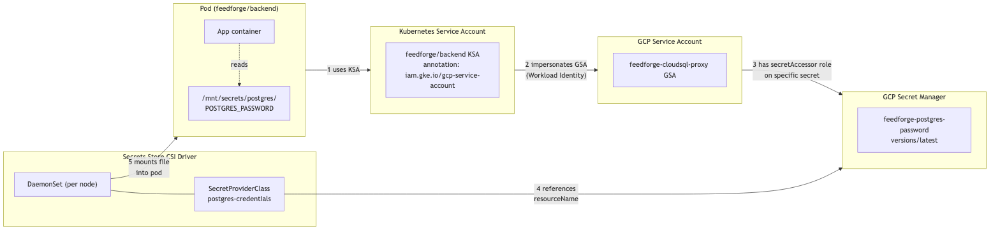
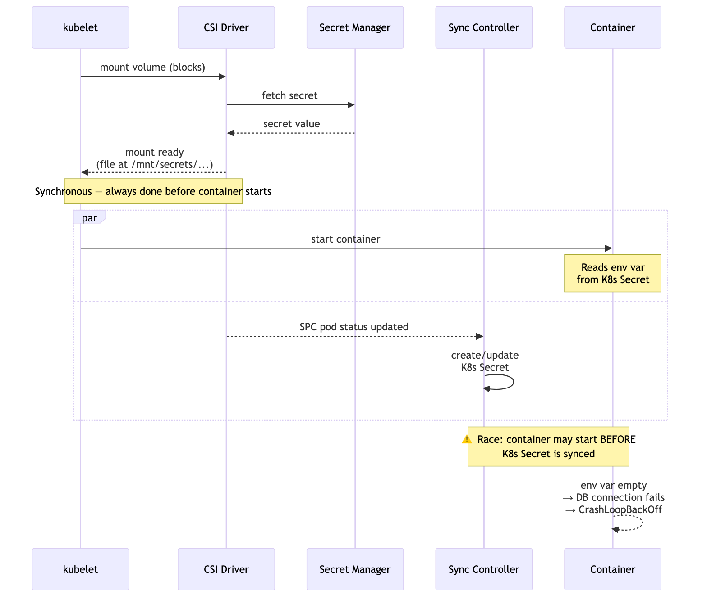

# Phase 8 — I Moved My Secrets to GCP Secret Manager. The Auth Chain Is Longer Than You Think.

*This is the twenty-third post in a series about learning Kubernetes by building FeedForge — an RSS feed aggregator with AI summarization on GKE. These posts are learning notes from someone figuring things out in real time. [Previous post here.](https://medium.com/@huchka)*

---

> Check out the [`phase-8-secret-manager`](https://github.com/huchka/feedforge/tree/phase-8-secret-manager) tag in the [FeedForge repo](https://github.com/huchka/feedforge) for the full source code at this point.

For the first six months of this project, my Postgres password lived in a Kubernetes Secret I created by hand:

```bash
kubectl create secret generic postgres-credentials \
  --from-literal=POSTGRES_USER=feedforge \
  --from-literal=POSTGRES_PASSWORD='sd**********345'
```

That's fine for a learning cluster. It's not great for anything else:

- The password is **only base64-encoded in the manifest**. Kubernetes Secrets *can* be encrypted at rest in etcd if you configure envelope encryption, but nothing prevents anyone with namespace-level RBAC from running `kubectl get secret -o yaml` and reading the value
- There's **no audit log** of who or what read it
- **Rotation** means editing the Secret and restarting every consumer manually
- **Disaster recovery** means I have to remember the command, because the password isn't in any config file

All of that points to the same answer: move secrets out of the cluster, into a dedicated secret store that the cloud provider already manages. On GCP, that's Secret Manager.

The tutorials make it look straightforward: install a CSI driver, write a `SecretProviderClass`, mount it as a volume. Everything I read glossed over what actually makes this hard — **the auth chain between the pod and the secret spans two IAM systems, four different resource kinds, and three separate bindings**, and every single link has to be configured correctly or you get `PermissionDenied` with no hint which link failed.

This post walks the whole chain.

## A note on what I'm building

Before going further: GKE actually has a **managed Secret Manager add-on** ([docs](https://cloud.google.com/secret-manager/docs/secret-manager-managed-csi-component)) that's part of the control plane. It's simpler to install and Google maintains it. I'm intentionally using the **open-source Secrets Store CSI Driver** instead, for one specific reason: I want the `secretObjects` feature that syncs mounted secrets into native Kubernetes Secrets, so my existing `envFrom` / `secretKeyRef` references keep working without app code changes. The managed add-on only supports file mounts — no Secret sync. If you're greenfield and your app can read files directly (which it arguably should), the managed add-on is the better choice. I'm retrofitting a running app, so OSS it is.

Similarly, the auth pattern I'm using here — **KSA → GSA impersonation** — is one valid option. Modern GKE also supports **direct IAM bindings to the KSA principal** (the `principal://iam.googleapis.com/...` format) via Workload Identity Federation, which can eliminate the middleman GSA for services that support it. I stuck with GSA impersonation because the rest of FeedForge already uses that pattern (Cloud SQL Auth Proxy, Vertex AI), and consistency within one project matters more than chasing the latest binding syntax. Your call may differ.

## What I was replacing

The pattern I had was the standard one:

```yaml
# deployment.yaml
env:
  - name: FEEDFORGE_DB_PASSWORD
    valueFrom:
      secretKeyRef:
        name: postgres-credentials
        key: POSTGRES_PASSWORD
```

Pod starts, kubelet resolves the env var from the K8s Secret, app reads `os.environ["FEEDFORGE_DB_PASSWORD"]`. Simple, works, insecure at rest.

The new pattern looks superficially the same from the app's perspective — the env var is still there. But the value now travels a longer path. Secret Manager holds the truth. The Secrets Store CSI Driver fetches it and materializes it as a file inside the pod. A separate sync controller watches that mount and creates a Kubernetes Secret from the file. The env var resolves against that synced Secret. The app doesn't know any of this happened — it just reads an env var.

Two outputs from one mount: a mounted file (primary CSI behavior) and an optional synced K8s Secret (for `envFrom` / `secretKeyRef` compatibility). The distinction matters later when we hit the cold-start race.

## The four moving parts

Before walking the chain, here are the pieces:

1. **GCP Secret Manager** — the source of truth. Stores the actual secret values, encrypted at rest, audit-logged, versioned, access-controlled via IAM.
2. **Secrets Store CSI Driver** — a Kubernetes plugin (installed once per cluster as a DaemonSet) that mounts external secrets into pods *as if they were files*. Uses the Container Storage Interface — yes, the same one used for disks and NFS — but applied cleverly to secrets.
3. **GCP Provider Plugin** — a companion DaemonSet that handles the cloud-specific communication. The CSI driver is provider-agnostic; the GCP plugin is what actually calls Secret Manager.
4. **SecretProviderClass** — a custom resource (CRD) that tells the CSI driver *which secrets to fetch* and *where to put them*.

The provider plugin is the piece I didn't fully understand at first. The CSI driver is generic — it knows how to mount volumes into pods, but not how to talk to any specific secret backend. The provider plugin is the bridge: when a pod mounts a `SecretProviderClass`, the CSI driver calls the provider, and the provider authenticates to Secret Manager **using the workload identity of the requesting pod** (not its own DaemonSet identity). That detail matters — it's why the `feedforge/backend` KSA's IAM grants are the ones that gate secret access, not the provider's.

## The auth chain

Here's the full path from pod to password:



Follow the numbered arrows:

1. **Pod uses a Kubernetes ServiceAccount** (`feedforge/backend` in my case). The KSA has an annotation pointing at a GCP service account.
2. **KSA → GSA impersonation (Workload Identity)**. The annotation alone isn't enough — there must be an IAM binding granting `roles/iam.workloadIdentityUser` on the GSA to the KSA.
3. **GSA → secret access**. The GSA must have `roles/secretmanager.secretAccessor` on the specific secret.
4. **SecretProviderClass references the secret** by resource name (`projects/<PROJECT_ID>/secrets/<name>/versions/latest`).
5. **CSI driver mounts the file** into the pod at the path defined by the SPC.

In this implementation, three separate IAM bindings gate the chain — the KSA→GSA workload identity binding, project-level roles on the GSA, and the per-secret `secretAccessor` grant. All must be correct. If any link is broken, pods fail to fetch secrets with unhelpful error messages. I spent a good hour on link 2 once, because "PermissionDenied from Secret Manager" looks like a Secret Manager IAM problem, but was actually a missing Workload Identity binding one layer up.

## Setting it up, layer by layer

### Layer 1: Infrastructure (Terraform)

The GCP side is entirely Terraform-managed. Three kinds of resources:

**The Workload Identity binding** — grants the KSA permission to impersonate the GSA:

```hcl
resource "google_service_account_iam_member" "cloudsql_proxy_workload_identity" {
  for_each = toset([
    "serviceAccount:${var.project_id}.svc.id.goog[feedforge/backend]",
    "serviceAccount:${var.project_id}.svc.id.goog[feedforge/feed-fetcher]",
    "serviceAccount:${var.project_id}.svc.id.goog[feedforge/daily-digest]",
  ])

  service_account_id = module.iam.cloudsql_proxy_sa_name
  role               = "roles/iam.workloadIdentityUser"
  member             = each.value
}
```

Note the special member format: `serviceAccount:<PROJECT_ID>.svc.id.goog[<NAMESPACE>/<KSA_NAME>]`. That's the GCP-side representation of a Kubernetes ServiceAccount. Worth knowing: the workload identity pool (`<PROJECT_ID>.svc.id.goog`) is **project-scoped**, not cluster-scoped. Every cluster in the project with Workload Identity enabled shares the same pool, which means a KSA named `feedforge/backend` resolves to the same identity across clusters. That's a feature for multi-cluster setups and a sharp edge if you weren't expecting it.

**The Secret Manager IAM grants** — give each GSA access to the secrets it needs:

```hcl
locals {
  postgres_secret_accessors = {
    cloudsql_proxy = module.iam.cloudsql_proxy_sa_email
    summarizer     = module.iam.summarizer_sa_email
  }

  postgres_secret_bindings = flatten([
    for secret in local.postgres_secret_names : [
      for sa_key, sa_email in local.postgres_secret_accessors : {
        secret   = secret
        sa_key   = sa_key
        sa_email = sa_email
      }
    ]
  ])
}

resource "google_secret_manager_secret_iam_member" "postgres_secret_access" {
  for_each = {
    for b in local.postgres_secret_bindings : "${b.secret}_${b.sa_key}" => b
  }

  project   = var.project_id
  secret_id = each.value.secret
  role      = "roles/secretmanager.secretAccessor"
  member    = "serviceAccount:${each.value.sa_email}"
}
```

The flatten-over-nested-for pattern is the canonical Terraform idiom for "bind many to many" — in this case, every secret × every accessor. Without it, you end up writing `resource "..." "postgres_user_access_by_cloudsql_proxy"` blocks one at a time, which is fine with two accessors and gets unmaintainable at five.

**The API enablement** — Secret Manager API is off by default on new projects:

```hcl
resource "google_project_service" "secretmanager" {
  project            = var.project_id
  service            = "secretmanager.googleapis.com"
  disable_on_destroy = false
}
```

Always set `disable_on_destroy = false`. Without it, `terraform destroy` would disable the API at the project level, which breaks any other service in that project using Secret Manager.

### Layer 2: The CSI driver (Helm)

The Secrets Store CSI Driver isn't part of core Kubernetes — it's a Kubernetes SIG project. You install it once per cluster:

```bash
# The driver itself (a DaemonSet)
helm upgrade --install csi-secrets-store \
  secrets-store-csi-driver/secrets-store-csi-driver \
  --namespace kube-system \
  --set syncSecret.enabled=true

# The GCP-specific provider
kubectl apply -f \
  https://raw.githubusercontent.com/GoogleCloudPlatform/secrets-store-csi-driver-provider-gcp/main/deploy/provider-gcp-plugin.yaml
```

`syncSecret.enabled=true` is important — it turns on the controller that syncs CSI-mounted files into native K8s Secrets. Without it, your pods can read the files but can't use `envFrom`/`secretKeyRef` to populate env vars. Heads up: the sync-as-Kubernetes-Secret feature is [documented as alpha](https://secrets-store-csi-driver.sigs.k8s.io/topics/sync-as-kubernetes-secret.html) in the upstream driver. It's been stable in my cluster, but if you're production-bound you probably want to skip `secretObjects` and read files directly.

I put both commands in a bootstrap script (`k8s/bootstrap/install-csi-secrets-store.sh`) so redeploying a cluster isn't a copy-paste exercise.

### Layer 3: The SecretProviderClass

This is where the "which secrets, where do they go" mapping lives:

```yaml
apiVersion: secrets-store.csi.x-k8s.io/v1
kind: SecretProviderClass
metadata:
  name: postgres-credentials
  namespace: feedforge
spec:
  provider: gcp
  parameters:
    secrets: |
      - resourceName: "projects/<PROJECT_ID>/secrets/feedforge-postgres-user/versions/latest"
        path: "POSTGRES_USER"
      - resourceName: "projects/<PROJECT_ID>/secrets/feedforge-postgres-password/versions/latest"
        path: "POSTGRES_PASSWORD"
  secretObjects:
    - secretName: postgres-credentials
      type: Opaque
      data:
        - objectName: "POSTGRES_USER"
          key: POSTGRES_USER
        - objectName: "POSTGRES_PASSWORD"
          key: POSTGRES_PASSWORD
```

Two sections:

- `parameters.secrets` — the list of Secret Manager secrets to fetch and the filenames to expose them as. `path: "POSTGRES_USER"` means the file will be at `/mnt/secrets/postgres/POSTGRES_USER`.
- `secretObjects` — the bridge to a traditional K8s Secret. The CSI driver (with `syncSecret.enabled=true`) materializes a Secret with this name from the mounted files.

The `<PROJECT_ID>` placeholder is a pain. Kustomize does have `vars` and `replacements` for targeted substitution, but I opted for overlay patches in `k8s/overlays/dev/patches/spc-postgres-patch.yaml` that strategic-merge the real project ID over the placeholder — each environment copies the patch and updates one value. It's less surgical than `replacements` but more obvious when reading the manifest.

### Layer 4: The pod

The pod changes are the smallest part:

```yaml
spec:
  containers:
    - name: backend
      env:
        - name: FEEDFORGE_DB_PASSWORD
          valueFrom:
            secretKeyRef:
              name: postgres-credentials
              key: POSTGRES_PASSWORD
              optional: true              # new
      volumeMounts:
        - name: postgres-creds
          mountPath: /mnt/secrets/postgres
          readOnly: true
  volumes:
    - name: postgres-creds
      csi:
        driver: secrets-store.csi.k8s.io
        readOnly: true
        volumeAttributes:
          secretProviderClass: postgres-credentials
```

The env var declaration stays — but now the Secret it references is created by the CSI driver instead of by me running `kubectl create secret`. The app code doesn't change at all.

`optional: true` is new, and there's a real reason for it.

## The async race you don't see

Here's what actually happens during pod startup, in order:



1. kubelet schedules the pod on a node
2. kubelet calls the CSI driver to mount the volume. The driver fetches the secret from Secret Manager (via the GCP provider using Workload Identity), writes the value to a file, and the mount completes. This is **synchronous** — kubelet blocks until the mount is ready.
3. Containers start. Env vars are injected into the process from the K8s Secret (if it exists) and the app reads them, or the app reads the mounted file directly.

Except there's a fourth thing happening, and it's not synchronous with step 2:

4. A **separate sync controller** watches `SecretProviderClassPodStatus` resources. When it sees a successful mount, it reads the mounted files and creates (or updates) a K8s Secret named in `secretObjects.secretName`.

Step 4 is **asynchronous and eventually consistent**. On a cold start — your first deploy ever, or after clearing the namespace — pods race against the sync controller. If the K8s Secret hasn't been created by the time the container starts, env var lookup fails. Without `optional: true`, kubelet refuses to start the container with `CreateContainerConfigError`. With `optional: true`, the env var is left unset, the app starts with an empty password, tries to connect to the database, and crashloops at the DB connection layer.

In my testing both paths self-healed within about 30–60 seconds. The K8s Secret gets synced, the next pod restart picks it up, everything comes up healthy. Exact timing depends on CrashLoopBackOff behavior and sync controller reconciliation — yours may be different, especially on slower nodes or under resource pressure. But the startup logs are noisy and the first-minute metrics look like the cluster is on fire.

The bulletproof fix is to stop using the K8s Secret altogether — read the credentials directly from the mounted file. Files are guaranteed present when the container starts (step 2 is synchronous), so there's no race. I haven't made that change yet; it'd require small edits to every workload's Python code. For now, `optional: true` takes the edge off the crashloop noise, and I've filed a follow-up issue to move to files.

## When a link breaks

During testing, I broke every link at least once. Here's a rough debugging table:

| Symptom | Likely broken link |
|---|---|
| `MountVolume.SetUp failed ... provider "gcp" not found` | CSI GCP provider plugin not installed |
| `rpc error ... permission denied` from provider | Link 2 (Workload Identity binding) or link 3 (secret IAM) |
| Pod works, but `kubectl get secret postgres-credentials` returns `NotFound` | Sync controller not running (`syncSecret.enabled=true` missing) |
| Pod mounts, files exist, but env var is empty | Race condition — CSI Secret sync hasn't completed yet |
| `Error: 7 PERMISSION_DENIED: Permission denied on resource project ... (or it may not exist)` | Secret doesn't exist yet (created IAM grants before the secret) OR secretmanager.googleapis.com API not enabled |

The "or it may not exist" part of the last error was especially misleading for me. Secret Manager deliberately returns the same error for "no such secret" and "secret exists but you can't see it" — it's a security feature (prevents enumeration), but it means "check the IAM binding" and "check if the secret exists" are both valid things to do, and the error doesn't tell you which.

## Files vs env vars — and why rotation is actually different

The `secretObjects` pattern (CSI mount → K8s Secret → env var) is there specifically so app code doesn't need to change. You get secret-manager-backed credentials without modifying a single line of Python.

But there's a real tradeoff: **env vars don't rotate, files do**.

The CSI driver supports rotation (also [upstream-documented as alpha](https://secrets-store-csi-driver.sigs.k8s.io/topics/secret-auto-rotation.html) at the time of writing). Start the driver with `--enable-secret-rotation` (and a `--rotation-poll-interval`, default 2 minutes) and it polls Secret Manager for new versions. When it finds one, it atomically rewrites the mounted files. If your app reads the file on every new DB authentication attempt, the rotated value is picked up without a pod restart — no kubelet or API server involvement needed.

The real world is messier than that. Existing pooled connections already authenticated with the old password stay open and happily use it. Rotating the actual database credential requires coordination on the server side too — the Postgres user has to accept the new password before old connections get recycled. Rotation is "transparent from the pod's point of view" in the narrow sense that no pod restart is needed; rotating the full system still takes design work around connection pool lifetimes and server-side credential rollover.

Env vars don't even offer the pod-level transparency. They're injected into the process at container start, and that's it. If you rotate a secret, you must do a rolling restart of every consumer pod to pick up the new value. The K8s Secret itself gets updated by the sync controller, but the env var values were already baked into the running processes.

For a learning project, env var indirection is the path of least resistance. For real rotation discipline — where you can change a compromised credential in seconds and have all pods pick it up without restarts — file mounts are the only option.

## What changed in the app

Zero lines of Python. The whole migration was infrastructure:

- Terraform: +60 lines for Workload Identity bindings, IAM grants, API enablement
- Kubernetes: `SecretProviderClass` manifests, `volumeMounts` and `volumes` on every workload, `optional: true` on secretKeyRef
- Bootstrap: ~40-line script to install the CSI driver

The backend, fetcher, digest, and summarizer still read `FEEDFORGE_DB_USER` and `FEEDFORGE_DB_PASSWORD` from env vars. They don't know anything about CSI, Secret Manager, or Workload Identity. That's the whole point of the indirection: one hardening change, zero app-level churn.

## Things I Learned

- **The CSI Secrets Store is a two-DaemonSet install.** One for the generic driver, one for the cloud-specific provider. If you forget the provider, the driver has nothing to call and pod mounts fail with an obscure "provider not found" error.

- **The KSA→GSA impersonation pattern needs three separate IAM bindings.** KSA → GSA (workload identity user), GSA → project (any cloud roles it needs), and the specific secret → GSA (secretAccessor). Missing any one means `PermissionDenied`, and the error message is the same for all three. If you're starting fresh, direct KSA principal bindings via Workload Identity Federation can skip the middleman GSA — worth knowing as the alternative even if you don't use it.

- **`secretmanager.googleapis.com` is off by default on new projects.** Terraform can enable it, but then your Secret Manager IAM grants depend on the API being on. Enable the API first (or split the apply), then create secrets, then grant IAM.

- **`google_secret_manager_secret_iam_member` requires the secret to already exist.** I hit this on the first apply — the IAM binding failed because I hadn't created the secret yet. For a clean TF-only workflow, managing `google_secret_manager_secret` resources alongside the IAM grants (but not `google_secret_manager_secret_version` — values should never live in TF state) is worth the extra code.

- **The `secretObjects` cold-start race is real.** The K8s Secret is created asynchronously by a sync controller watching SPC pod status, not by the CSI mount directly. On fresh deploys, expect ~30s of crashloop while the race resolves. `optional: true` makes the failure quieter; reading files instead of env vars eliminates it entirely.

- **File-based reads unlock hot rotation.** Env vars are baked in at pod start and never change. Files can be atomically rewritten by the CSI driver on every poll cycle. If rotation matters to you, the files-only approach is the only one that works without rolling restarts.

- **Secret Manager returns "not found or no permission" for both cases.** This is a security feature (no enumeration), but a debugging nightmare. When you see `PERMISSION_DENIED`, check both the IAM binding *and* whether the secret exists.

- **Kustomize needs a pattern for environment-specific values like PROJECT_ID.** I went with strategic-merge overlay patches that re-declare the whole `parameters.secrets` block. It works but duplicates the base. Kustomize `replacements` are cleaner if you want to substitute just one field; worth knowing both.
