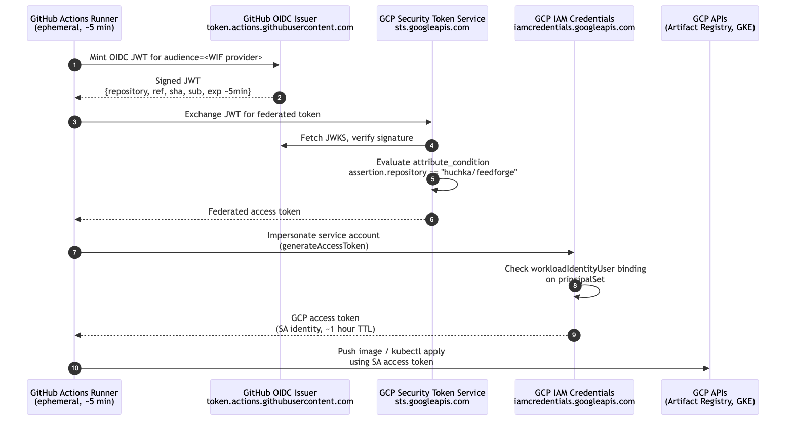

# GitHub Actions Authenticates to GCP Without Storing Any Secrets. Three Tokens Make That Possible.

*This is the twenty-sixth post in a series about learning Kubernetes by building FeedForge — an RSS feed aggregator with AI summarization on GKE. These posts are learning notes from someone figuring things out in real time. [Previous post here.](https://medium.com/@huchka)*

---

> The PR this post is about: [feedforge#26](https://github.com/huchka/feedforge/pull/26). Merge commit `ae00a99`.

I just migrated FeedForge's CI/CD from Google Cloud Build to GitHub Actions. The migration itself was a few YAML files and a Terraform module. The part that took me a minute to actually understand — and the part worth writing about — was the auth.

Google's documentation calls it "keyless authentication" or "Workload Identity Federation." Both labels are technically accurate and both are slightly misleading. There absolutely *are* tokens in this flow — three of them, in a chain. None of them is stored anywhere persistent. None is a long-lived secret. What "keyless" actually means, once you walk the mechanism, is that the authentication is a sequence of short-lived, policy-gated OIDC exchanges rather than a stored credential.

This post is the walk-through of that sequence.

## The question that drove this post

After my Terraform applied, the module exported three outputs that I needed to wire into GitHub:

```bash
GCP_PROJECT_ID    = project-76da2d1f-231c-4c94-ae9
GCP_SA_EMAIL      = feedforge-github-actions@project-76da2d1f-231c-4c94-ae9.iam.gserviceaccount.com
GCP_WIF_PROVIDER  = projects/694368573752/locations/global/workloadIdentityPools/github-pool/providers/github-provider
```

The Google Action docs say to wire them as **Variables**, not Secrets. They look credential-shaped at first glance — the SA email reads like a username, the WIF provider URI is opaque and project-coupled — so the natural question is: **are these safe to expose?** If anyone else knew these three values, could they authenticate to my GCP project from their own GitHub Actions?

The short answer is no, they couldn't. The more useful answer is *why* not, and that requires walking the auth chain end-to-end. The rest of this post is that walk.

## The chain

Here's what happens every time the deploy job runs:



Three tokens, all short-lived, all minted on demand:

1. **GitHub OIDC JWT** — minted on request by GitHub when a workflow job with `id-token: write` asks for it. Signed with GitHub's private key. Lives in memory for ~5 minutes. (A job can request more than one if it needs to.)
2. **STS federated token** — proof that GCP successfully validated the JWT. Intermediate.
3. **GCP access token** — actual credentials that perform work, impersonating your service account. Lives ~1 hour.

When the runner shuts down at the end of the job, all three vanish. Nothing persists. There is no `~/.gcloud/credentials.json` left behind, no JSON key in a vault, no API key in an env var.

## Walking it claim by claim

The reason this is safe is that *every step has a verification gate*. Let me unpack each.

### Step 1: GitHub mints the JWT

The runner has access to two special environment variables that exist only in jobs with `permissions: id-token: write`:

```
ACTIONS_ID_TOKEN_REQUEST_URL
ACTIONS_ID_TOKEN_REQUEST_TOKEN
```

Hitting that URL — authenticated with the `ACTIONS_ID_TOKEN_REQUEST_TOKEN` bearer header — and passing `?audience=<value>` in the query string returns a JWT signed by GitHub's private key. The `audience` value is what the verifier (GCP, here) expects to see in the JWT's `aud` claim. The `google-github-actions/auth@v2` action defaults that audience to `https://iam.googleapis.com/<your-WIF-provider-resource-name>`. The provider resource name itself (passed as `workload_identity_provider:` in the workflow) is the schemeless `projects/.../providers/...` form; the URL prefix is added when forming the audience. Two formats, one underlying identifier.

The JWT body looks like this (I decoded one to verify):

```json
{
  "iss":        "https://token.actions.githubusercontent.com",
  "aud":        "https://iam.googleapis.com/projects/694368573752/locations/global/workloadIdentityPools/github-pool/providers/github-provider",
  "sub":        "repo:huchka/feedforge:ref:refs/heads/main",
  "repository": "huchka/feedforge",
  "repository_owner": "huchka",
  "ref":        "refs/heads/main",
  "sha":        "ae00a99d078f196d90795138aaf85bd092e8699b",
  "workflow":   "deploy",
  "actor":      "huchka",
  "exp":        <~5 min from now>,
  "iat":        <now>
}
```

The crucial point: **the `repository` claim is set by GitHub, not by my workflow.** My workflow can't lie about which repo it's running in. If I write a workflow file in `someone-else/different-repo`, the JWT GitHub mints for it will say `repository: someone-else/different-repo`. There's no way to forge this from inside the workflow.

### Step 2: GCP STS validates and issues a federated token

The runner POSTs the JWT to `sts.googleapis.com/v1/token`. GCP runs four checks:

1. **Signature verification.** GCP starts at GitHub's OIDC discovery endpoint (`https://token.actions.githubusercontent.com/.well-known/openid-configuration`), which publishes a `jwks_uri` pointing at the JWKS endpoint where the public keys live. Each key has an ID; the JWT's header has a `kid` field; the verifier picks the matching key and validates the signature. GitHub can rotate its signing keys at will — verifiers always pick up the current set from the JWKS — so I never have to touch Terraform when rotation happens. To forge a JWT that passes this check, you need GitHub's current private key. If you have that, this Service Account is the least of anyone's problems.
2. **Issuer match.** The JWT's `iss` claim must match the `oidc.issuer_uri` configured on the WIF provider. My Terraform sets that to `https://token.actions.githubusercontent.com`.
3. **Audience match.** The `aud` claim must match an audience the WIF provider accepts. By default that's the URL form of the provider (`https://iam.googleapis.com/<provider-resource-name>`), which is what the auth action requests automatically.
4. **`attribute_condition`.** This is where the policy lives. My Terraform configures it as:

```hcl
attribute_condition = "assertion.repository == \"huchka/feedforge\""
```

GCP evaluates this against the JWT's `repository` claim. If the JWT says `repository: huchka/feedforge`, the condition is `true` and STS issues a federated token. If it says anything else, STS rejects the request with `unauthorized_client: The given credential is rejected by the attribute condition`.

This is the load-bearing line. Anyone with a JWT from any other repo gets stopped here.

### Step 3: Impersonate the service account

In my setup, the federated token doesn't itself have GCP permissions on any resource — I only use it to impersonate a service account. (WIF can also bind IAM roles directly to a federated identity, skipping the impersonation step. I didn't go that route; impersonation gives a single named SA identity that's easier to audit.) The runner exchanges the federated token for an access token that impersonates a specific service account via a separate API call to `iamcredentials.googleapis.com`'s `generateAccessToken` method.

For this exchange to succeed, the impersonating identity (the federated identity) needs `roles/iam.workloadIdentityUser` on the target SA. My Terraform sets that up too:

```hcl
resource "google_service_account_iam_member" "github_actions_workload_identity_user" {
  service_account_id = google_service_account.github_actions.name
  role               = "roles/iam.workloadIdentityUser"
  member             = "principalSet://iam.googleapis.com/projects/${data.google_project.current.number}/locations/global/workloadIdentityPools/github-pool/attribute.repository/huchka/feedforge"
}
```

For the `principalSet://...attribute.repository/huchka/feedforge` syntax to mean what it looks like, the WIF provider needs an explicit `attribute_mapping` that surfaces the JWT's `repository` claim as the `attribute.repository` GCP attribute. Mine does:

```hcl
attribute_mapping = {
  "google.subject"       = "assertion.sub"
  "attribute.repository" = "assertion.repository"
  "attribute.ref"        = "assertion.ref"
}
```

Without that mapping, IAM bindings on `attribute.repository` simply don't match anything — even though the JWT claim is present and `attribute_condition` can read it directly via `assertion.repository`. It's the kind of step you can copy-paste right past in a tutorial and then spend an hour debugging when the impersonation call returns "permission denied." Worth being explicit.

With the mapping in place, the binding above translates to "any federated identity whose JWT had `repository: huchka/feedforge` may impersonate this SA." That's a second policy gate — even if a JWT somehow passed `attribute_condition`, the impersonation step also checks the binding.

The exchange returns a normal-looking GCP access token with about a one-hour TTL. The `google-github-actions/auth@v2` action writes an ADC (application default credentials) configuration file describing how to obtain credentials, not a static bearer token sitting on disk. Downstream tools (gcloud, the various Cloud SDKs) read that config and refresh credentials through the federation chain as needed; the rest of the job behaves as if it were authenticated to a regular SA, but the underlying tokens are short-lived and may be re-minted.

### Step 4: Do work

`gcloud auth configure-docker`, `docker push`, `gcloud container clusters get-credentials`, `kubectl apply` — all of these use the SA access token from step 3. Each underlying API call carries `Authorization: Bearer <token>`. The cluster, the registry, and the IAM API all see "this is the `feedforge-github-actions@...` service account doing work" and check that SA's project-level role bindings (`roles/artifactregistry.writer` for image push, `roles/container.developer` for K8s deploys).

When the job ends, the credential file goes away with the runner.

## Why the three identifiers can be public

Now I can answer my original question: why aren't `GCP_PROJECT_ID`, `GCP_SA_EMAIL`, and `GCP_WIF_PROVIDER` sensitive?

Imagine an attacker who has all three. They want to use them to push a malicious image to my Artifact Registry, or apply something nasty to my GKE cluster.

To do so, they need a GitHub-signed JWT with `repository: huchka/feedforge`. They have three options:

1. **Mint one themselves.** Requires GitHub's private signing key. Game over for everyone if so.
2. **Get GitHub to mint one for them.** Requires running a workflow inside `huchka/feedforge` itself — i.e., write access to my repo. If they have that, the WIF identifiers don't matter; they can already do anything CI does.
3. **Get GitHub to mint one with `repository: huchka/feedforge` from outside the repo.** Not possible. The `repository` claim is filled in by GitHub from the actual repo running the job, not from the job's input.

The three identifiers are useful for *talking to* GCP. They're useless for *authenticating to* GCP. The cryptographic gate is the JWT signature; the policy gate is the `attribute_condition` plus the `principalSet` binding. Neither is something the identifiers themselves unlock.

GitHub's distinction:

- **Secrets** are cryptographic material. Leaking compromises something.
- **Variables** are configuration. Leaking is embarrassing, not breach-tier.

These three are squarely in the second category. I made them Variables. They show up in logs in plain text. That's intentional and fine.

## A test you can run yourself

If you're skeptical (and you should be — this is the right thing to be skeptical about), try to authenticate from a different repo. Open any other GitHub repo you control, drop in this workflow, replace the values with mine (or your own equivalents), and run it via `workflow_dispatch`:

```yaml
name: try-to-steal
on: workflow_dispatch
permissions:
  id-token: write
  contents: read
jobs:
  try:
    runs-on: ubuntu-latest
    steps:
      - uses: google-github-actions/auth@v2
        with:
          workload_identity_provider: projects/694368573752/locations/global/workloadIdentityPools/github-pool/providers/github-provider
          service_account: feedforge-github-actions@project-76da2d1f-231c-4c94-ae9.iam.gserviceaccount.com
```

It will fail at the STS exchange:

```
Error: google-github-actions/auth failed with: failed to generate Google Cloud federated token:
{
  "error": "unauthorized_client",
  "error_description": "The given credential is rejected by the attribute condition."
}
```

GCP saw the JWT's `repository: <your-other-repo>` claim, evaluated `assertion.repository == "huchka/feedforge"` against it, got `false`, and refused before any impersonation could happen. That error message is the gate doing its job, in plain text, in your terminal.

This is a non-trivial level of evidence. The reason these public-looking identifiers are safe isn't a docs claim — it's something you can verify yourself in two minutes.

## Where each piece lives in the code

For anyone who wants to see the exact wiring, here's the map. The PR is `ae00a99`; everything below is browsable at that commit.

| Concept | File | What it does |
|---|---|---|
| Workflow can request a JWT | `.github/workflows/deploy.yaml` → `permissions: { id-token: write }` | Without this line, no JWT, no auth |
| Workflow does the auth dance | `.github/workflows/deploy.yaml` → `google-github-actions/auth@v2` step | Performs steps 1–3 above |
| GCP trusts GitHub's OIDC issuer | `terraform/modules/github-actions/main.tf` → `oidc { issuer_uri = "https://token.actions.githubusercontent.com" }` | The trust anchor |
| Repo-scoping policy | same file → `attribute_condition` | Step 2's policy gate |
| Impersonation grant | same file → `google_service_account_iam_member` with `principalSet://...attribute.repository/huchka/feedforge` | Step 3's policy gate |
| What the SA can actually do | same file → `google_project_iam_member` with `roles/artifactregistry.writer`, `roles/container.developer` | The least-privilege role set |

Everything fits in about 60 lines of Terraform. There is no key, no rotation script, no secrets manager involved in the auth itself. The Secret Manager FeedForge uses is for application secrets — DB passwords, webhook URLs — and is unrelated to this auth chain.

## What I haven't done yet

The `attribute_condition` is scoped to repository, not to branch or workflow. Today, only the deploy workflow has `id-token: write` and it only runs on `main` pushes. Practically, that means the only way to get the SA's permissions is to land code on `main`, which already requires repo write access.

But it's defense-in-depth I haven't taken yet. A stricter condition would be:

```hcl
attribute_condition = "assertion.repository == \"huchka/feedforge\" && assertion.ref == \"refs/heads/main\""
```

Or, scoping the `principalSet` binding to a specific branch ref. I deferred that because doing it well also implies splitting CI and deploy into separate service accounts, which is a structural change worth its own design pass. I filed it as future work.

## The general pattern

Once the chain clicked, I started seeing the same shape in places I'd worked with before but hadn't connected:

- **GKE Workload Identity Federation** (Pods → GCP services): the Pod gets a projected Kubernetes ServiceAccount token from the kubelet; the GKE metadata server intercepts requests for Google credentials and runs the STS exchange against that token; an annotated GCP SA can then be impersonated. Different signer (Kubernetes, not GitHub), but the same broker pattern: a workload-local OIDC token gets exchanged at STS, optionally followed by impersonation.
- **AWS IRSA** (IAM Roles for Service Accounts on EKS): EKS cluster runs an OIDC provider, Pods get OIDC tokens via projected ServiceAccount tokens, AWS STS exchanges them for IAM role credentials. Same shape.
- **Azure Federated Credentials**: AKS or GitHub Actions to Azure AD, OIDC token exchange, no client secrets.
- **HashiCorp Vault JWT auth**: Same idea, Vault is the broker.

The unifying mental model: **one party signs short-lived tokens with a private key, the other party trusts the matching public key, and a policy on the verifier side gates which signed tokens get to do what.** Once you have that model, you can read the docs for any of these systems and skim the parts that don't matter to find the parts that do — *what's the issuer, what's the verifier, what's the policy?*

## Things I Learned

- **"Keyless" really means "no stored long-lived secret material."** Tokens are very much present, just minted fresh per request and short-lived enough that compromising one is a small, time-bounded problem. Reframing "keyless" as "ephemeral and policy-gated" made the marketing language match the mechanism.

- **The `attribute_condition` is the highest-leverage one-liner in the Terraform module.** Skipping it (the WIF docs let you set up a provider without a condition) is a serious defense-in-depth loss. How catastrophic depends on the IAM bindings: if your `principalSet` is also broad (e.g., bound to the whole pool with no `attribute.repository` filter), the SA becomes impersonable from any GitHub repo on Earth. If your binding is still repo-scoped via the `principalSet`, you've lost a layer but not the whole defense. Either way, the condition is one line and there's no good reason not to have it. I don't think Google should let you create a WIF provider without one.

- **The `repository` claim is filled in by GitHub, not by my workflow.** This is the load-bearing fact behind the security guarantee. Workflow-controlled inputs you'd worry about being spoofable are not the ones that gate the policy.

- **The three identifier outputs are addresses, not credentials.** They're metadata about *who and where to ask*, not material for *how to authenticate*. Variables, public-safe, fine in logs.

- **You can verify the policy gate yourself in two minutes** by trying to auth from a different repo and reading the rejection message. This is a much higher level of evidence than docs claims, and it's free.

- **The same OIDC pattern shows up in five places I now see daily.** GKE Workload Identity, AWS IRSA, Azure Federated Credentials, Vault JWT auth, and now my GitHub Actions → GCP setup. Building one mental model — issuer signs, verifier trusts, policy gates — paid back the time spent learning WIF immediately. The next provider's docs are 80% skimmable.

- **Defense-in-depth has a point of diminishing returns at small scale.** I deferred ref-scoping the WIF binding because the only workflow with `id-token: write` is gated on `main` pushes. A second line of defense exists conceptually but adds zero protection against the threat model I actually face today. Worth doing when I add a second deploy-capable workflow; not worth doing now. Knowing when *not* to add the extra layer is part of using least-privilege thoughtfully.
